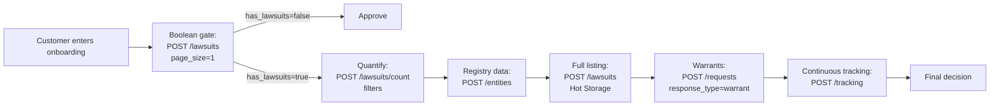

> 🤖 This guide shows the minimum sequence of calls to perform a full legal diligence on a person or company using Judit. Use it as a starting skeleton — adapt the flow to your risk matrix.

## The flow



## Prerequisites

<CardGroup cols={2}>
  <Card title="API key" icon="key">
    Sign up at [judit.io](https://judit.io) and generate your key. See [Authentication](/en/introduction/authentication).
  </Card>
  <Card title="Webhook URL (optional)" icon="webhook">
    Public HTTPS endpoint to receive `tracking_response`. See [Webhook](/en/webhook/callbacks).
  </Card>
</CardGroup>

## Step 1: Boolean gate (coarse filter)

Before spending on full diligence, do a cheap check.

<CodeGroup>
```bash cURL
curl -X POST 'https://lawsuits.production.judit.io/lawsuits' \
  --header 'api-key: '"$JUDIT_API_KEY" \
  --header 'Content-Type: application/json' \
  --data '{
    "search": { "search_type": "cpf", "search_key": "999.999.999-99", "response_type": "lawsuits" },
    "search_params": { "pagination": { "page": 1, "page_size": 1 } }
  }'
```

```python Python
import os, requests

def has_lawsuits(doc: str, search_type: str = "cpf") -> bool:
    r = requests.post(
        "https://lawsuits.production.judit.io/lawsuits",
        headers={"api-key": os.environ["JUDIT_API_KEY"]},
        json={
            "search": {"search_type": search_type, "search_key": doc, "response_type": "lawsuits"},
            "search_params": {"pagination": {"page": 1, "page_size": 1}},
        },
        timeout=10,
    )
    return r.json().get("has_lawsuits", False)

if not has_lawsuits("999.999.999-99"):
    approve_user()
    return
```
</CodeGroup>

Details at [Has Lawsuits? (true/false)](/en/cache-judit/has-lawsuits).

## Step 2: Quantify and snapshot

If the gate returned `true`, now it's worth understanding **the magnitude** of the exposure.

<CodeGroup>
```python Python
def lawsuits_count(doc, search_type="cpf", filter_=None):
    body = {
        "search": {"search_type": search_type, "search_key": doc, "response_type": "lawsuits"}
    }
    if filter_:
        body["search"]["search_params"] = {"filter": filter_}
    r = requests.post(
        "https://lawsuits.production.judit.io/lawsuits/count",
        headers={"api-key": os.environ["JUDIT_API_KEY"]},
        json=body, timeout=10,
    )
    return r.json()["total"]

# How many defendant labor lawsuits?
n_labor = lawsuits_count("999.999.999-99", filter_={
    "side": "Passive",
    "tribunals": {"keys": ["TRT01","TRT02","TRT15"], "not_equal": False},
})
```
</CodeGroup>

Details at [Lawsuits Count](/en/cache-judit/count) and [Synthetic Aggregations](/en/cache-judit/cache-grouped).

## Step 3: Registry data

```python
def entity(doc):
    r = requests.post(
        "https://lawsuits.production.judit.io/entities",
        headers={"api-key": os.environ["JUDIT_API_KEY"]},
        json={"search": {"search_type": "cpf", "search_key": doc, "response_type": "entity"}},
        timeout=10,
    )
    return r.json()
```

Response includes alternative names, addresses, phones, partners (PJ) and Federal Revenue status. See [Registry Data](/en/registration-data/registration-data).

## Step 4: Detailed Hot Storage listing

When you need the contents of the lawsuits for analysis, fetch them via Hot Storage with pagination.

```python
def list_lawsuits(doc, page=1, page_size=50):
    r = requests.post(
        "https://lawsuits.production.judit.io/lawsuits",
        headers={"api-key": os.environ["JUDIT_API_KEY"]},
        json={
            "search": {"search_type": "cpf", "search_key": doc, "response_type": "lawsuits"},
            "search_params": {"pagination": {"page": page, "page_size": page_size}},
        },
        timeout=15,
    )
    return r.json()["lawsuits"]
```

Details at [Hot Storage](/en/cache-judit/hotstorage).

## Step 5: Arrest warrants (optional, for individuals)

```python
def open_warrants(cpf):
    r = requests.post(
        "https://requests.production.judit.io/requests",
        headers={"api-key": os.environ["JUDIT_API_KEY"]},
        json={"search": {"search_type": "cpf", "search_key": cpf, "response_type": "warrant"}},
        timeout=15,
    )
    return r.json()["request_id"]  # async query — receive via webhook
```

Details at [Arrest Warrants](/en/criminal-consultation/warrant).

## Step 6: Continuous tracking

For approved customers, configure periodic monitoring:

```python
def track_cpf(cpf, callback_url):
    r = requests.post(
        "https://tracking.production.judit.io/tracking",
        headers={"api-key": os.environ["JUDIT_API_KEY"]},
        json={
            "search": {"search_type": "cpf", "search_key": cpf, "response_type": "lawsuits"},
            "recurrence": 7,
            "notification_filters": {"step_terms": ["sentença", "trânsito em julgado", "execução"]},
            "callback_url": callback_url,
        },
        timeout=10,
    )
    return r.json()["tracking_id"]
```

Details at [Tracking](/en/tracking/tracking).

## Costs and tips

<AccordionGroup>
  <Accordion title="Budget-driven decisions">
    The tiered flow avoids unnecessary spend: if the gate (Step 1) is `false`, stop. If it's `true` but the count (Step 2) is low, it may not pay off to bring the full list.
  </Accordion>

  <Accordion title="Data freshness">
    Hot Storage returns Judit datalake (cache) data. For the most recent court state, use the [async query](/en/requests/requests) with `on_demand: true`.
  </Accordion>

  <Accordion title="Secrecy">
    If your diligence requires access to secret lawsuits, register the OAB credential at the [Vault](/en/essentials/cofre-de-credenciais) and use `customer_key` on every relevant call.
  </Accordion>

  <Accordion title="Responsible throttling">
    For portfolios, fan out in parallel (10-50 concurrent), respecting your plan limit. On 429, exponential backoff.
  </Accordion>
</AccordionGroup>

## Next steps

* 👉 **[Mass Monitoring](/en/guides/mass-monitoring)** — guide to monitoring 10k+ entities with quota governance.
* 👉 **[Error Codes](/en/resource/errors)** — troubleshooting during integration.
* 👉 **[Court Coverage](/en/resource/courtCoverage)** — to validate which filters to use.
