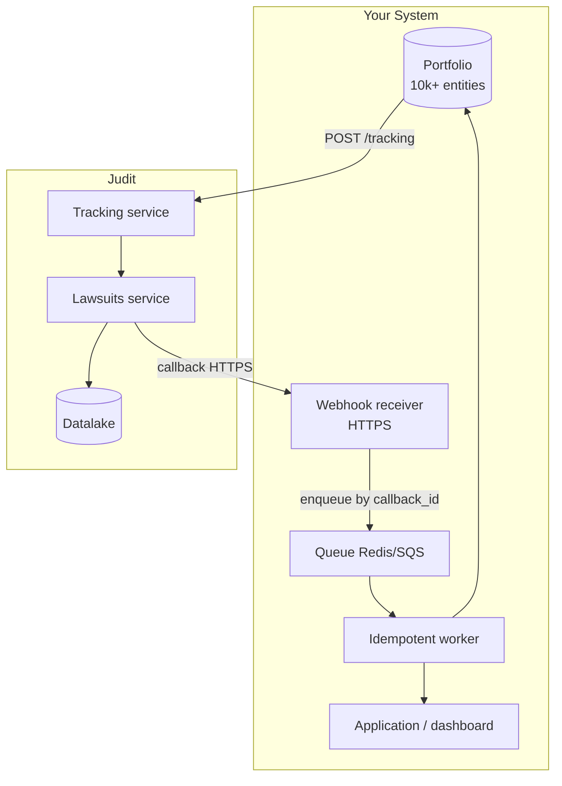

> 🤖 This guide shows how to set up continuous monitoring of thousands of lawsuits on Judit without surprise costs or missed events. Use it as a reference for portfolio architectures, collection teams, law firms and banks.

## Principles

<CardGroup cols={2}>
  <Card title="1. Tier by criticality" icon="layer-group">
    Don't use the same `recurrence` for everything. Active courts with pending judgment: 1 day. Archived: 30 days.
  </Card>
  <Card title="2. Filter the noise" icon="filter">
    `notification_filters.step_terms` avoids trafficking/billing irrelevant steps. Start with 5–10 terms and tune.
  </Card>
  <Card title="3. Always idempotent" icon="rotate">
    `callback_id` unique per delivery — store it in a table and ignore duplicates. Webhooks redeliver.
  </Card>
  <Card title="4. Tracker granularity" icon="boxes-stacked">
    One tracker per (entity, tier) makes it easy to pause/disable those that drop in criticality.
  </Card>
</CardGroup>

## Reference architecture



## Step 1: Model the tiers

| Tier | Criterion | Recurrence |
| :--- | :--- | :--- |
| **Hot** | Pending judgment, active appeal, claim amount > $100k | 1 day |
| **Warm** | Active without urgency | 7 days |
| **Cold** | Archived, suspended, stayed | 30 days |

Tier decisions should be **dynamic**: as soon as `step_type = "SENTENÇA"` arrives, promote to **Hot**.

## Step 2: Create trackers in batch

```python
import os, requests
from concurrent.futures import ThreadPoolExecutor

API_KEY = os.environ["JUDIT_API_KEY"]
CALLBACK_URL = "https://your-app.com/webhooks/judit"

TIERS = {
    "hot":  {"recurrence": 1, "step_terms": ["sentença", "recurso", "execução", "trânsito"]},
    "warm": {"recurrence": 7, "step_terms": ["sentença", "execução"]},
    "cold": {"recurrence": 30, "step_terms": ["sentença", "arquivamento"]},
}

def create_tracker(entity_doc, tier):
    cfg = TIERS[tier]
    r = requests.post(
        "https://tracking.production.judit.io/tracking",
        headers={"api-key": API_KEY},
        json={
            "search": {"search_type": "cpf", "search_key": entity_doc, "response_type": "lawsuits"},
            "recurrence": cfg["recurrence"],
            "notification_filters": {"step_terms": cfg["step_terms"]},
            "callback_url": CALLBACK_URL,
        },
        timeout=15,
    )
    r.raise_for_status()
    return r.json()["tracking_id"]

with ThreadPoolExecutor(max_workers=20) as ex:
    futures = [ex.submit(create_tracker, doc, tier) for doc, tier in portfolio]
    tracker_ids = [f.result() for f in futures]
```

Details at [Tracking](/en/tracking/tracking).

## Step 3: Idempotent webhook receiver

<CodeGroup>
```python Python (Flask)
from flask import Flask, request, jsonify
import sqlite3

app = Flask(__name__)
db = sqlite3.connect("callbacks.db", check_same_thread=False)
db.execute("CREATE TABLE IF NOT EXISTS seen (callback_id TEXT PRIMARY KEY, seen_at TIMESTAMP DEFAULT CURRENT_TIMESTAMP)")

@app.post("/webhooks/judit")
def receive():
    payload = request.get_json()
    cb_id = payload.get("callback_id")
    if not cb_id:
        return jsonify(ok=False), 400
    try:
        db.execute("INSERT INTO seen (callback_id) VALUES (?)", (cb_id,))
        db.commit()
    except sqlite3.IntegrityError:
        return jsonify(ok=True, status="duplicate"), 200
    process_event(payload)  # idempotent by design
    return jsonify(ok=True), 200
```

```javascript Node.js (Express)
const express = require("express");
const app = express();
const seen = new Set();
app.use(express.json());

app.post("/webhooks/judit", (req, res) => {
  const cb = req.body.callback_id;
  if (!cb) return res.status(400).end();
  if (seen.has(cb)) return res.json({ ok: true, status: "duplicate" });
  seen.add(cb);
  processEvent(req.body);
  res.json({ ok: true });
});

app.listen(8080);
```
</CodeGroup>

Retry behavior at [Webhook](/en/webhook/callbacks).

## Step 4: Auto-promote/demote tiers

```python
def process_event(payload):
    event = payload.get("event")
    if event != "tracking_response":
        return
    data = payload["response_data"]
    for step in data.get("steps", []):
        term = (step.get("step_type") or "").upper()
        if term in ("SENTENÇA", "RECURSO", "EXECUÇÃO"):
            promote_to(data["lawsuit_cnj"], "hot")
        elif term == "ARQUIVAMENTO":
            demote_to(data["lawsuit_cnj"], "cold")
```

To reconfigure `recurrence` or other tracker fields, do `PATCH https://tracking.production.judit.io/tracking/{id}` with the new payload. For pausing or resuming only, use `POST /tracking/{id}/pause` and `POST /tracking/{id}/resume`.

## Costs and governance

<AccordionGroup>
  <Accordion title="Tracker cost calculation">
    Total cost ≈ Σ (entities × runs/month). Hot tier (1d) = ~30 runs/month; warm (7d) = ~4; cold (30d) = ~1. Adjust per-tier recurrence to fit the budget.
  </Accordion>

  <Accordion title="Strategic pauses">
    Use `POST /tracking/{id}/pause` during forensic recess, strikes, or when an entity enters a "regulatory freeze". Resume later with `POST /tracking/{id}/resume`. Simple and cheap operations.
  </Accordion>

  <Accordion title="Redeliveries and backoff">
    If your webhook returns 5xx, Judit redelivers with backoff (1m, 5m, 30m, 2h, 6h). Make sure your receiver responds 2xx even when processing happens asynchronously (queue and ack).
  </Accordion>

  <Accordion title="Quota and 429">
    For portfolios > 10k, throttle on your side: limit tracker creation to 50/min and ingestion to 200 webhooks/s. On 429, read `X-RateLimit-Reset` and respect it.
  </Accordion>

  <Accordion title="Graceful shutdown">
    Trackers consume quota even when idle. Mark for `DELETE` when an entity leaves the portfolio (customer churned, lawsuit closed 2+ years without movement).
  </Accordion>
</AccordionGroup>

## Next steps

* 👉 **[Full KYC](/en/guides/kyc-completo)** — onboarding flow with Judit.
* 👉 **[Webhook & Callbacks](/en/webhook/callbacks)** — detailed delivery behavior.
* 👉 **[Error Codes](/en/resource/errors)** — when the tracker comes back empty or with `application_error`.
