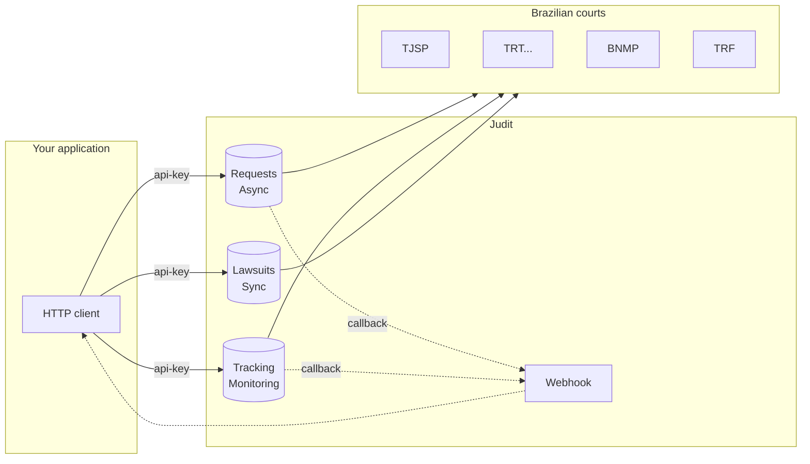

export const ArchitectureAnimation = () => (
  <iframe sandbox="allow-scripts" scrolling="no" style={{width:'100%',height:'560px',border:'none',borderRadius:'12px',display:'block',margin:'20px 0'}} srcDoc={`<!doctype html><html><head><meta charset="utf-8"></head><body><canvas id="c"></canvas><script>(function(){
var A='#4FD1C5',J='#1FC16B',T='#E0A82E',D='#8B5CF6',RE='#ef4444',M='#7A8599';
var BG='#090c0d',TXT='#e5e7eb',NF='#111827',PT='#0a1020';
var TOTAL=55.0;
var XP={app:0.10,judit:0.40,dl:0.65,court:0.88};
var NW=88,NH=42;
var NODES=[{id:'app',label:'Your App',col:A},{id:'judit',label:'Judit API',col:J},{id:'dl',label:'Datalake',col:D},{id:'court',label:'Courts',col:T}];
var FLOWS=[
  {id:'async',title:'① Requests — Async On-Demand',sub:'Real-time extraction directly from the court',col:A,ts:1,te:13,act:['app','judit','dl','court'],steps:[
    {fr:'app',to:'judit',label:'POST /requests',note:'{search_type, search_key}',col:A,ts:1.0,te:1.8,yp:0.30},
    {fr:'judit',to:'app',label:'202 {request_id}',note:'request accepted',col:J,ts:2.2,te:3.0,yp:0.38},
    {fr:'judit',to:'dl',label:'query database',note:'',col:D,ts:3.4,te:4.2,yp:0.46},
    {fr:'dl',to:'judit',label:'cached data',note:'',col:D,ts:4.6,te:5.4,yp:0.54},
    {fr:'judit',to:'app',label:'webhook / polling',note:'cached_response: true',col:J,ts:5.8,te:6.6,yp:0.62},
    {fr:'judit',to:'court',label:'court extraction',note:'in real time',col:T,ts:7.0,te:7.8,yp:0.70},
    {fr:'court',to:'judit',label:'lawsuit data',note:'',col:J,ts:8.2,te:9.0,yp:0.78},
    {fr:'judit',to:'app',label:'webhook / polling',note:'cached_response: false',col:J,ts:9.4,te:10.2,yp:0.84}]},
  {id:'hist',title:'② Requests — Async (Historical)',sub:'Scans the datalake and external sources without querying the court',col:'#60A5FA',ts:14,te:25,act:['app','judit','dl'],steps:[
    {fr:'app',to:'judit',label:'POST /requests',note:'{search_type, search_key}',col:A,ts:14.5,te:15.3,yp:0.32},
    {fr:'judit',to:'app',label:'202 {request_id}',note:'request accepted',col:J,ts:15.8,te:16.6,yp:0.44},
    {fr:'judit',to:'dl',label:'scan database + external sources',note:'',col:'#60A5FA',ts:17.1,te:17.9,yp:0.56},
    {fr:'dl',to:'judit',label:'lawsuits found',note:'',col:'#60A5FA',ts:18.4,te:19.2,yp:0.68},
    {fr:'judit',to:'app',label:'webhook / polling',note:'response_data',col:J,ts:19.7,te:20.5,yp:0.80}]},
  {id:'track',title:'③ Tracking — Monitoring',sub:'Periodically checks the court and notifies via webhook',col:'#F6AD55',ts:26,te:39,act:['app','judit','court'],steps:[
    {fr:'app',to:'judit',label:'POST /tracking',note:'{search_type, search_key}',col:A,ts:26.5,te:27.3,yp:0.32},
    {fr:'judit',to:'court',label:'checks periodically',note:'configurable recurrence',col:T,ts:28.2,te:29.0,yp:0.48},
    {fr:'court',to:'judit',label:'new movement',note:'',col:J,ts:29.9,te:30.7,yp:0.62},
    {fr:'judit',to:'app',label:'webhook',note:'event: new_step',col:'#F6AD55',ts:31.6,te:32.4,yp:0.78}]},
  {id:'sync',title:'④ Lawsuits — Synchronous (Hot Storage)',sub:'Reads the JUDIT datalake — does not query the court',col:D,ts:40,te:53,act:['app','judit','dl'],steps:[
    {fr:'app',to:'judit',label:'POST /lawsuits',note:'{search_type, search_key}',col:A,ts:40.5,te:41.3,yp:0.32},
    {fr:'judit',to:'dl',label:'datalake read',note:'without querying the court',col:D,ts:42.2,te:43.0,yp:0.48},
    {fr:'dl',to:'judit',label:'indexed lawsuits',note:'in milliseconds',col:D,ts:43.9,te:44.7,yp:0.62},
    {fr:'judit',to:'app',label:'200 {response_data}',note:'same request — synchronous',col:J,ts:45.6,te:46.4,yp:0.78}]}
];
var cv=document.getElementById('c');
function setup(){var dpr=Math.min(window.devicePixelRatio||1,2),r=cv.getBoundingClientRect(),W=r.width||window.innerWidth,H=r.height||window.innerHeight;cv.width=Math.max(1,W*dpr);cv.height=Math.max(1,H*dpr);var ctx=cv.getContext('2d');ctx.setTransform(dpr,0,0,dpr,0,0);return{ctx:ctx,w:W,h:H};}
function ease(t){return t<0.5?2*t*t:1-Math.pow(-2*t+2,2)/2;}
function rr(ctx,x,y,w,h,r){ctx.beginPath();ctx.moveTo(x+r,y);ctx.arcTo(x+w,y,x+w,y+h,r);ctx.arcTo(x+w,y+h,x,y+h,r);ctx.arcTo(x,y+h,x,y,r);ctx.arcTo(x,y,x+w,y,r);ctx.closePath();}
function gx(n,w){return n==='app'?w*XP.app:n==='judit'?w*XP.judit:n==='dl'?w*XP.dl:w*XP.court;}
function eg(fr,to,w){var fx=gx(fr,w),tx=gx(to,w),d=tx>fx?1:-1;return{x1:fx+d*NW/2,x2:tx-d*NW/2,d:d};}
function dPkt(ctx,x,y,lbl,col){var pw=Math.max(36,lbl.length*6+14),ph=20;ctx.save();ctx.shadowColor=col;ctx.shadowBlur=18;rr(ctx,x-pw/2,y-ph/2,pw,ph,5);ctx.fillStyle=col;ctx.fill();ctx.shadowBlur=0;ctx.fillStyle=PT;ctx.font='bold 9px monospace';ctx.textAlign='center';ctx.textBaseline='middle';ctx.fillText(lbl,x,y+0.5);ctx.restore();}
function draw(ctx,w,h,t){
  var ct=t%TOTAL;
  ctx.fillStyle=BG;ctx.fillRect(0,0,w,h);
  var fl=null;for(var i=0;i<FLOWS.length;i++){if(ct>=FLOWS[i].ts&&ct<FLOWS[i].te){fl=FLOWS[i];break;}}
  var nodeY=h*0.21;
  for(var i=0;i<NODES.length;i++){var n=NODES[i],lx=gx(n.id,w),ia=!fl||(fl.act.indexOf(n.id)>=0);ctx.save();ctx.strokeStyle=n.col;ctx.globalAlpha=ia?0.38:0.08;ctx.lineWidth=1;ctx.setLineDash([4,7]);ctx.beginPath();ctx.moveTo(lx,nodeY+NH/2);ctx.lineTo(lx,h*0.92);ctx.stroke();ctx.restore();}
  if(fl){ctx.save();ctx.fillStyle=fl.col;ctx.font='bold 13px Inter,system-ui,sans-serif';ctx.textAlign='center';ctx.textBaseline='middle';ctx.fillText(fl.title,w/2,h*0.055);ctx.fillStyle=M;ctx.font='10.5px Inter,system-ui,sans-serif';ctx.fillText(fl.sub,w/2,h*0.118);ctx.restore();}
  if(fl){for(var si=0;si<fl.steps.length;si++){var s=fl.steps[si],sy=h*s.yp,e=eg(s.fr,s.to,w),x1=e.x1,x2=e.x2,d=e.d,clx=(x1+x2)/2;var state=ct<s.ts?'pre':ct>s.te?'done':'live',alpha=state==='pre'?0.10:state==='done'?0.55:1.0;ctx.save();ctx.globalAlpha=alpha;ctx.strokeStyle=s.col;ctx.lineWidth=1.5;ctx.setLineDash([]);ctx.beginPath();ctx.moveTo(x1,sy);ctx.lineTo(x2,sy);ctx.stroke();ctx.fillStyle=s.col;ctx.beginPath();ctx.moveTo(x2,sy);ctx.lineTo(x2-d*7,sy-4);ctx.lineTo(x2-d*7,sy+4);ctx.closePath();ctx.fill();ctx.fillStyle=TXT;ctx.font='bold 10px monospace';ctx.textAlign='center';ctx.textBaseline='bottom';ctx.fillText(s.label,clx,sy-4);if(s.note){ctx.fillStyle=M;ctx.font='9px monospace';ctx.fillText(s.note,clx,sy-16);}ctx.restore();if(state==='live'){var p=ease((ct-s.ts)/(s.te-s.ts));dPkt(ctx,x1+(x2-x1)*p,sy+14,s.label,s.col);}}}
  for(var i=0;i<NODES.length;i++){var nd=NODES[i],px=gx(nd.id,w),ia=!fl||(fl.act.indexOf(nd.id)>=0),isCx=fl&&fl.id==='sync'&&nd.id==='court';ctx.save();ctx.globalAlpha=ia?1:0.18;if(ia){ctx.shadowColor=nd.col;ctx.shadowBlur=15;}rr(ctx,px-NW/2,nodeY-NH/2,NW,NH,8);ctx.fillStyle=NF;ctx.fill();ctx.shadowBlur=0;ctx.strokeStyle=isCx?RE:ia?nd.col:'rgba(255,255,255,0.10)';ctx.lineWidth=ia?1.8:1;ctx.stroke();ctx.fillStyle=isCx?RE:ia?nd.col:M;ctx.font='bold 11px Inter,system-ui,sans-serif';ctx.textAlign='center';ctx.textBaseline='middle';ctx.fillText(nd.label,px,nodeY);ctx.restore();if(isCx){ctx.save();ctx.strokeStyle=RE;ctx.lineWidth=2;ctx.globalAlpha=0.85;var bx=px+NW/2-12,by=nodeY-NH/2+10,br=8;ctx.beginPath();ctx.moveTo(bx-br,by-br);ctx.lineTo(bx+br,by+br);ctx.stroke();ctx.beginPath();ctx.moveTo(bx+br,by-br);ctx.lineTo(bx-br,by+br);ctx.stroke();ctx.restore();}}
  for(var f=0;f<FLOWS.length;f++){var ia=fl&&fl.id===FLOWS[f].id;ctx.save();ctx.beginPath();ctx.arc(w/2+(f-(FLOWS.length-1)/2)*24,h*0.962,ia?5:3,0,Math.PI*2);ctx.fillStyle=ia?FLOWS[f].col:'rgba(255,255,255,0.18)';ctx.fill();ctx.restore();}
}
var dim,t0;
function loop(){var t=(performance.now()-t0)/1000;draw(dim.ctx,dim.w,dim.h,t);requestAnimationFrame(loop);}
window.addEventListener('load',function(){dim=setup();t0=performance.now();loop();});
window.addEventListener('resize',function(){dim=setup();});
cv.addEventListener('click',function(e){var r=cv.getBoundingClientRect(),cx=e.clientX-r.left,cy=e.clientY-r.top;for(var f=0;f<FLOWS.length;f++){var dx=cx-(dim.w/2+(f-(FLOWS.length-1)/2)*24),dy=cy-dim.h*0.962;if(dx*dx+dy*dy<=144){t0=performance.now()-FLOWS[f].ts*1000;break;}}});
cv.addEventListener('mousemove',function(e){var r=cv.getBoundingClientRect(),cx=e.clientX-r.left,cy=e.clientY-r.top,over=false;for(var f=0;f<FLOWS.length;f++){var dx=cx-(dim.w/2+(f-(FLOWS.length-1)/2)*24),dy=cy-dim.h*0.962;if(dx*dx+dy*dy<=144){over=true;break;}}cv.style.cursor=over?'pointer':'default';});
})()\x3c/script></body></html>`} />
);

The **Judit API** delivers ready-to-use Brazilian lawsuit data through a single integration. Instead of maintaining scrapers for each court, your application makes one HTTP call and receives the lawsuit cover, parties, lawyers, steps, attachments and relationships — in real time or from a constantly updated datalake.

> 🤖 Judit covers state, federal, labor, electoral, military and superior courts plus BNMP. Authentication is via the `api-key` header. The 3 main services are `requests` (asynchronous), `tracking` (monitoring) and `lawsuits` (synchronous / cache).

## What you can do

- **Search lawsuits** by CPF, CNPJ, OAB, Name or CNJ number — asynchronous (live court fetch) or synchronous (Judit cache in milliseconds).
- **Track lawsuits** automatically and receive webhook updates when new movements happen.
- **Detect new lawsuits** (birth) tied to a document.
- **Get registration data** (individuals and companies), with the option of reading from the datalake or live from the Brazilian Federal Revenue.
- **Download attachments** and BNMP arrest warrants as PDFs.
- **Query penal executions** (sentence enforcement).
- **Summarize lawsuits with AI** — automatically generate a cover summary (Judit AI).

## Common use cases

<CardGroup cols={2}>
  <Card title="Law firms" icon="briefcase">
    Centralize the firm's entire caseload in a single dashboard. Watch critical movements and generate automated reports.
  </Card>
  <Card title="In-house legal" icon="building">
    Track the corporate caseload and feed lawsuit status into internal systems (ERP, CRM, BI).
  </Card>
  <Card title="Fintechs and credit bureaus" icon="chart-line">
    Run mass due diligence and enrich risk analysis with lawsuit data per CPF/CNPJ in real time.
  </Card>
  <Card title="Compliance and KYC" icon="shield-check">
    Check counterpart-related lawsuits (PEPs, criminal records, warrants) during onboarding.
  </Card>
  <Card title="LegalTechs" icon="code">
    Launch your platform without maintaining scrapers per court — focus on product, not infrastructure.
  </Card>
  <Card title="Collections and recovery" icon="hand-holding-dollar">
    Identify relevant passive lawsuits (claim amount, phase, class) and prioritize outreach.
  </Card>
</CardGroup>

## Architecture in 1 minute

<ArchitectureAnimation />

Three services, one auth pattern:

| Service | URL | When to use |
| --- | --- | --- |
| `requests` | `https://requests.production.judit.io` | Live fetch from courts. Result arrives via webhook or polling. |
| `tracking` | `https://tracking.production.judit.io` | Continuous lawsuit monitoring at the recurrence you choose. |
| `lawsuits` | `https://lawsuits.production.judit.io` | Synchronous reading of the JUDIT data lake, returning the processes linked to the consulted document. |

## Get started in 3 steps

<Steps>
  <Step title="Request your API Key">
    Reach out to our [commercial team](https://api.whatsapp.com/send/?phone=5521985284143) and receive your access key.
  </Step>
  <Step title="Make your first query">
    Follow the [Quickstart](/en/introduction/quickstart) to create your first request in under 5 minutes.
  </Step>
</Steps>
