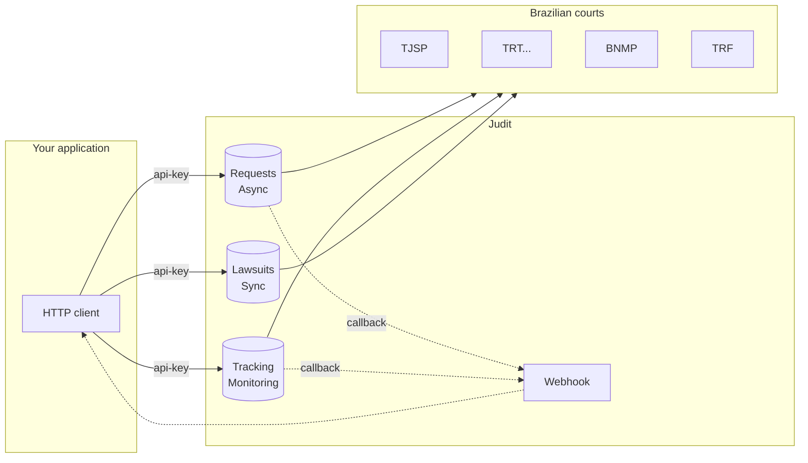

The **Judit API** delivers ready-to-use Brazilian lawsuit data through a single integration. Instead of maintaining scrapers for each court, your application makes one HTTP call and receives the lawsuit cover, parties, lawyers, steps, attachments and relationships — in real time or from a constantly updated datalake.

> 🤖 Judit covers state, federal, labor, electoral, military and superior courts plus BNMP. Authentication is via the `api-key` header. The 3 main services are `requests` (asynchronous), `tracking` (monitoring) and `lawsuits` (synchronous / cache).

## What you can do

- **Search lawsuits** by CPF, CNPJ, OAB, Name or CNJ number — asynchronous (live court fetch) or synchronous (Judit cache in milliseconds).
- **Track lawsuits** automatically and receive webhook updates when new movements happen.
- **Detect new lawsuits** (birth) tied to a document.
- **Get registration data** (individuals and companies), with the option of reading from the datalake or live from the Brazilian Federal Revenue.
- **Download attachments** and BNMP arrest warrants as PDFs.
- **Query penal executions** (sentence enforcement).
- **Summarize lawsuits with AI** — automatically generate a cover summary (Judit AI).

## Common use cases

<CardGroup cols={2}>
  <Card title="Law firms" icon="briefcase">
    Centralize the firm's entire caseload in a single dashboard. Watch critical movements and generate automated reports.
  </Card>
  <Card title="In-house legal" icon="building">
    Track the corporate caseload and feed lawsuit status into internal systems (ERP, CRM, BI).
  </Card>
  <Card title="Fintechs and credit bureaus" icon="chart-line">
    Run mass due diligence and enrich risk analysis with lawsuit data per CPF/CNPJ in real time.
  </Card>
  <Card title="Compliance and KYC" icon="shield-check">
    Check counterpart-related lawsuits (PEPs, criminal records, warrants) during onboarding.
  </Card>
  <Card title="LegalTechs" icon="code">
    Launch your platform without maintaining scrapers per court — focus on product, not infrastructure.
  </Card>
  <Card title="Collections and recovery" icon="hand-holding-dollar">
    Identify relevant passive lawsuits (claim amount, phase, class) and prioritize outreach.
  </Card>
</CardGroup>

## Architecture in 1 minute

Three services, one auth pattern:

| Service | URL | When to use |
| --- | --- | --- |
| `requests` | `https://requests.production.judit.io` | Live fetch from courts. Result arrives via webhook or polling. |
| `tracking` | `https://tracking.production.judit.io` | Continuous lawsuit monitoring at the recurrence you choose. |
| `lawsuits` | `https://lawsuits.production.judit.io` | Synchronous reading of the JUDIT data lake, returning the processes linked to the consulted document. |

## Get started in 3 steps

<Steps>
  <Step title="Request your API Key">
    Reach out to our [commercial team](https://api.whatsapp.com/send/?phone=5521985284143) and receive your access key.
  </Step>
  <Step title="Make your first query">
    Follow the [Quickstart](/en/introduction/quickstart) to create your first request in under 5 minutes.
  </Step>
</Steps>
