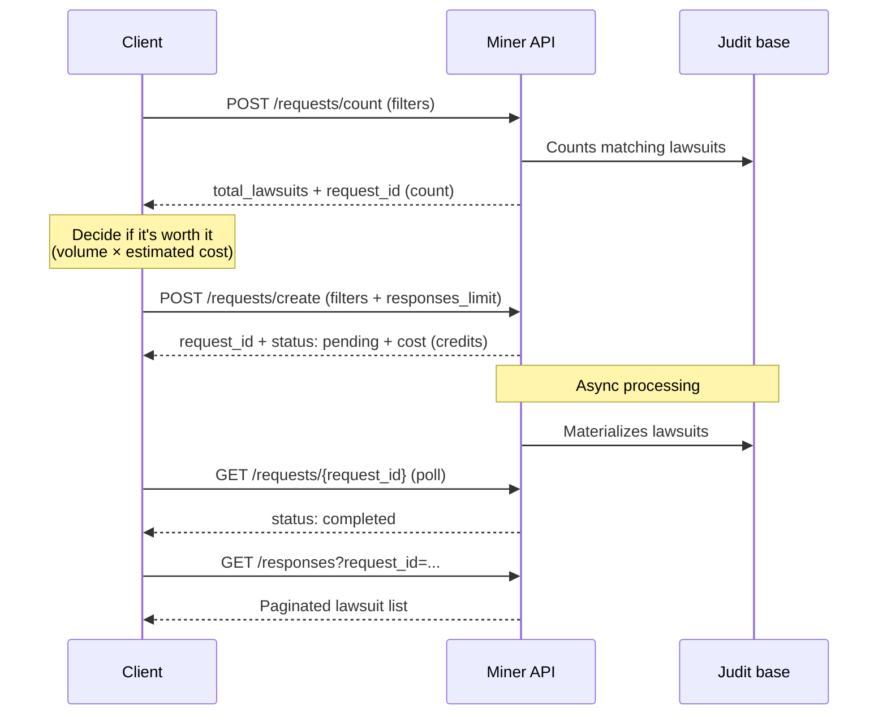

<Note>
**Public beta.** Miner is a new Judit product in open beta. The endpoints and pricing model documented here are stable, but small adjustments may happen during this phase. We recommend pinning the contract version and following [docs.judit.io/en/resource/changelog](/en/resource/changelog).
</Note>

<Warning>
**Miner API usage pricing is not included in the JUDIT Miner Platform license.** API consumption is billed **separately, in credits**, per the [Credits & billing](/en/miner/credits) tiers. Confirm the active tiers for your account with the commercial team before running production queries.
</Warning>

**Judit Miner** is a product dedicated to **discovering judicial assets at scale**: paid or in-payment **judgement bonds** (`judgement-bond`) and **sentence executions** with recovery potential (`sentence-execution`). Instead of going lawsuit by lawsuit, you define a set of filters (courts, amount range, natures, tags) and Judit identifies every lawsuit that fits — automatically excluding the ones your company has already retrieved.

> 🤖 Base host: `https://miner.production.judit.io`. Authentication via the `api-key` header (same key used across Judit products, with `miner_enabled` granted). Pricing is **credit-based** — every `find` is priced by tier before processing.

## What Miner does

<CardGroup cols={2}>
  <Card title="Find judgement bonds" icon="scale-balanced">
    Identify federal, state and municipal judgement bonds by budget year, nature (alimentary/common) and court. Ideal for credit-rights funds and recovery practices.
  </Card>
  <Card title="Map sentence executions" icon="gavel">
    Detect executions with signs of approved calculation, possible bond or already-issued bond. Ideal for sourcing credit-rights portfolios.
  </Card>
  <Card title="Amount range filters" icon="coins">
    Slice by free min/max or pre-defined tiers (`0-100k`, `100k-250k`, `250k-500k`, `500k-750k`, `750k-1.5M`, `1.5M+`).
  </Card>
  <Card title="No repeats across queries" icon="filter-circle-xmark">
    `count` automatically excludes lawsuits your company has already retrieved — you only pay for what you haven't seen.
  </Card>
</CardGroup>

## How it works

Miner follows a 3-step flow: **estimate** → **purchase** → **paginate**.

| Step | Endpoint | Purpose |
| --- | --- | --- |
| **1. Count** | `POST /requests/count` | Know how many lawsuits match your filters, **no credit cost**. Synchronous response. |
| **2. Create find** | `POST /requests/create` | Trigger the real query. Returns `cost` (credits charged) and `status: pending`. |
| **3. Track** | `GET /requests/{request_id}` | Poll until `status: completed`. |
| **4. Collect** | `GET /responses?request_id=...` | List the returned lawsuits, paginated (up to 100 per page). |

## Who it's for

<CardGroup cols={2}>
  <Card title="Credit-rights funds" icon="building-columns">
    Mass sourcing of judgement bonds and judicial credits — with fine-grained filters by amount and court.
  </Card>
  <Card title="Recovery law firms" icon="briefcase">
    Identify executions with signs of approved calculation or imminent bond for proactive outreach.
  </Card>
  <Card title="Banks and fintechs" icon="chart-line">
    Curate baskets of judicial assets for portfolio analysis and securitization.
  </Card>
  <Card title="Marketplace platforms" icon="store">
    Feed bond-marketplace listings with always-fresh inventory.
  </Card>
</CardGroup>

## What's not in Miner

- **Lawsuit lookup by CNJ** → use [Lawsuit Query](/en/requests/requests) (async Requests) or [Hot Storage](/en/cache-judit/hotstorage) (sync).
- **Continuous tracking of movements** → use [Tracking](/en/tracking/tracking).
- **Registration data (individuals/companies)** → use [`/entities`](/en/registration-data/registration-data).

Miner focuses on **asset discovery** based on lawsuit attributes. For any other case, the corresponding products remain available and bill normally.

## Next steps

<CardGroup cols={2}>
  <Card title="Quickstart" icon="bolt" href="/en/miner/quickstart">
    Run your first query in under 10 minutes.
  </Card>
  <Card title="Concepts" icon="book" href="/en/miner/concepts">
    Understand `kind`, `natures`, `tags`, amount tiers and combination rules.
  </Card>
  <Card title="Credits & billing" icon="coins" href="/en/miner/credits">
    How `cost` is computed, price tiers and handling of billing errors.
  </Card>
  <Card title="Supported courts" icon="building-columns" href="/en/miner/tribunals">
    Full list of IDs and acronyms for the `tribunals` filter.
  </Card>
</CardGroup>
