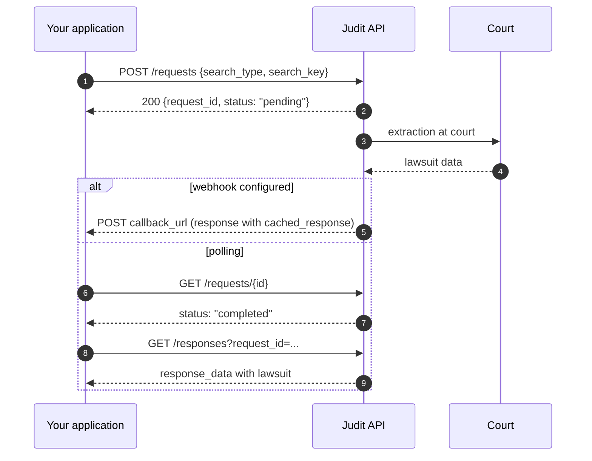

import { EndpointBadges } from '/snippets/badges.mdx';

import CachedResponseInfo from '/snippets/cached-response-en.mdx';

export const AsyncFlowAnimation = () => (
  <iframe sandbox="allow-scripts" scrolling="no" style={{width:'100%',height:'560px',border:'none',borderRadius:'12px',display:'block',margin:'20px 0'}} srcDoc={`<!doctype html><html><head><meta charset="utf-8"><style>*{margin:0;padding:0;box-sizing:border-box}html,body{width:100%;height:100%;overflow:hidden;background:#090c0d}canvas{display:block;width:100%;height:100%}</style></head><body><canvas id="c"></canvas><script>(function(){
var A='#4FD1C5',J='#1FC16B',T='#E0A82E',M='#7A8599';
var BG='#090c0d',TXT='#e5e7eb',NF='#111827',PT='#0a1020';
var STEPS=[
  {from:'app',to:'jud',label:'POST /requests',sub:'{search_type, search_key}',col:A,ts:0.5,te:1.2},
  {from:'jud',to:'app',label:'200 {request_id}',sub:'status: pending',col:'#F6AD55',ts:1.7,te:2.4},
  {from:'jud',to:'crt',label:'extraction at court',sub:'',col:A,ts:2.9,te:3.6},
  {from:'crt',to:'jud',label:'lawsuit data',sub:'',col:J,ts:4.1,te:4.8},
  {sep:'alt',label:'alt  webhook configured'},
  {from:'jud',to:'app',label:'POST callback_url',sub:'cached_response',col:J,ts:5.5,te:6.2},
  {sep:'else',label:'else  polling'},
  {from:'app',to:'jud',label:'GET /requests/{id}',sub:'',col:A,ts:7.2,te:7.9},
  {from:'jud',to:'app',label:'status: completed',sub:'',col:J,ts:8.4,te:9.1},
  {from:'app',to:'jud',label:'GET /responses?...',sub:'request_id=...',col:A,ts:9.6,te:10.3},
  {from:'jud',to:'app',label:'response_data',sub:'with lawsuit',col:J,ts:10.8,te:11.5},
  {sep:'end'}
];
var YPS=[0.19,0.28,0.37,0.46,0.516,0.572,0.624,0.678,0.754,0.830,0.906,0.950];
for(var i=0;i<STEPS.length;i++){STEPS[i].yp=YPS[i];}
var TOTAL=14.0,cv=document.getElementById('c');
function setup(){var dpr=Math.min(window.devicePixelRatio||1,2),r=cv.getBoundingClientRect(),W=r.width||window.innerWidth,H=r.height||window.innerHeight;cv.width=Math.max(1,W*dpr);cv.height=Math.max(1,H*dpr);var ctx=cv.getContext('2d');ctx.setTransform(dpr,0,0,dpr,0,0);return{ctx:ctx,w:W,h:H};}
function ease(t){return t<0.5?2*t*t:1-Math.pow(-2*t+2,2)/2;}
function rr(ctx,x,y,w,h,r){ctx.beginPath();ctx.moveTo(x+r,y);ctx.arcTo(x+w,y,x+w,y+h,r);ctx.arcTo(x+w,y+h,x,y+h,r);ctx.arcTo(x,y+h,x,y,r);ctx.arcTo(x,y,x+w,y,r);ctx.closePath();}
function nx(n,w){return n==='app'?w*0.13:n==='jud'?w*0.5:w*0.87;}
function nc(n){return n==='app'?A:n==='jud'?J:T;}
function eg(fr,to,w,nw){var fx=nx(fr,w),tx=nx(to,w),d=tx>fx?1:-1;return{x1:fx+d*nw/2,x2:tx-d*nw/2,d:d};}
function dNode(ctx,x,y,lbl,col,nw,nh){ctx.save();ctx.shadowColor=col;ctx.shadowBlur=18;rr(ctx,x-nw/2,y-nh/2,nw,nh,8);ctx.fillStyle=NF;ctx.fill();ctx.shadowBlur=0;ctx.strokeStyle=col;ctx.lineWidth=1.8;ctx.stroke();ctx.fillStyle=col;ctx.font='bold 12px Inter,system-ui,sans-serif';ctx.textAlign='center';ctx.textBaseline='middle';ctx.fillText(lbl,x,y);ctx.restore();}
function dPkt(ctx,x,y,lbl,col){ctx.save();var pw=Math.max(38,lbl.length*7+16),ph=20;ctx.shadowColor=col;ctx.shadowBlur=22;rr(ctx,x-pw/2,y-ph/2,pw,ph,5);ctx.fillStyle=col;ctx.fill();ctx.shadowBlur=0;ctx.fillStyle=PT;ctx.font='bold 9.5px monospace';ctx.textAlign='center';ctx.textBaseline='middle';ctx.fillText(lbl,x,y+0.5);ctx.restore();}
function draw(ctx,w,h,t){
  var ct=t%TOTAL,nw=Math.min(94,w*0.16),nh=42,nodeY=h*0.068,ll=nodeY+nh/2,bx1=w*0.02,bx2=w*0.98,altS=null,endS=null;
  ctx.fillStyle=BG;ctx.fillRect(0,0,w,h);
  for(var i=0;i<STEPS.length;i++){if(STEPS[i].sep==='alt')altS=STEPS[i];if(STEPS[i].sep==='end')endS=STEPS[i];}
  if(altS&&endS){ctx.save();ctx.strokeStyle='rgba(255,255,255,0.25)';ctx.lineWidth=1;ctx.setLineDash([4,6]);rr(ctx,bx1,h*altS.yp-11,bx2-bx1,(h*endS.yp+5)-(h*altS.yp-11),5);ctx.stroke();ctx.restore();}
  var ns=['app','jud','crt'];
  for(var i=0;i<ns.length;i++){var lx=nx(ns[i],w),lc=nc(ns[i]);ctx.save();ctx.strokeStyle=lc;ctx.globalAlpha=0.45;ctx.lineWidth=1;ctx.setLineDash([5,8]);ctx.beginPath();ctx.moveTo(lx,ll);ctx.lineTo(lx,h*0.955);ctx.stroke();ctx.restore();}
  for(var i=0;i<STEPS.length;i++){
    var s=STEPS[i],sy=h*s.yp;
    if(s.sep==='alt'||s.sep==='else'){ctx.save();ctx.strokeStyle='rgba(255,255,255,0.30)';ctx.lineWidth=1;ctx.setLineDash([3,5]);ctx.beginPath();ctx.moveTo(bx1,sy);ctx.lineTo(bx2,sy);ctx.stroke();ctx.fillStyle='rgba(255,255,255,0.06)';rr(ctx,bx1,sy-8,s.label.length*6+14,16,3);ctx.fill();ctx.fillStyle=M;ctx.font='10px monospace';ctx.textAlign='left';ctx.textBaseline='middle';ctx.fillText(s.label,bx1+5,sy);ctx.restore();continue;}
    if(s.sep==='end'){ctx.save();ctx.strokeStyle='rgba(255,255,255,0.25)';ctx.lineWidth=1;ctx.setLineDash([]);ctx.beginPath();ctx.moveTo(bx1,sy);ctx.lineTo(bx2,sy);ctx.stroke();ctx.restore();continue;}
    var e=eg(s.from,s.to,w,nw),x1=e.x1,x2=e.x2,d=e.d,clx=(x1+x2)/2;
    var state=ct<s.ts?'pre':ct>s.te?'done':'live',alpha=state==='pre'?0.15:state==='done'?0.6:1.0;
    ctx.save();ctx.globalAlpha=alpha;ctx.strokeStyle=s.col;ctx.lineWidth=1.4;ctx.setLineDash([]);ctx.beginPath();ctx.moveTo(x1,sy);ctx.lineTo(x2,sy);ctx.stroke();
    ctx.fillStyle=s.col;ctx.beginPath();ctx.moveTo(x2,sy);ctx.lineTo(x2-d*7,sy-4);ctx.lineTo(x2-d*7,sy+4);ctx.closePath();ctx.fill();
    ctx.fillStyle=TXT;ctx.font='bold 10px monospace';ctx.textAlign='center';ctx.textBaseline='bottom';ctx.fillText(s.label,clx,sy-4);
    if(s.sub){ctx.fillStyle=M;ctx.font='9px monospace';ctx.fillText(s.sub,clx,sy-15);}
    ctx.restore();
    if(state==='live'){var p=ease((ct-s.ts)/(s.te-s.ts));dPkt(ctx,x1+(x2-x1)*p,sy+14,s.label,s.col);}
  }
  dNode(ctx,nx('app',w),nodeY,'Your App',A,nw,nh);
  dNode(ctx,nx('jud',w),nodeY,'Judit API',J,nw,nh);
  dNode(ctx,nx('crt',w),nodeY,'Court',T,nw,nh);
}
var dim,t0;
function loop(){var t=(performance.now()-t0)/1000;dim.ctx.clearRect(0,0,dim.w,dim.h);draw(dim.ctx,dim.w,dim.h,t);requestAnimationFrame(loop);}
window.addEventListener('load',function(){dim=setup();t0=performance.now();loop();});
window.addEventListener('resize',function(){dim=setup();});
})()\x3c/script></body></html>`} />
);

<CachedResponseInfo />

<Warning>
**One court fetch per day, per lawsuit**

For lawsuit queries (`search_type: "lawsuit_cnj"`), fetching updated data from the court for a specific lawsuit happens, by default, **at most once per day**. If you trigger more than one query for the same lawsuit on the same day, the following calls return the data already in cache (`cached_response: true`), with no new court fetch.

This is a performance optimization, **not a billing exemption**: every request you send is counted and billed normally, as established in your contract, regardless of whether the result came from cache or from a fresh court extraction.
</Warning>

The **Asynchronous Lawsuit Query** is the most complete and freshest way to fetch a lawsuit: Judit reaches the court in real time, downloads the full tree (cover, parties, lawyers, steps, classes, attachments) and returns it via webhook or polling.

> 🤖 The lawsuit search route operates **asynchronously**. The client application must make a `POST /requests` to start the search, wait for processing (via Webhook or by polling `GET /requests/{id}`), and, when the status is `completed`, capture the data via `GET /responses`.

<EndpointBadges auth billing="billable" flow="async" attachments />

## When to use

<CardGroup cols={2}>
  <Card title="Forced refresh" icon="arrows-rotate">
    The lawsuit must reflect the latest court state — the datalake cache isn't enough.
  </Card>
  <Card title="Full cover + steps" icon="list-tree">
    You need every cover field, all steps, attachments (up to 1,000 per query) and relationships.
  </Card>
  <Card title="AI summary" icon="sparkles">
    Trigger `judit_ia: ["summary"]` to get a human-friendly summary ready for your UI.
  </Card>
  <Card title="Lawsuits under secrecy" icon="lock">
    Combine with the [Credentials Vault](/en/essentials/cofre-de-credenciais) to reach lawsuits that require court login.
  </Card>
</CardGroup>

> If speed beats freshness (e.g. on-screen validation, interactive dashboard), use the [Hot Storage Synchronous Query](/en/cache-judit/hotstorage) — millisecond response from Judit's datalake.

## Asynchronous on-demand flow (overview)

<AsyncFlowAnimation />



## Understanding the Asynchronous Flow

Since data extraction directly from the courts can take a few seconds or minutes (depending on court instability), the Judit API uses an asynchronous request pattern.


The flow consists of 3 simple steps:
1. **Create the request:** You send the lawsuit number.
2. **Track the status:** You check if the bot has finished the extraction.
3. **Capture the result:** You consume the JSON with the lawsuit data.

---

## Step 1: Creating the Search Request

To initiate a lawsuit search, make a `POST` request to the base requests route, sending the desired parameters in the body of the call.

### Payload Parameters (Body)

Refer to the table below to configure your search, enable attachments, or trigger **Judit AI**:

| Parameter | Type | Required | Description |
| :--- | :--- | :--- | :--- |
| `search.search_type` | string | **Yes** | Defines the entity being searched. For lawsuits, always use `"lawsuit_cnj"`. |
| `search.search_key` | string | **Yes** | The lawsuit number in the CNJ standard (e.g., `"0009999-99.9999.8.26.9999"`). |
| `with_attachments` | boolean | No | If `true`, Judit will download the lawsuit files. |
| `judit_ia` | array | No | List of AI *features* applied to the result. Send `["summary"]` to receive a humanized summary of the header and case updates. |
| `search_params.lawsuit_instance` | integer | No | Forces the search at a specific instance (e.g., `1` or `2`). |

<Warning>
**Judit AI (Beta):** The artificial intelligence feature (`judit_ia`) is in Beta. Response time may vary and the summary structure is subject to improvements.
</Warning>

<Warning>
**Limit of 1,000 attachments per request:** When `with_attachments: true`, Judit returns **up to 1,000 attachments per query**. If the lawsuit has more attachments than that, the remaining ones are not included in that response — to capture them, make a **new lawsuit query** for the same CNJ, which will return the next batch of up to 1,000 attachments. Repeat this (one new query per batch of 1,000) until you have retrieved all of the lawsuit's attachments.
</Warning>

### Request Example (POST)

<CodeGroup>

```bash cURL (Without Attachments)
curl --location 'https://requests.production.judit.io/requests/' \
--header 'Content-Type: application/json' \
--header 'api-key: <api-key>' \
--data '{
    "search": {
        "search_type": "lawsuit_cnj",
        "search_key": "0009999-99.9999.8.26.9999"
    },
    "with_attachments": false
}'
```

```bash cURL (With Attachments)
curl --location 'https://requests.production.judit.io/requests/' \
--header 'Content-Type: application/json' \
--header 'api-key: <api-key>' \
--data '{
    "search": {
        "search_type": "lawsuit_cnj",
        "search_key": "0009999-99.9999.8.26.9999"
    },
    "with_attachments": true
}'
```

```bash cURL (With Attachments and AI)
curl --location 'https://requests.production.judit.io/requests/' \
--header 'Content-Type: application/json' \
--header 'api-key: <api-key>' \
--data '{
    "search": {
        "search_type": "lawsuit_cnj",
        "search_key": "0009999-99.9999.8.26.9999"
    },
    "with_attachments": true,
    "judit_ia": ["summary"]
}'
```

```json Response Example (Status 201)
{
    "request_id": "84b4d8f5-50f8-4c14-818f-912c722a6908",
    "search": {
        "search_type": "lawsuit_cnj",
        "search_key": "0009999-99.9999.8.26.9999",
        "response_type": "lawsuit"
    },
    "with_attachments": true,
    "status": "pending",
    "created_at": "2024-06-18T22:03:35.560Z"
}
```
</CodeGroup>

Save the value of `request_id`, as you will need it for the next steps.

---

<Info>
**🚀 Shortcut: Automate with Webhooks (Recommended)**

If you have a Webhook URL configured, **Steps 2 and 3 below are entirely optional**. 
Instead of programming your application to keep polling the request status, the Judit API will send the found lawsuits **incrementally** directly to your server as soon as they are captured, finishing the flow with a `request_completed` event.

👉 *[Learn how to configure and receive Webhooks here](/en/webhook/callbacks)*
</Info>

---

## Step 2: Check the Request Status

<Warning>
This step is crucial if you are not using **Webhooks**. Responses are inserted into the database incrementally as the bots interact with the court.
</Warning>

To find out whether the extraction has finished, query the request history endpoint passing the ID generated in Step 1:
<CodeGroup>
```bash cURL
curl --location 'https://requests.production.judit.io/requests/<request_id>' \
--header 'api-key: <api-key>' \
--header 'Content-Type: application/json' \
--data ''
```

```json Response example (200 OK)
{
  "request_id": "05ee9825-b2b4-480b-b29e-f071ca7d9c72",
  "search": {
      "search_type": "lawsuit_cnj",
      "search_key": "9999999-99.9999.9.99.9999",
      "response_type": "lawsuit",
      "search_params": {
        "filter": {},
        "pagination": {}
      }
  },
  "origin": "api",
  "origin_id": "46fac09a-b34f-4dfd-a24f-b358bf04dfd4",
  "user_id": "82082593-c664-4d7b-b174-2f0dc4791daf",
  "status": "completed",
  "created_at": "2024-02-21T17:33:22.876Z",
  "updated_at": "2024-02-21T17:33:26.316Z",
  "tags": {
      "dashboard_id": null
  }
}
```
</CodeGroup>
Wait until the **`status`** property changes to **`"completed"`**.

---

## Step 3: Capture the Result (The Lawsuit)

As soon as the status is `completed`, you can retrieve the complete lawsuit data (and the AI summary, if requested).

### Request example (GET)

<CodeGroup>
```bash cURL
curl --location 'https://requests.production.judit.io/responses?page_size=100&request_id=<request_id>' \
  --header 'api-key: '"$JUDIT_API_KEY"
```

```javascript Node.js
const res = await fetch(
  `https://requests.production.judit.io/responses?page_size=100&request_id=${requestId}`,
  { headers: { "api-key": process.env.JUDIT_API_KEY } }
);
const data = await res.json();
console.log(data.page_data);
```

```php PHP
<?php
$ch = curl_init('https://requests.production.judit.io/responses?page_size=100&request_id=' . urlencode($requestId));
curl_setopt_array($ch, [
    CURLOPT_RETURNTRANSFER => true,
    CURLOPT_HTTPHEADER => ['api-key: ' . getenv('JUDIT_API_KEY')],
]);
echo curl_exec($ch);
```

```python Python
import os, requests

resp = requests.get(
    "https://requests.production.judit.io/responses",
    params={"request_id": request_id, "page_size": 100},
    headers={"api-key": os.environ["JUDIT_API_KEY"]},
    timeout=15,
)
print(resp.json())
```

```go Go
package main

import (
    "fmt"
    "io"
    "net/http"
    "net/url"
    "os"
)

func main() {
    requestID := "<request_id>"
    base, _ := url.Parse("https://requests.production.judit.io/responses")
    q := base.Query(); q.Set("request_id", requestID); q.Set("page_size", "100")
    base.RawQuery = q.Encode()
    req, _ := http.NewRequest("GET", base.String(), nil)
    req.Header.Set("api-key", os.Getenv("JUDIT_API_KEY"))
    res, _ := http.DefaultClient.Do(req)
    defer res.Body.Close()
    out, _ := io.ReadAll(res.Body); fmt.Println(string(out))
}
```
</CodeGroup>

### Response examples

<Accordion title="See response examples (3 variants)">
<CodeGroup>

```json Simple response example (200 OK)
{
        "request_status": "completed",
        "page": 1,
        "page_count": 1,
        "all_pages_count": 1,
        "all_count": 1,
        "page_data": [
            {
                "request_id": "03abbf28-822e-45a0-a22c-098fbe157aa4",
                "response_id": "061c60b2-7fa9-4d20-87bb-1bedd31d5572",
                "origin": "api",
                "origin_id": "03abbf28-822e-45a0-a22c-098fbe157aa4",
                "response_type": "lawsuit",
                "response_data": {
                    "code": "9999999-99.9999.9.99.9999",
                    "justice": "8",
                    "tribunal": "26",
                    "instance": 1,
                    "distribution_date": "2019-02-15T16:00:00.000Z",
                    "judge": "Usuário teste",
                    "tribunal_acronym": "TJSP",
                    "secrecy_level": 0,
                    "tags": {
                        "crawl_id": "a9b6820a-6c84-4db5-b4f4-2f1909aa3805",
                        "dictionary_updated_at": "2025-08-13T18:43:48.143Z"
                    },
                    "subjects": [
                        {
                            "code": "",
                            "name": "PAGAMENTO"
                        }
                    ],
                    "classifications": [
                        {
                            "code": "7",
                            "name": "PROCEDIMENTO COMUM CÍVEL"
                        }
                    ],
                    "courts": [
                        {
                            "name": "1ª Vara Cível"
                        }
                    ],
                    "parties": [
                        {
                            "main_document": "99999999999",
                            "name": "Usuário 2",
                            "side": "Passive",
                            "person_type": "Desconhecido",
                            "documents": [
                                {
                                    "document": "99999999999",
                                    "document_type": "cpf"
                                }
                            ],
                            "lawyers": [
                                {
                                    "name": "Usuário 3",
                                    "documents": []
                                }
                            ]
                        },
                        {
                            "main_document": "99999999999",
                            "name": "Usuário 4",
                            "side": "Active",
                            "person_type": "Desconhecido",
                            "documents": [
                                {
                                    "document": "99999999999",
                                    "document_type": "cnpj"
                                }
                            ],
                            "lawyers": [
                                {
                                    "name": "Usuário 5",
                                    "documents": []
                                }
                            ]
                        },
                        {
                            "name": "Usuário 4",
                            "side": "Active",
                            "person_type": "Desconhecido",
                            "documents": [],
                            "lawyers": [
                                {
                                    "name": "Usuário 5",
                                    "documents": []
                                }
                            ]
                        },
                        {
                            "name": "Usuário 2",
                            "side": "Passive",
                            "person_type": "Desconhecido",
                            "documents": [],
                            "lawyers": [
                                {
                                    "name": "Usuário 3",
                                    "documents": []
                                }
                            ]
                        },
                        {
                            "name": "Usuário 5",
                            "side": "Active",
                            "person_type": "Advogado",
                            "documents": []
                        },
                        {
                            "name": "Usuário 3",
                            "side": "Passive",
                            "person_type": "Advogado",
                            "documents": []
                        }
                    ],
                    "steps": [
                        {
                            "lawsuit_cnj": "9999999-99.9999.9.99.9999",
                            "lawsuit_instance": 1,
                            "step_date": "2019-07-16T00:00:00.000Z",
                            "private": false,
                            "tags": {
                                "crawl_id": "36fc0ffd-98fa-4990-bd6f-6a82e5565119"
                            },
                            "step_id": "56174b2e",
                            "content": "Início da Execução Juntado\n0003695-16.2019.8.26.0189 - Cumprimento de sentença",
                            "steps_count": 32,
                            "created_at": "2025-07-09T13:48:33.114Z",
                            "updated_at": "2025-08-11T18:57:39.041Z"
                        },
                        {
                            "lawsuit_cnj": "9999999-99.9999.9.99.9999",
                            "lawsuit_instance": 1,
                            "step_date": "2019-06-06T00:00:00.000Z",
                            "private": false,
                            "tags": {
                                "crawl_id": "36fc0ffd-98fa-4990-bd6f-6a82e5565119"
                            },
                            "step_id": "939794b9",
                            "content": "Arquivado Definitivamente",
                            "created_at": "2025-07-09T13:48:33.114Z",
                            "updated_at": "2025-08-11T18:57:39.041Z"
                        },
                        {
                            "lawsuit_cnj": "9999999-99.9999.9.99.9999",
                            "lawsuit_instance": 1,
                            "step_date": "2019-06-06T00:00:00.000Z",
                            "private": false,
                            "tags": {
                                "crawl_id": "36fc0ffd-98fa-4990-bd6f-6a82e5565119"
                            },
                            "step_id": "423978eb",
                            "content": "Trânsito em Julgado às partes\nCertidão de trânsito em julgado e remessa ao arquivo geral",
                            "created_at": "2025-07-09T13:48:33.114Z",
                            "updated_at": "2025-08-11T18:57:39.041Z"
                        }
                    ],
                    "attachments": [
                        {
                            "attachment_id": "60153051-1-1",
                            "attachment_date": "2019-02-15T16:00:41.000Z",
                            "attachment_name": "Petição (Outras)",
                            "extension": "pdf",
                            "status": "pending",
                            "tags": {
                                "crawl_id": "424cd251-3d1f-407e-9d17-cb61219545aa"
                            },
                            "user_data": null
                        },
                        {
                            "attachment_id": "60153057-5-1",
                            "attachment_date": "2019-02-15T16:00:42.000Z",
                            "attachment_name": "Instrumento de Procuração",
                            "extension": "pdf",
                            "status": "pending",
                            "tags": {
                                "crawl_id": "424cd251-3d1f-407e-9d17-cb61219545aa"
                            },
                            "user_data": null
                        },
                        {
                            "attachment_id": "60153061-6-1",
                            "attachment_date": "2019-02-15T16:00:43.000Z",
                            "attachment_name": "Guia",
                            "extension": "pdf",
                            "status": "pending",
                            "tags": {
                                "crawl_id": "424cd251-3d1f-407e-9d17-cb61219545aa"
                            },
                            "user_data": null
                        },
                        {
                            "attachment_id": "60153064-7-1",
                            "attachment_date": "2019-02-15T16:00:44.000Z",
                            "attachment_name": "Guia",
                            "extension": "pdf",
                            "status": "pending",
                            "tags": {
                                "crawl_id": "424cd251-3d1f-407e-9d17-cb61219545aa"
                            },
                            "user_data": null
                        }
                    ],
                    "related_lawsuits": [],
                    "crawler": {
                        "source_name": "JSaj - TJ - SP - Lawsuit - Auth - 1 instance",
                        "crawl_id": "a9b6820a-6c84-4db5-b4f4-2f1909aa3805",
                        "weight": 10,
                        "updated_at": "2025-08-13T18:43:47.770Z"
                    },
                    "metadata": {},
                    "county": "VARA JUIZADO ESP. CIVEL CRIM. DE FERNANDOPOLIS",
                    "amount": 5798,
                    "state": "SP",
                    "city": "FERNANDOPOLIS",
                    "justice_description": "JUSTIÇA ESTADUAL",
                    "last_step": {
                        "lawsuit_cnj": "9999999-99.9999.9.99.9999",
                        "lawsuit_instance": 1,
                        "step_date": "2019-07-16T00:00:00.000Z",
                        "private": false,
                        "tags": {
                            "crawl_id": "a9b6820a-6c84-4db5-b4f4-2f1909aa3805"
                        },
                        "step_id": "56174b2e",
                        "content": "Início da Execução Juntado\n0003695-16.2019.8.26.0189 - Cumprimento de sentença",
                        "steps_count": 32
                    },
                    "phase": "Execução ou cumprimento",
                    "status": "Ativo",
                    "name": "Usuário 4 X Usuário 2",
                    "created_at": "2025-08-13T18:43:51.016Z",
                    "updated_at": "2025-08-13T18:43:51.016Z",
                    "free_justice": false
                },
                "user_id": "7f8065a3-4891-428d-9456-dedfc12ff850",
                "created_at": "2025-08-13T18:40:54.982Z",
                "request_created_at": "2025-08-13T18:40:54.037Z",
                "tags": {
                    "debug": true,
                    "dashboard_id": null,
                    "cached_response": false,
                    "cached": false
                }
            }
        ]
    }

```
```json Response with attachment example (200 OK)
{
        "request_status": "completed",
        "page": 1,
        "page_count": 1,
        "all_pages_count": 1,
        "all_count": 1,
        "page_data": [
            {
                "request_id": "03abbf28-822e-45a0-a22c-098fbe157aa4",
                "response_id": "061c60b2-7fa9-4d20-87bb-1bedd31d5572",
                "origin": "api",
                "origin_id": "03abbf28-822e-45a0-a22c-098fbe157aa4",
                "response_type": "lawsuit",
                "response_data": {
                    "code": "9999999-99.9999.9.99.9999",
                    "justice": "8",
                    "tribunal": "26",
                    "instance": 1,
                    "distribution_date": "2019-02-15T16:00:00.000Z",
                    "judge": "Usuário teste",
                    "tribunal_acronym": "TJSP",
                    "secrecy_level": 0,
                    "tags": {
                        "crawl_id": "a9b6820a-6c84-4db5-b4f4-2f1909aa3805",
                        "dictionary_updated_at": "2025-08-13T18:43:48.143Z"
                    },
                    "subjects": [
                        {
                            "code": "",
                            "name": "PAGAMENTO"
                        }
                    ],
                    "classifications": [
                        {
                            "code": "7",
                            "name": "PROCEDIMENTO COMUM CÍVEL"
                        }
                    ],
                    "courts": [
                        {
                            "name": "1ª Vara Cível"
                        }
                    ],
                    "parties": [
                        {
                            "main_document": "99999999999",
                            "name": "Usuário 2",
                            "side": "Passive",
                            "person_type": "Desconhecido",
                            "documents": [
                                {
                                    "document": "99999999999",
                                    "document_type": "cpf"
                                }
                            ],
                            "lawyers": [
                                {
                                    "name": "Usuário 3",
                                    "documents": []
                                }
                            ]
                        },
                        {
                            "main_document": "99999999999",
                            "name": "Usuário 4",
                            "side": "Active",
                            "person_type": "Desconhecido",
                            "documents": [
                                {
                                    "document": "99999999999",
                                    "document_type": "cnpj"
                                }
                            ],
                            "lawyers": [
                                {
                                    "name": "Usuário 5",
                                    "documents": []
                                }
                            ]
                        },
                        {
                            "name": "Usuário 4",
                            "side": "Active",
                            "person_type": "Desconhecido",
                            "documents": [],
                            "lawyers": [
                                {
                                    "name": "Usuário 5",
                                    "documents": []
                                }
                            ]
                        },
                        {
                            "name": "Usuário 2",
                            "side": "Passive",
                            "person_type": "Desconhecido",
                            "documents": [],
                            "lawyers": [
                                {
                                    "name": "Usuário 3",
                                    "documents": []
                                }
                            ]
                        },
                        {
                            "name": "Usuário 5",
                            "side": "Active",
                            "person_type": "Advogado",
                            "documents": []
                        },
                        {
                            "name": "Usuário 3",
                            "side": "Passive",
                            "person_type": "Advogado",
                            "documents": []
                        }
                    ],
                    "steps": [
                        {
                            "lawsuit_cnj": "9999999-99.9999.9.99.9999",
                            "lawsuit_instance": 1,
                            "step_date": "2019-07-16T00:00:00.000Z",
                            "private": false,
                            "tags": {
                                "crawl_id": "36fc0ffd-98fa-4990-bd6f-6a82e5565119"
                            },
                            "step_id": "56174b2e",
                            "content": "Início da Execução Juntado\n0003695-16.2019.8.26.0189 - Cumprimento de sentença",
                            "steps_count": 32,
                            "created_at": "2025-07-09T13:48:33.114Z",
                            "updated_at": "2025-08-11T18:57:39.041Z"
                        },
                        {
                            "lawsuit_cnj": "9999999-99.9999.9.99.9999",
                            "lawsuit_instance": 1,
                            "step_date": "2019-06-06T00:00:00.000Z",
                            "private": false,
                            "tags": {
                                "crawl_id": "36fc0ffd-98fa-4990-bd6f-6a82e5565119"
                            },
                            "step_id": "939794b9",
                            "content": "Arquivado Definitivamente",
                            "created_at": "2025-07-09T13:48:33.114Z",
                            "updated_at": "2025-08-11T18:57:39.041Z"
                        },
                        {
                            "lawsuit_cnj": "9999999-99.9999.9.99.9999",
                            "lawsuit_instance": 1,
                            "step_date": "2019-06-06T00:00:00.000Z",
                            "private": false,
                            "tags": {
                                "crawl_id": "36fc0ffd-98fa-4990-bd6f-6a82e5565119"
                            },
                            "step_id": "423978eb",
                            "content": "Trânsito em Julgado às partes\nCertidão de trânsito em julgado e remessa ao arquivo geral",
                            "created_at": "2025-07-09T13:48:33.114Z",
                            "updated_at": "2025-08-11T18:57:39.041Z"
                        }
                    ],
                    "attachments": [
                        {
                            "attachment_id": "60153051-1-1",
                            "attachment_date": "2019-02-15T16:00:41.000Z",
                            "attachment_name": "Petição (Outras)",
                            "extension": "pdf",
                            "status": "done",
                            "tags": {
                                "crawl_id": "424cd251-3d1f-407e-9d17-cb61219545aa"
                            },
                            "user_data": null
                        },
                        {
                            "attachment_id": "60153057-5-1",
                            "attachment_date": "2019-02-15T16:00:42.000Z",
                            "attachment_name": "Instrumento de Procuração",
                            "extension": "pdf",
                            "status": "done",
                            "tags": {
                                "crawl_id": "424cd251-3d1f-407e-9d17-cb61219545aa"
                            },
                            "user_data": null
                        },
                        {
                            "attachment_id": "60153061-6-1",
                            "attachment_date": "2019-02-15T16:00:43.000Z",
                            "attachment_name": "Guia",
                            "extension": "pdf",
                            "status": "done",
                            "tags": {
                                "crawl_id": "424cd251-3d1f-407e-9d17-cb61219545aa"
                            },
                            "user_data": null
                        },
                        {
                            "attachment_id": "60153064-7-1",
                            "attachment_date": "2019-02-15T16:00:44.000Z",
                            "attachment_name": "Guia",
                            "extension": "pdf",
                            "status": "done",
                            "tags": {
                                "crawl_id": "424cd251-3d1f-407e-9d17-cb61219545aa"
                            },
                            "user_data": null
                        }
                    ],
                    "related_lawsuits": [],
                    "crawler": {
                        "source_name": "JSaj - TJ - SP - Lawsuit - Auth - 1 instance",
                        "crawl_id": "a9b6820a-6c84-4db5-b4f4-2f1909aa3805",
                        "weight": 10,
                        "updated_at": "2025-08-13T18:43:47.770Z"
                    },
                    "metadata": {},
                    "county": "VARA JUIZADO ESP. CIVEL CRIM. DE FERNANDOPOLIS",
                    "amount": 5798,
                    "state": "SP",
                    "city": "FERNANDOPOLIS",
                    "justice_description": "JUSTIÇA ESTADUAL",
                    "last_step": {
                        "lawsuit_cnj": "9999999-99.9999.9.99.9999",
                        "lawsuit_instance": 1,
                        "step_date": "2019-07-16T00:00:00.000Z",
                        "private": false,
                        "tags": {
                            "crawl_id": "a9b6820a-6c84-4db5-b4f4-2f1909aa3805"
                        },
                        "step_id": "56174b2e",
                        "content": "Início da Execução Juntado\n0003695-16.2019.8.26.0189 - Cumprimento de sentença",
                        "steps_count": 32
                    },
                    "phase": "Execução ou cumprimento",
                    "status": "Ativo",
                    "name": "Usuário 4 X Usuário 2",
                    "created_at": "2025-08-13T18:43:51.016Z",
                    "updated_at": "2025-08-13T18:43:51.016Z",
                    "free_justice": false
                },
                "user_id": "7f8065a3-4891-428d-9456-dedfc12ff850",
                "created_at": "2025-08-13T18:40:54.982Z",
                "request_created_at": "2025-08-13T18:40:54.037Z",
                "tags": {
                    "debug": true,
                    "dashboard_id": null,
                    "cached_response": false,
                    "cached": false
                }
            }
        ]
    }

```

```json Response with Judit AI example (200 OK)
{
        "request_status": "completed",
        "page": 1,
        "page_count": 1,
        "all_pages_count": 1,
        "all_count": 1,
        "page_data": [
            {
                "request_id": "03abbf28-822e-45a0-a22c-098fbe157aa4",
                "response_id": "061c60b2-7fa9-4d20-87bb-1bedd31d5572",
                "origin": "api",
                "origin_id": "03abbf28-822e-45a0-a22c-098fbe157aa4",
                "response_type": "lawsuit",
                "response_data": {
                    "code": "9999999-99.9999.9.99.9999",
                    "justice": "8",
                    "tribunal": "26",
                    "instance": 1,
                    "distribution_date": "2019-02-15T16:00:00.000Z",
                    "judge": "Usuário teste",
                    "tribunal_acronym": "TJSP",
                    "secrecy_level": 0,
                    "tags": {
                        "crawl_id": "a9b6820a-6c84-4db5-b4f4-2f1909aa3805",
                        "dictionary_updated_at": "2025-08-13T18:43:48.143Z"
                    },
                    "subjects": [
                        {
                            "code": "",
                            "name": "PAGAMENTO"
                        }
                    ],
                    "classifications": [
                        {
                            "code": "7",
                            "name": "PROCEDIMENTO COMUM CÍVEL"
                        }
                    ],
                    "courts": [
                        {
                            "name": "1ª Vara Cível"
                        }
                    ],
                    "parties": [
                        {
                            "main_document": "99999999999",
                            "name": "Usuário 2",
                            "side": "Passive",
                            "person_type": "Desconhecido",
                            "documents": [
                                {
                                    "document": "99999999999",
                                    "document_type": "cpf"
                                }
                            ],
                            "lawyers": [
                                {
                                    "name": "Usuário 3",
                                    "documents": []
                                }
                            ]
                        },
                        {
                            "main_document": "99999999999",
                            "name": "Usuário 4",
                            "side": "Active",
                            "person_type": "Desconhecido",
                            "documents": [
                                {
                                    "document": "99999999999",
                                    "document_type": "cnpj"
                                }
                            ],
                            "lawyers": [
                                {
                                    "name": "Usuário 5",
                                    "documents": []
                                }
                            ]
                        },
                        {
                            "name": "Usuário 4",
                            "side": "Active",
                            "person_type": "Desconhecido",
                            "documents": [],
                            "lawyers": [
                                {
                                    "name": "Usuário 5",
                                    "documents": []
                                }
                            ]
                        },
                        {
                            "name": "Usuário 2",
                            "side": "Passive",
                            "person_type": "Desconhecido",
                            "documents": [],
                            "lawyers": [
                                {
                                    "name": "Usuário 3",
                                    "documents": []
                                }
                            ]
                        },
                        {
                            "name": "Usuário 5",
                            "side": "Active",
                            "person_type": "Advogado",
                            "documents": []
                        },
                        {
                            "name": "Usuário 3",
                            "side": "Passive",
                            "person_type": "Advogado",
                            "documents": []
                        }
                    ],
                    "steps": [
                        {
                            "lawsuit_cnj": "9999999-99.9999.9.99.9999",
                            "lawsuit_instance": 1,
                            "step_date": "2019-07-16T00:00:00.000Z",
                            "private": false,
                            "tags": {
                                "crawl_id": "36fc0ffd-98fa-4990-bd6f-6a82e5565119"
                            },
                            "step_id": "56174b2e",
                            "content": "Início da Execução Juntado\n0003695-16.2019.8.26.0189 - Cumprimento de sentença",
                            "steps_count": 32,
                            "created_at": "2025-07-09T13:48:33.114Z",
                            "updated_at": "2025-08-11T18:57:39.041Z"
                        },
                        {
                            "lawsuit_cnj": "9999999-99.9999.9.99.9999",
                            "lawsuit_instance": 1,
                            "step_date": "2019-06-06T00:00:00.000Z",
                            "private": false,
                            "tags": {
                                "crawl_id": "36fc0ffd-98fa-4990-bd6f-6a82e5565119"
                            },
                            "step_id": "939794b9",
                            "content": "Arquivado Definitivamente",
                            "created_at": "2025-07-09T13:48:33.114Z",
                            "updated_at": "2025-08-11T18:57:39.041Z"
                        },
                        {
                            "lawsuit_cnj": "9999999-99.9999.9.99.9999",
                            "lawsuit_instance": 1,
                            "step_date": "2019-06-06T00:00:00.000Z",
                            "private": false,
                            "tags": {
                                "crawl_id": "36fc0ffd-98fa-4990-bd6f-6a82e5565119"
                            },
                            "step_id": "423978eb",
                            "content": "Trânsito em Julgado às partes\nCertidão de trânsito em julgado e remessa ao arquivo geral",
                            "created_at": "2025-07-09T13:48:33.114Z",
                            "updated_at": "2025-08-11T18:57:39.041Z"
                        }
                    ],
                    "attachments": [
                        {
                            "attachment_id": "60153051-1-1",
                            "attachment_date": "2019-02-15T16:00:41.000Z",
                            "attachment_name": "Petição (Outras)",
                            "extension": "pdf",
                            "status": "pending",
                            "tags": {
                                "crawl_id": "424cd251-3d1f-407e-9d17-cb61219545aa"
                            },
                            "user_data": null
                        },
                        {
                            "attachment_id": "60153057-5-1",
                            "attachment_date": "2019-02-15T16:00:42.000Z",
                            "attachment_name": "Instrumento de Procuração",
                            "extension": "pdf",
                            "status": "pending",
                            "tags": {
                                "crawl_id": "424cd251-3d1f-407e-9d17-cb61219545aa"
                            },
                            "user_data": null
                        },
                        {
                            "attachment_id": "60153061-6-1",
                            "attachment_date": "2019-02-15T16:00:43.000Z",
                            "attachment_name": "Guia",
                            "extension": "pdf",
                            "status": "pending",
                            "tags": {
                                "crawl_id": "424cd251-3d1f-407e-9d17-cb61219545aa"
                            },
                            "user_data": null
                        },
                        {
                            "attachment_id": "60153064-7-1",
                            "attachment_date": "2019-02-15T16:00:44.000Z",
                            "attachment_name": "Guia",
                            "extension": "pdf",
                            "status": "pending",
                            "tags": {
                                "crawl_id": "424cd251-3d1f-407e-9d17-cb61219545aa"
                            },
                            "user_data": null
                        }
                    ],
                    "related_lawsuits": [],
                    "crawler": {
                        "source_name": "JSaj - TJ - SP - Lawsuit - Auth - 1 instance",
                        "crawl_id": "a9b6820a-6c84-4db5-b4f4-2f1909aa3805",
                        "weight": 10,
                        "updated_at": "2025-08-13T18:43:47.770Z"
                    },
                    "metadata": {},
                    "county": "VARA JUIZADO ESP. CIVEL CRIM. DE FERNANDOPOLIS",
                    "amount": 5798,
                    "state": "SP",
                    "city": "FERNANDOPOLIS",
                    "justice_description": "JUSTIÇA ESTADUAL",
                    "last_step": {
                        "lawsuit_cnj": "9999999-99.9999.9.99.9999",
                        "lawsuit_instance": 1,
                        "step_date": "2019-07-16T00:00:00.000Z",
                        "private": false,
                        "tags": {
                            "crawl_id": "a9b6820a-6c84-4db5-b4f4-2f1909aa3805"
                        },
                        "step_id": "56174b2e",
                        "content": "Início da Execução Juntado\n0003695-16.2019.8.26.0189 - Cumprimento de sentença",
                        "steps_count": 32
                    },
                    "phase": "Execução ou cumprimento",
                    "status": "Ativo",
                    "name": "Usuário 4 X Usuário 2",
                    "created_at": "2025-08-13T18:43:51.016Z",
                    "updated_at": "2025-08-13T18:43:51.016Z",
                    "free_justice": false
                },
                "user_id": "7f8065a3-4891-428d-9456-dedfc12ff850",
                "created_at": "2025-08-13T18:40:54.982Z",
                "request_created_at": "2025-08-13T18:40:54.037Z",
                "tags": {
                    "debug": true,
                    "dashboard_id": null,
                    "cached_response": false,
                    "cached": false
                }
            }
        ]
    },
    {
            "request_id": "3c6614e3-25f1-4df4-9675-694c3ea01499",
            "response_id": "2dc884c1-e57b-47be-ba6c-568b3f066799",
            "origin": "api",
            "origin_id": "3c6614e3-25f1-4df4-9675-694c3ea014d9",
            "response_type": "summary",
            "response_data": {
                "data": [
                    "## Resumo\n\nO processo de número <strong className=\"text-primary\">0000000-00.0000.0.00.0000</strong> trata-se de uma disputa judicial envolvendo direitos autorais, 
                    onde o requerente, Usuário 1, alega ter seus direitos violados pelo requerido, Usuário 2. A distribuição do processo ocorreu no dia 7 de agosto de 2015 e, após trâmites 
                    legais e recursos, o processo foi arquivado definitivamente em 22 de novembro de 2024. Durante todo esse tempo, houve várias movimentações, incluindo cumprimento e execução 
                    de sentença.\n\n## Partes\n\n<ul>\n  <li>\n    <p>\n      <strong className=\"text-foreground text-base leading-5 font-semibold\">Usuário 1</strong>\n      
                    <span className=\"text-muted-foreground text-sm\">CPF: 000.000.000-00</span>\n      <br />\n      <p className=\"text-foreground/70 text-md font-normal\">\n        Requerente 
                    da ação, buscando a proteção de seus direitos autorais que alega terem sido violados.\n      </p>\n      <br className=\"last-of-type:hidden\"/>\n    </p>\n  </li>\n  <li>\n    
                    <p>\n      <strong className=\"text-foreground text-base leading-5 font-semibold\">Usuário 2</strong>\n      <span className=\"text-muted-foreground text-sm\">
                    CNPJ: 00.000.000/0000-00</span>\n      <br />\n      <p className=\"text-foreground/70 text-md font-normal\">\n        Requerido na ação, acusado de violar direitos autorais do 
                    requerente.\n      </p>\n      <br className=\"last-of-type:hidden\"/>\n    </p>\n  </li>\n</ul>\n\n## Classe\n\n<ul>\n  <li>\n    <p>\n      <strong className=\"text-foreground 
                    text-base leading-5 font-semibold\">Procedimento Comum Cível</strong>\n      <br />\n      <p className=\"text-foreground/70 text-md font-normal\">\n        É uma classe 
                    processual genérica para ações que vão a julgamento com base no direito civil, não enquadrando-se em procedimentos especiais.\n      </p>\n    </p>\n  </li>\n</ul>\n\n## 
                    Assuntos\n\n<ul>\n  <li>\n    <p>\n      <strong className=\"text-foreground text-base leading-5 font-semibold\">Direito Autoral</strong>\n      <br />\n      
                    <p className=\"text-foreground/70 text-md font-normal\">\n        O assunto do processo envolve disputas relacionadas à proteção da exclusividade de uso, gozo e disposição de uma 
                    obra intelectual criada.\n      </p>\n      <br />\n    </p>\n  </li>\n</ul>\n\n## Movimentações\n\nEm termos gerais, o processo foi marcado por uma longa tramitação. Inicialmente, 
                    o <span className=\"font-bold\">requerente</span> Usuário 1 buscou judicialmente a defesa de seus direitos autorais, alegando violações por parte do <span className=\"font-bold\">requerido</span>, 
                    Usuário 2. Durante o caso, houve apelação (tentativa de modificar uma decisão desfavorável) pelo requerente, além de embargos de declaração (pedidos de esclarecimento sobre a decisão), ambos não 
                    acolhidos, mantendo-se inalterada a decisão contestada. Em <span className=\"text-primary\">23 de julho de 2023</span>, houve o recebimento dos autos do Tribunal de Justiça com trânsito 
                    em julgado (quando não há mais possibilidade de recurso) da decisão que negou provimento ao recurso do requerente. Seguiu-se a execução da sentença, na qual se busca o cumprimento do 
                    que foi determinado pela Justiça, e finalmente, o <span className=\"text-primary\">processo foi arquivado definitivamente em 22 de novembro de 2024</span>, sinalizando a conclusão do litígio."
                ],
                "origin_id": "0f5baa30-f681-47cd-a381-01d489f4d079",
                "origin": "response"
            },
            "user_id": "7f8065a3-4891-9999-9456-dedfc12ff899",
            "created_at": "2026-03-18T17:18:18.156Z",
            "request_created_at": "2026-03-18T17:16:15.810Z"
        }

```

</CodeGroup></Accordion>

### What you receive back

The return is paginated and contains the [Lawsuit Object](/en/schemas/lawsuit-object) inside the `page_data` array. If you requested **Judit AI** (`use_judit_ia: true`), the `judit_ia` object brings a human-readable summary of the lawsuit + structured listing of parties, classes, subjects and movements.

| Field | Type | Description |
| :--- | :--- | :--- |
| `request_status` | string | Final request status (`completed`, `created`, `processing`). |
| `page` / `page_count` / `all_pages_count` / `all_count` | number | Pagination. |
| `page_data` | array | List of responses — usually 1 per request. |
| `page_data[].response_type` | string | `lawsuit`, `lawsuits`, `application_error`, etc. |
| `page_data[].response_data` | object | Main content — follows the [Lawsuit Schema](/en/schemas/lawsuit-object). |
| `page_data[].cached_response` | boolean | `true` if it came from datalake; `false` if it came fresh from court. |

## Next steps

* 👉 **[Webhook & Callbacks](/en/webhook/callbacks)** — receive automatic notifications when the search ends.
* 👉 **[Hot Storage (sync)](/en/cache-judit/hotstorage)** — for an immediate response (cached).
* 👉 **[Has Lawsuits? (true/false)](/en/cache-judit/has-lawsuits)** — lightweight boolean gate.
* 👉 **[Lawsuits Count](/en/cache-judit/count)** — only the total.
* 👉 **[Error Codes](/en/resource/errors)** — troubleshooting.
