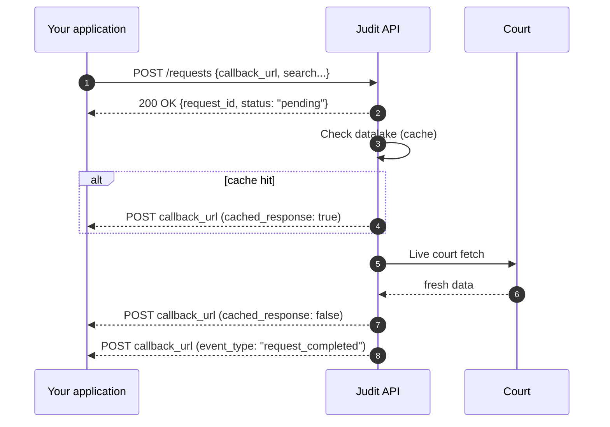

import CachedResponseInfo from '/snippets/cached-response-en.mdx';

export const WebhookAnimation = () => (
  <iframe sandbox="allow-scripts" scrolling="no" style={{width:'100%',height:'540px',border:'none',borderRadius:'12px',display:'block',margin:'20px 0'}} srcDoc={`<!doctype html><html><head><meta charset="utf-8"><style>*{margin:0;padding:0;box-sizing:border-box}html,body{width:100%;height:100%;overflow:hidden;background:#090c0d}canvas{display:block;width:100%;height:100%}</style></head><body><canvas id="c"></canvas><script>(function(){
var A='#4FD1C5',J='#1FC16B',T='#E0A82E',AM='#F6AD55',M='#7A8599';
var BG='#090c0d',TXT='#e5e7eb',NF='#111827',PT='#0a1020';
var TOTAL=53.0;
var XP={app:0.13,judit:0.50,court:0.87};
var NW=88,NH=42;
var FLOWS=[
  {id:'cache',title:'① With cached history',sub:'datalake delivered immediately, court updates next — minimum 3 webhooks',col:AM,ts:1,te:12,act:['app','judit','court'],steps:[
    {fr:'app',to:'judit',label:'POST /requests',note:'{callback_url, search...}',col:A,ts:1.2,te:2.0,yp:0.30},
    {fr:'judit',to:'app',label:'200 {request_id}',note:'status: pending',col:AM,ts:2.5,te:3.3,yp:0.41},
    {fr:'judit',to:'app',label:'webhook #1',note:'cached_response: true',col:AM,ts:3.8,te:4.6,yp:0.52},
    {fr:'judit',to:'court',label:'court extraction',note:'waiting for fresh data',col:T,ts:5.1,te:5.9,yp:0.62},
    {fr:'court',to:'judit',label:'updated data',note:'',col:J,ts:6.4,te:7.2,yp:0.72},
    {fr:'judit',to:'app',label:'webhook #2',note:'cached_response: false',col:J,ts:7.7,te:8.5,yp:0.82},
    {fr:'judit',to:'app',label:'webhook #3',note:'event_type: request_completed',col:J,ts:9.0,te:9.8,yp:0.92}]},
  {id:'nocache',title:'② No cache — on-demand',sub:'data not indexed or on_demand:true — no cache event — 2 webhooks',col:A,ts:15,te:25,act:['app','judit','court'],steps:[
    {fr:'app',to:'judit',label:'POST /requests',note:'{callback_url, on_demand:true}',col:A,ts:15.2,te:16.0,yp:0.32},
    {fr:'judit',to:'app',label:'200 {request_id}',note:'status: pending',col:AM,ts:16.5,te:17.3,yp:0.45},
    {fr:'judit',to:'court',label:'court extraction',note:'real-time fetch',col:T,ts:17.8,te:18.6,yp:0.58},
    {fr:'court',to:'judit',label:'fresh data',note:'',col:J,ts:19.1,te:19.9,yp:0.70},
    {fr:'judit',to:'app',label:'webhook #1',note:'cached_response: false',col:J,ts:20.4,te:21.2,yp:0.82},
    {fr:'judit',to:'app',label:'webhook #2',note:'event_type: request_completed',col:J,ts:21.7,te:22.5,yp:0.92}]},
  {id:'monitor',title:'③ Monitoring — New Actions',sub:'2 cases detected → 1 webhook per case + request_completed',col:J,ts:28,te:39,act:['app','judit','court'],steps:[
    {fr:'judit',to:'court',label:'checks new actions',note:'automatic polling',col:T,ts:28.5,te:29.3,yp:0.30},
    {fr:'court',to:'judit',label:'2 cases with new action',note:'new movements detected',col:J,ts:29.8,te:30.6,yp:0.43},
    {fr:'judit',to:'app',label:'webhook #1',note:'case A — new action',col:J,ts:31.1,te:31.9,yp:0.56},
    {fr:'judit',to:'app',label:'webhook #2',note:'case B — new action',col:J,ts:32.4,te:33.2,yp:0.69},
    {fr:'judit',to:'app',label:'webhook #3',note:'event_type: request_completed',col:J,ts:33.7,te:34.5,yp:0.82}]},
  {id:'procmon',title:'④ Lawsuit Monitoring',sub:'monitors specific CNJ — minimum 2 webhooks per movement detected',col:T,ts:42,te:52,act:['app','judit','court'],steps:[
    {fr:'judit',to:'court',label:'checks lawsuit',note:'monitoring specific CNJ',col:T,ts:42.5,te:43.3,yp:0.38},
    {fr:'court',to:'judit',label:'new movement',note:'updated proceedings',col:J,ts:43.8,te:44.6,yp:0.52},
    {fr:'judit',to:'app',label:'webhook #1',note:'cover + full movements',col:J,ts:45.1,te:45.9,yp:0.66},
    {fr:'judit',to:'app',label:'webhook #2',note:'event_type: request_completed',col:J,ts:46.4,te:47.2,yp:0.80}]}
];
var NODES=[{id:'app',label:'Your App',col:A},{id:'judit',label:'Judit API',col:J},{id:'court',label:'Court',col:T}];
var cv=document.getElementById('c');
function setup(){var dpr=Math.min(window.devicePixelRatio||1,2),r=cv.getBoundingClientRect(),W=r.width||window.innerWidth,H=r.height||window.innerHeight;cv.width=Math.max(1,W*dpr);cv.height=Math.max(1,H*dpr);var ctx=cv.getContext('2d');ctx.setTransform(dpr,0,0,dpr,0,0);return{ctx:ctx,w:W,h:H};}
function ease(t){return t<0.5?2*t*t:1-Math.pow(-2*t+2,2)/2;}
function rr(ctx,x,y,w,h,r){ctx.beginPath();ctx.moveTo(x+r,y);ctx.arcTo(x+w,y,x+w,y+h,r);ctx.arcTo(x+w,y+h,x,y+h,r);ctx.arcTo(x,y+h,x,y,r);ctx.arcTo(x,y,x+w,y,r);ctx.closePath();}
function gx(n,w){return n==='app'?w*XP.app:n==='judit'?w*XP.judit:w*XP.court;}
function eg(fr,to,w){var fx=gx(fr,w),tx=gx(to,w),d=tx>fx?1:-1;return{x1:fx+d*NW/2,x2:tx-d*NW/2,d:d};}
function dPkt(ctx,x,y,lbl,col){var pw=Math.max(36,lbl.length*6+14),ph=20;ctx.save();ctx.shadowColor=col;ctx.shadowBlur=18;rr(ctx,x-pw/2,y-ph/2,pw,ph,5);ctx.fillStyle=col;ctx.fill();ctx.shadowBlur=0;ctx.fillStyle=PT;ctx.font='bold 9px monospace';ctx.textAlign='center';ctx.textBaseline='middle';ctx.fillText(lbl,x,y+0.5);ctx.restore();}
function draw(ctx,w,h,t){
  var ct=t%TOTAL;
  ctx.fillStyle=BG;ctx.fillRect(0,0,w,h);
  var fl=null;for(var i=0;i<FLOWS.length;i++){if(ct>=FLOWS[i].ts&&ct<FLOWS[i].te){fl=FLOWS[i];break;}}
  var nodeY=h*0.19;
  for(var i=0;i<NODES.length;i++){var n=NODES[i],lx=gx(n.id,w);ctx.save();ctx.strokeStyle=n.col;ctx.globalAlpha=0.35;ctx.lineWidth=1;ctx.setLineDash([4,7]);ctx.beginPath();ctx.moveTo(lx,nodeY+NH/2);ctx.lineTo(lx,h*0.96);ctx.stroke();ctx.restore();}
  if(fl){ctx.save();ctx.fillStyle=fl.col;ctx.font='bold 13px Inter,system-ui,sans-serif';ctx.textAlign='center';ctx.textBaseline='middle';ctx.fillText(fl.title,w/2,h*0.055);ctx.fillStyle=M;ctx.font='10px Inter,system-ui,sans-serif';ctx.fillText(fl.sub,w/2,h*0.118);ctx.restore();}
  if(fl){for(var si=0;si<fl.steps.length;si++){var s=fl.steps[si],sy=h*s.yp,e=eg(s.fr,s.to,w),x1=e.x1,x2=e.x2,d=e.d,clx=(x1+x2)/2;var state=ct<s.ts?'pre':ct>s.te?'done':'live',alpha=state==='pre'?0.10:state==='done'?0.55:1.0;ctx.save();ctx.globalAlpha=alpha;ctx.strokeStyle=s.col;ctx.lineWidth=1.5;ctx.setLineDash([]);ctx.beginPath();ctx.moveTo(x1,sy);ctx.lineTo(x2,sy);ctx.stroke();ctx.fillStyle=s.col;ctx.beginPath();ctx.moveTo(x2,sy);ctx.lineTo(x2-d*7,sy-4);ctx.lineTo(x2-d*7,sy+4);ctx.closePath();ctx.fill();ctx.fillStyle=TXT;ctx.font='bold 10px monospace';ctx.textAlign='center';ctx.textBaseline='bottom';ctx.fillText(s.label,clx,sy-4);if(s.note){ctx.fillStyle=M;ctx.font='9px monospace';ctx.fillText(s.note,clx,sy-16);}ctx.restore();if(state==='live'){var p=ease((ct-s.ts)/(s.te-s.ts));dPkt(ctx,x1+(x2-x1)*p,sy+14,s.label,s.col);}}}
  for(var i=0;i<NODES.length;i++){var nd=NODES[i],px=gx(nd.id,w);ctx.save();ctx.shadowColor=nd.col;ctx.shadowBlur=14;rr(ctx,px-NW/2,nodeY-NH/2,NW,NH,8);ctx.fillStyle=NF;ctx.fill();ctx.shadowBlur=0;ctx.strokeStyle=nd.col;ctx.lineWidth=1.8;ctx.stroke();ctx.fillStyle=nd.col;ctx.font='bold 11px Inter,system-ui,sans-serif';ctx.textAlign='center';ctx.textBaseline='middle';ctx.fillText(nd.label,px,nodeY);ctx.restore();}
  for(var f=0;f<FLOWS.length;f++){var ia=fl&&fl.id===FLOWS[f].id;ctx.save();ctx.beginPath();ctx.arc(w/2+(f-1.5)*24,h*0.962,ia?5:3,0,Math.PI*2);ctx.fillStyle=ia?FLOWS[f].col:'rgba(255,255,255,0.18)';ctx.fill();ctx.restore();}
}
var dim,t0;
function loop(){var t=(performance.now()-t0)/1000;draw(dim.ctx,dim.w,dim.h,t);requestAnimationFrame(loop);}
window.addEventListener('load',function(){dim=setup();t0=performance.now();loop();});
window.addEventListener('resize',function(){dim=setup();});
cv.addEventListener('click',function(e){var r=cv.getBoundingClientRect(),cx=e.clientX-r.left,cy=e.clientY-r.top;for(var f=0;f<FLOWS.length;f++){var dx=cx-(dim.w/2+(f-(FLOWS.length-1)/2)*24),dy=cy-dim.h*0.962;if(dx*dx+dy*dy<=144){t0=performance.now()-FLOWS[f].ts*1000;break;}}});
cv.addEventListener('mousemove',function(e){var r=cv.getBoundingClientRect(),cx=e.clientX-r.left,cy=e.clientY-r.top,over=false;for(var f=0;f<FLOWS.length;f++){var dx=cx-(dim.w/2+(f-(FLOWS.length-1)/2)*24),dy=cy-dim.h*0.962;if(dx*dx+dy*dy<=144){over=true;break;}}cv.style.cursor=over?'pointer':'default';});
})()</script></body></html>`} />
);

<CachedResponseInfo />

**Webhooks** push your query and tracking results in real time: no polling required. As soon as Judit finishes processing a request, we `POST` the response object to your configured URL. It's the most efficient and cheapest way to integrate asynchronous flows.

> 🤖 Delivery pattern: HTTP POST with `application/json`. Use a public HTTPS URL. Implement idempotency based on `request_id` + `cached_response`. On 5xx or timeout, we retry with backoff.

## When to use

<CardGroup cols={2}>
  <Card title="Async at scale" icon="bolt">
    For high volumes (hundreds/thousands of requests), webhooks eliminate polling and dramatically reduce your quota usage.
  </Card>
  <Card title="Tracking notifications" icon="bell">
    Get notified the moment a tracker detects a new step or a new lawsuit is born.
  </Card>
  <Card title="Internal-system integration" icon="diagram-project">
    Queue → handler → ERP/CRM/BI: event-driven pattern without polling Judit.
  </Card>
  <Card title="Cache vs. update identification" icon="layer-group">
    Use `cached_response` to distinguish the initial (cache) response from the later (court-fresh) one.
  </Card>
</CardGroup>

## How it works

<WebhookAnimation />



For each event we `POST` HTTPS to your URL with `application/json`. **Delivery is incremental** — you may receive several responses for the same `request_id` before the `request_completed` event signals the end of the flow.

## Configuring your webhook

There are **two ways** to receive callbacks:

<CardGroup cols={2}>
  <Card title="1. Account-wide (recommended)" icon="building">
    Register a single URL that receives **every** callback (queries + tracking). Request via [Support](https://api.whatsapp.com/send/?phone=5511920501949) — takes minutes.
  </Card>
  <Card title="2. Per-request" icon="bullseye">
    Add `callback_url` in the request payload. Useful for dynamic routing (e.g. webhook per environment or per end-customer).
  </Card>
</CardGroup>

<CodeGroup>
```json Request with callback_url
{
    "search": {
        "search_type": "lawsuit_cnj",
        "search_key": "9999999-99.9999.9.99.9999"
    },
    "callback_url": "https://api.yourdomain.com/webhooks/judit",
    "with_attachments": true
}
```

```bash cURL
curl -X POST "https://requests.production.judit.io/requests" \
  -H "api-key: $JUDIT_API_KEY" \
  -H "Content-Type: application/json" \
  -d '{
    "search": { "search_type": "lawsuit_cnj", "search_key": "9999999-99.9999.9.99.9999" },
    "callback_url": "https://api.yourdomain.com/webhooks/judit",
    "with_attachments": true
  }'
```

```javascript Node.js
await fetch("https://requests.production.judit.io/requests", {
  method: "POST",
  headers: {
    "api-key": process.env.JUDIT_API_KEY,
    "Content-Type": "application/json",
  },
  body: JSON.stringify({
    search: { search_type: "lawsuit_cnj", search_key: "9999999-99.9999.9.99.9999" },
    callback_url: "https://api.yourdomain.com/webhooks/judit",
    with_attachments: true,
  }),
});
```
</CodeGroup>

<Note>
The `with_attachments` parameter applies **only to lawsuit queries** (`search_type: "lawsuit_cnj"`).
</Note>

## Events delivered

| `event_type` | Fires when | Payload |
| --- | --- | --- |
| `response_created` | Every time a new `response_data` is generated for the request (cache or court) | `lawsuit`, `entity`, `warrant` or `execution` object |
| `request_completed` | End of the request flow (all courts responded) | Final `request` object with `status: "completed"` |
| `tracking_response` | Fired by trackers (each new movement detected) | Same shape as `response_created`, but via `tracking_id` |

Every payload uses a standard envelope:

```json
{
  "user_id": "ab829a35-894b-4fbd-9168-2398fd69cecc",
  "callback_id": "d5dcbbd6-a9cc-4eef-b1d1-d58a59c4631b",
  "event_type": "response_created",
  "reference_type": "request",
  "reference_id": "ec545a1e-c0ac-47cf-a3df-3668f1bdde11",
  "payload": { /* event-specific object */ }
}
```

- `callback_id` — unique delivery id (use for idempotency).
- `reference_id` — the `request_id` or `tracking_id` that originated the event.
- `payload` — content (lawsuit, registration data, etc.).

## `cached_response`: reading the two deliveries

Most requests produce **two deliveries** in sequence: one from cache, one from the live court. Use `cached_response` to identify.

| Sequence | `event_type` | `cached_response` | Meaning |
| --- | --- | --- | --- |
| 1 | `response_created` | `true` | Came from Judit's datalake (fast initial response). |
| 2 | `response_created` | `false` | Live fetch from the court. **Always the definitive version when present.** |
| 3 | `request_completed` | — | All courts responded. Your app can close the loop. |

> ⚠️ For lawsuits recently refreshed (within `cache_ttl_in_days`), you may receive **only** the `cached_response: true` delivery — no live fetch happens because the cache is still valid.

## Best practices (production-grade)

<AccordionGroup>
  <Accordion title="✅ Idempotency" icon="repeat">
    Use `callback_id` as the idempotency key: drop duplicates based on it. On retries, the same `callback_id` is redelivered.
  </Accordion>
  <Accordion title="✅ Reply fast (HTTP 2xx)" icon="bolt">
    Reply `200 OK` in **less than 10 seconds**. Process asynchronously (queue/worker). Slow responses count as failure and trigger retry.
  </Accordion>
  <Accordion title="✅ Persist the event before processing" icon="database">
    Production pattern: write the raw event into a queue/log and process later. Avoids loss on application errors.
  </Accordion>
  <Accordion title="✅ Treat `cached_response: true` as provisional" icon="layer-group">
    Always treat the `cached_response: false` delivery (when it exists) as the final version. Your UI/reports should reflect the latest value.
  </Accordion>
  <Accordion title="✅ Validate source (HTTPS + IP allowlist)" icon="shield-halved">
    Accept `POST` only from Judit IPs (ask support for the list). Always HTTPS. In regulated environments also validate the `User-Agent` header.
  </Accordion>
  <Accordion title="✅ Implement tolerant retry" icon="rotate">
    On 5xx or timeout we retry with exponential backoff. If your URL stays down for too long, events are lost — keep the endpoint stable.
  </Accordion>
</AccordionGroup>

## Webhook receiver (Node.js example)

```javascript
import express from "express";
const app = express();
app.use(express.json());

const seen = new Set();
const lastByRequest = new Map();

app.post("/webhooks/judit", async (req, res) => {
  const { callback_id, event_type, reference_id, payload } = req.body;

  // 1. Idempotency
  if (seen.has(callback_id)) return res.sendStatus(200);
  seen.add(callback_id);

  // 2. Reply quickly — process async
  res.sendStatus(200);

  // 3. Logic
  if (event_type === "response_created") {
    const cached = !!payload?.tags?.cached_response || payload?.cached_response;
    if (!cached || !lastByRequest.has(reference_id)) {
      lastByRequest.set(reference_id, payload);
      await persistResponse(payload);
    }
  }
  if (event_type === "request_completed") {
    await markRequestDone(reference_id);
  }
});

app.listen(3000);
```

```python Python (FastAPI)
from fastapi import FastAPI, Request
app = FastAPI()
seen = set()

@app.post("/webhooks/judit")
async def judit(req: Request):
    body = await req.json()
    cb_id = body.get("callback_id")
    if cb_id in seen:
        return {"ok": True}
    seen.add(cb_id)

    if body["event_type"] == "response_created":
        # Persist preferring cached_response: false
        ...
    return {"ok": True}
```

## Webhook delivery request
When a search or tracking is performed through the JUDIT API, we send back a response with the information found. To ensure that all responses are delivered to a single webhook, registration must be done by contacting our [Support](https://api.whatsapp.com/send/?phone=5511920501949). Alternatively, the webhook can also be specified by adding the <strong>callback_url</strong> parameter to the request payload, as shown in the example below:

```json
{
    "search": {
        "search_type": "lawsuit_cnj",
        "search_key": "9999999-99.9999.9.99.9999"
    },
    "callback_url": "https://webhook.site/b0ac6522-5bfc-42fa-bebf-a8c2b5ec0999",
    "with_attachments": true
}
```

<Note>
    The <strong>"with_attachments"</strong> parameter should only be used for lawsuit queries, that is, when the <strong>"search_type"</strong> field is set to <strong>"lawsuit_cnj"</strong>.
 </Note>

 ## Response delivery

We send a POST request to the webhook, delivering responses based on your search results. Delivery happens incrementally, as responses are generated, and is completed when the request status is updated to **"completed"**.

<Warning>
  It is possible for the webhook to receive two responses with similar content. This happens because, initially, a cached response may be sent (`cached_response: true`). Later, a new complete response is generated and sent with `cached_response: false`, containing all available information.

  This difference is indicated by the `cached_response` field:

- `true` → the response came from our database.

- `false` → the response was obtained by the crawler directly from the court.
</Warning>

<Note>

⚠️ In some cases, the `cached_response` field may be `true` and still be the only response sent. This happens when the lawsuit query was performed recently, making a new capture from the court unnecessary.
</Note>

### Response for historical query:


Example response with `cached_response: true`:

<Accordion title="See response example">
```json
{
    "user_id": "ab829a35-894b-4fbd-9168-2398fd69cecc",
    "callback_id": "d5dcbbd6-a9cc-4eef-b1d1-d58a59c4631b",
    "event_type": "response_created",
    "reference_type": "request",
    "reference_id": "ec545a1e-c0ac-47cf-a3df-3668f1bdde11",
    "payload": {
        "request_id": "ec545a1e-c0ac-47cf-a3df-3668f1bdde11",
        "response_id": "2db448e0-7b9d-4e6b-a2d7-9c0adcff9b77",
        "response_type": "lawsuit",
        "response_data": {
            "code": "9999999-99.9999.9.99.9999",
            "instance": 1,
            "name": "Usuário teste 1 X Usuário teste 2",
            "free_justice": true,
            "secrecy_level": 0,
            "courts": [
                {
                    "code": "7846",
                    "name": "BANGU REGIONAL 2 VARA CIVEL"
                }
            ],
            "tribunal_acronym": "TJRJ",
            "county": "CAPITAL CENTRAL DE ARQUIVAMENTO DO NUR 1",
            "state": "RJ",
            "city": "RIO DE JANEIRO",
            "distribution_date": "2022-01-13T13:06:46.799Z",
            "last_step": {
                "step_id": "27572cb5",
                "step_date": "2025-06-29T20:07:53.000Z",
                "content": "Remetidos os Autos (cumpridos) para 2ª Vara Cível da Regional de Bangu",
                "steps_count": 19
            },
            "tags": {
                "crawl_id": "eb2d2f65-69c0-43bd-b75a-ad9d9a787447",
                "dictionary_updated_at": "2025-08-06T13:48:47.823Z",
                "possible_homonym": true,
                "datalake_id": "08004925520228190204",
                "datalake_segment": "JUSTICA_ESTADUAL"
            },
            "justice": "8",
            "tribunal": "19",
            "crawler": {
                "source_name": "JPje - RJ - Lawsuit - Auth - 1 instance",
                "crawl_id": "eb2d2f65-69c0-43bd-b75a-ad9d9a787447",
                "updated_at": "2025-07-01T15:42:55.700Z",
                "weight": 10
            },
            "area": "DIREITO CIVIL",
            "justice_description": "JUSTIÇA ESTADUAL",
            "created_at": "2024-09-25T04:13:06.923Z",
            "updated_at": "2025-08-04T15:27:19.032Z",
            "amount": 11617.01,
            "classifications": [
                {
                    "code": "7",
                    "name": "PROCEDIMENTO COMUM CÍVEL"
                }
            ],
            "subjects": [
                {
                    "code": "10671",
                    "name": "OBRIGAÇÃO DE FAZER / NÃO FAZER"
                },
                {
                    "code": "6007",
                    "name": "REPETIÇÃO DE INDÉBITO"
                },
                {
                    "code": "10441",
                    "name": "ACIDENTE DE TRÂNSITO"
                },
                {
                    "code": "14",
                    "name": "DIREITO TRIBUTÁRIO"
                },
                {
                    "code": "5986",
                    "name": "CRÉDITO TRIBUTÁRIO"
                },
                {
                    "code": "899",
                    "name": "DIREITO CIVIL"
                },
                {
                    "code": "10431",
                    "name": "RESPONSABILIDADE CIVIL"
                },
                {
                    "code": "10439",
                    "name": "INDENIZAÇÃO POR DANO MATERIAL"
                },
                {
                    "code": "8826",
                    "name": "DIREITO PROCESSUAL CIVIL E DO TRABALHO"
                },
                {
                    "code": "9148",
                    "name": "LIQUIDAÇÃO / CUMPRIMENTO / EXECUÇÃO"
                },
                {
                    "code": "",
                    "name": "INDENIZAÇÃO POR DANO MORAL"
                }
            ],
            "parties": [
                {
                    "main_document": "99999999999",
                    "name": "Usuário teste 1",
                    "side": "Active",
                    "person_type": "Autor",
                    "documents": [
                        {
                            "document": "99999999999",
                            "document_type": "cpf"
                        }
                    ],
                    "lawyers": [
                        {
                            "name": "Usuário teste 2",
                            "documents": []
                        }
                    ]
                },
                {
                    "main_document": "99999999999",
                    "name": "Usuário teste 2",
                    "side": "Passive",
                    "person_type": "RÉU",
                    "documents": [
                        {
                            "document": "99999999999",
                            "document_type": "cnpj"
                        }
                    ],
                    "lawyers": [
                        {
                            "name": "Usuário teste 3 - (99999999999)",
                            "documents": []
                        }
                    ]
                },
                {
                    "name": "Usuário teste 2",
                    "side": "Active",
                    "person_type": "Advogado",
                    "documents": [],
                    "lawyers": []
                },
                {
                    "name": "Usuário teste 3 - (99999999999)",
                    "side": "Passive",
                    "person_type": "Advogado",
                    "documents": [],
                    "lawyers": []
                }
            ],
            "attachments": [],
            "related_lawsuits": [],
            "steps": []
        },
        "user_id": "ab829a35-894b-4fbd-9168-2398fd69cecc",
        "created_at": "2025-08-06T13:48:47.824Z",
        "request_created_at": "2025-08-06T13:48:46.910Z",
        "is_scrapper_info": false,
        "tags": {
            "dashboard_id": null,
            "cached_response": true
        },
        "origin": "api",
        "origin_id": "ec545a1e-c0ac-47cf-a3df-3668f1bdde11"
    }
}
```
</Accordion>

Example response with `cached_response: false`:

<Accordion title="See response example">
```json
{
    "user_id": "ab829a35-894b-4fbd-9168-2398fd69cecc",
    "callback_id": "3be957e0-876f-4d36-b98b-d60ad63a0e1c",
    "event_type": "response_created",
    "reference_type": "request",
    "reference_id": "ec545a1e-c0ac-47cf-a3df-3668f1bdde11",
    "payload": {
        "request_id": "ec545a1e-c0ac-47cf-a3df-3668f1bdde11",
        "response_id": "aab3ba92-da01-461b-9d88-b3fc610b8b99",
        "response_type": "lawsuit",
        "response_data": {
            "code": "9999999-99.9999.9.99",
            "instance": 1,
            "name": "Uusuário teste 1 X Usuário teste 2",
            "free_justice": false,
            "secrecy_level": 0,
            "courts": [
                {
                    "code": "7838",
                    "name": "BANGU REGIONAL 1 VARA CIVEL"
                },
                {
                    "name": "1ª Vara Cível da Regional de Bangu",
                    "date": "2022-11-14T00:00:00.000Z"
                }
            ],
            "tribunal_acronym": "TJRJ",
            "county": "CAPITAL CENTRAL DE ARQUIVAMENTO DO NUR 1",
            "state": "RJ",
            "city": "RIO DE JANEIRO",
            "judge": "Juiz de Direito",
            "distribution_date": "2022-11-14T20:58:19.530Z",
            "last_step": {
                "step_id": "5d89299a",
                "step_date": "2023-07-04T09:44:00.000Z",
                "content": "Baixa Definitiva",
                "steps_count": 26
            },
            "tags": {
                "crawl_id": "f8639963-31af-4d0c-be0d-502db2d222cc",
                "dictionary_updated_at": "2025-08-06T13:48:47.822Z",
                "possible_homonym": true,
                "datalake_id": "08246793020228190204",
                "datalake_segment": "JUSTICA_ESTADUAL"
            },
            "justice": "8",
            "tribunal": "19",
            "crawler": {
                "source_name": "JPje - RJ - Lawsuit - Auth - 1 instance",
                "crawl_id": "f8639963-31af-4d0c-be0d-502db2d222cc",
                "updated_at": "2025-07-29T18:36:21.461Z",
                "weight": 10
            },
            "area": "DIREITO DO CONSUMIDOR",
            "justice_description": "JUSTIÇA ESTADUAL",
            "created_at": "2024-09-25T05:29:22.270Z",
            "updated_at": "2025-08-04T15:27:19.298Z",
            "amount": 9614.9,
            "classifications": [
                {
                    "code": "7",
                    "name": "PROCEDIMENTO COMUM CÍVEL"
                }
            ],
            "subjects": [
                {
                    "code": "7760",
                    "name": "FORNECIMENTO DE ENERGIA ELÉTRICA"
                },
                {
                    "code": "7780",
                    "name": "INDENIZAÇÃO POR DANO MATERIAL"
                },
                {
                    "code": "6226",
                    "name": "INCLUSÃO INDEVIDA EM CADASTRO DE INADIMPLENTES"
                },
                {
                    "code": "1156",
                    "name": "DIREITO DO CONSUMIDOR"
                },
                {
                    "code": "6220",
                    "name": "RESPONSABILIDADE DO FORNECEDOR"
                },
                {
                    "code": "7779",
                    "name": "INDENIZAÇÃO POR DANO MORAL"
                },
                {
                    "code": "7771",
                    "name": "CONTRATOS DE CONSUMO"
                }
            ],
            "parties": [
                {
                    "main_document": "99999999999",
                    "name": "Usuário teste 2",
                    "side": "Passive",
                    "person_type": "RÉU",
                    "documents": [
                        {
                            "document": "99999999999",
                            "document_type": "cnpj"
                        }
                    ],
                    "lawyers": [
                        {
                            "main_document": "99999999999",
                            "name": "Usuário teste 2",
                            "documents": [
                                {
                                    "document": "99999999999",
                                    "document_type": "cpf"
                                },
                                {
                                    "document": "999999",
                                    "document_type": "oab"
                                }
                            ]
                        },
                        {
                            "main_document": "99999999999",
                            "name": "Usuário teste 3",
                            "documents": [
                                {
                                    "document": "99999999999",
                                    "document_type": "cpf"
                                },
                                {
                                    "document": "9999999",
                                    "document_type": "oab"
                                }
                            ]
                        },
                        {
                            "main_document": "99999999999",
                            "name": "usuário teste 4",
                            "documents": [
                                {
                                    "document": "99999999999",
                                    "document_type": "cpf"
                                },
                                {
                                    "document": "9999999",
                                    "document_type": "oab"
                                }
                            ]
                        }
                    ]
                },
                {
                    "main_document": "99999999999",
                    "name": "Usuário teste 2",
                    "side": "Passive",
                    "person_type": "Advogado",
                    "documents": [
                        {
                            "document": "99999999999",
                            "document_type": "cpf"
                        },
                        {
                            "document": "99999999",
                            "document_type": "oab"
                        },
                        {
                            "document": "9999999",
                            "document_type": "oab"
                        }
                    ],
                    "lawyers": []
                },
                {
                    "main_document": "99999999999",
                    "name": "Usuário teste 3",
                    "side": "Passive",
                    "person_type": "Advogado",
                    "documents": [
                        {
                            "document": "99999999999",
                            "document_type": "cpf"
                        },
                        {
                            "document": "RJ0145264",
                            "document_type": "oab"
                        },
                        {
                            "document": "99999999",
                            "document_type": "oab"
                        }
                    ],
                    "lawyers": []
                },
                {
                    "main_document": "99999999999",
                    "name": "usuário teste 4",
                    "side": "Passive",
                    "person_type": "Advogado",
                    "documents": [
                        {
                            "document": "99999999999",
                            "document_type": "cpf"
                        },
                        {
                            "document": "RJ000000",
                            "document_type": "oab"
                        },
                        {
                            "document": "99999999",
                            "document_type": "oab"
                        }
                    ],
                    "lawyers": []
                },
                {
                    "main_document": "99999999999",
                    "name": "Uusuário teste 1",
                    "side": "Active",
                    "person_type": "Autor",
                    "documents": [
                        {
                            "document": "99999999999",
                            "document_type": "cpf"
                        }
                    ],
                    "lawyers": [
                        {
                            "main_document": "99999999999",
                            "name": "Usuário teste5",
                            "documents": [
                                {
                                    "document": "99999999999",
                                    "document_type": "cpf"
                                },
                                {
                                    "document": "999999RJ",
                                    "document_type": "oab"
                                }
                            ]
                        }
                    ]
                }
            ],
            "attachments": [],
            "related_lawsuits": [],
            "steps": []
        },
        "user_id": "ab829a35-894b-4fbd-9168-2398fd69cecc",
        "created_at": "2025-08-06T13:48:47.824Z",
        "request_created_at": "2025-08-06T13:48:46.910Z",
        "is_scrapper_info": false,
        "tags": {
            "dashboard_id": null,
            "cached_response": false
        },
        "origin": "api",
        "origin_id": "ec545a1e-c0ac-47cf-a3df-3668f1bdde11"
    }
}
```
</Accordion>

### Response for lawsuit query:


Example response with `cached_response: true`:

<Accordion title="See response example">
```json
{
  "user_id": "7f8065a3-4891-428d-9456-dedfc12ff850",
  "callback_id": "1a1700da-531b-4b50-ab38-2855a2525929",
  "event_type": "response_created",
  "reference_type": "request",
  "reference_id": "949f0d48-022b-496c-a9a9-97a80c3f8044",
  "payload": {
    "request_id": "949f0d48-022b-496c-a9a9-97a80c3f8044",
    "response_id": "752c4e7d-b0b0-435f-a27f-56bed8e559c7",
    "response_type": "lawsuit",
    "response_data": {
      "code": "9999999-99.9999.9.99.9999",
      "instance": 1,
      "name": "Usuário teste 1 X Usuário teste 2",
      "free_justice": true,
      "secrecy_level": 0,
      "courts": [
        {
          "code": "7846",
          "name": "BANGU REGIONAL 2 VARA CIVEL"
        }
      ],
      "tribunal_acronym": "TJRJ",
      "county": "CAPITAL CENTRAL DE ARQUIVAMENTO DO NUR 1",
      "state": "RJ",
      "city": "RIO DE JANEIRO",
      "distribution_date": "2022-01-13T00:00:00.000Z",
      "last_step": {
        "step_id": "27572cb5",
        "step_date": "2025-06-29T20:07:53.000Z",
        "content": "Remetidos os Autos (cumpridos) para 2ª Vara Cível da Regional de Bangu",
        "steps_count": 19
      },
      "tags": {
        "crawl_id": "5bfc2f70-3142-4b79-b306-f4d9a70cc88e",
        "dictionary_updated_at": "2025-08-13T13:27:19.460Z",
        "possible_homonym": true,
        "datalake_id": "08004925520228190204",
        "datalake_segment": "JUSTICA_ESTADUAL"
      },
      "justice": "8",
      "tribunal": "19",
      "crawler": {
        "source_name": "JPje - RJ - Lawsuit - Auth - 1 instance",
        "crawl_id": "5bfc2f70-3142-4b79-b306-f4d9a70cc88e",
        "updated_at": "2025-08-13T13:26:20.073Z",
        "weight": 10
      },
      "status": "Finalizado",
      "phase": "Arquivado",
      "area": "DIREITO CIVIL",
      "justice_description": "JUSTIÇA ESTADUAL",
      "created_at": "2024-09-25T04:13:06.923Z",
      "updated_at": "2025-08-13T13:26:23.583Z",
      "amount": 11617.01,
      "classifications": [
        {
          "code": "7",
          "name": "PROCEDIMENTO COMUM CÍVEL"
        }
      ],
      "subjects": [
        {
          "code": "14",
          "name": "DIREITO TRIBUTÁRIO"
        },
        {
          "code": "5986",
          "name": "CRÉDITO TRIBUTÁRIO"
        },
        {
          "code": "899",
          "name": "DIREITO CIVIL"
        },
        {
          "code": "10431",
          "name": "RESPONSABILIDADE CIVIL"
        },
        {
          "code": "10439",
          "name": "INDENIZAÇÃO POR DANO MATERIAL"
        },
        {
          "code": "8826",
          "name": "DIREITO PROCESSUAL CIVIL E DO TRABALHO"
        },
        {
          "code": "9148",
          "name": "LIQUIDAÇÃO / CUMPRIMENTO / EXECUÇÃO"
        },
        {
          "code": "10671",
          "name": "OBRIGAÇÃO DE FAZER / NÃO FAZER"
        },
        {
          "code": "6007",
          "name": "REPETIÇÃO DE INDÉBITO"
        },
        {
          "code": "10441",
          "name": "ACIDENTE DE TRÂNSITO"
        },
        {
          "code": "",
          "name": "INDENIZAÇÃO POR DANO MORAL"
        }
      ],
      "parties": [
        {
          "main_document": "99999999999",
          "name": "Usuário teste 1",
          "side": "Active",
          "person_type": "Autor",
          "documents": [
            {
              "document": "99999999999",
              "document_type": "cpf"
            }
          ],
          "lawyers": [
            {
              "name": "Usuário teste 3",
              "documents": []
            }
          ]
        },
        {
          "main_document": "99999999999",
          "name": "Usuário teste 2",
          "side": "Passive",
          "person_type": "RÉU",
          "documents": [
            {
              "document": "99999999999",
              "document_type": "cnpj"
            }
          ],
          "lawyers": [
            {
              "name": "Usuário teste 2 - (99999999999)",
              "documents": []
            }
          ]
        },
        {
          "name": "Usuário teste 3",
          "side": "Active",
          "person_type": "Advogado",
          "documents": [],
          "lawyers": []
        },
        {
          "name": "Usuário teste 2 - (99999999999)",
          "side": "Passive",
          "person_type": "Advogado",
          "documents": [],
          "lawyers": []
        }
      ],
      "attachments": [
        {
          "attachment_id": "201273181",
          "attachment_name": "Certidão de Débito (Certidão de Débito)",
          "extension": "html",
          "tags": {
            "crawl_id": "7ce9007d-98d2-4ea6-b729-ca1f3bc77d2f"
          },
          "status": "done",
          "attachment_date": null
        },
        {
          "attachment_id": "16345831",
          "attachment_name": "Sentença (Sentença)",
          "extension": "html",
          "tags": {
            "crawl_id": "c53921e7-7c6e-4bbc-b816-64aee561cf8c"
          },
          "status": "done",
          "attachment_date": "2022-04-08T14:04:57.000Z"
        },
        {
          "attachment_id": "13084368",
          "attachment_name": "Contestação (Contestação)",
          "extension": "html",
          "tags": {
            "crawl_id": "c53921e7-7c6e-4bbc-b816-64aee561cf8c"
          },
          "status": "done",
          "attachment_date": "2022-02-15T15:52:41.000Z"
        },
        {
          "attachment_id": "11529202",
          "attachment_name": "Decisão (Decisão)",
          "extension": "html",
          "tags": {
            "crawl_id": "c53921e7-7c6e-4bbc-b816-64aee561cf8c"
          },
          "status": "done",
          "attachment_date": "2022-01-19T19:17:51.000Z"
        }
      ],
      "related_lawsuits": [],
      "steps": [
        {
          "lawsuit_cnj": "9999999-99.9999.9.99.9999",
          "lawsuit_instance": 1,
          "step_id": "27572cb5",
          "step_date": "2025-06-29T20:07:53.000Z",
          "content": "Remetidos os Autos (cumpridos) para 2ª Vara Cível da Regional de Bangu",
          "private": false,
          "created_at": "2025-08-13T13:26:23.096Z",
          "updated_at": "2025-08-13T13:26:23.096Z",
          "tags": {
            "crawl_id": "5bfc2f70-3142-4b79-b306-f4d9a70cc88e"
          }
        },
        {
          "lawsuit_cnj": "9999999-99.9999.9.99.9999",
          "lawsuit_instance": 1,
          "step_id": "a9d74d34",
          "step_date": "2025-06-29T20:07:53.000Z",
          "step_type": "123",
          "private": false,
          "created_at": "2025-08-11T18:00:08.187Z",
          "updated_at": "2025-08-11T18:00:08.187Z",
          "tags": {
            "crawl_id": "b5fc9f65-f071-48a0-a760-5a3a69e6ae6d"
          }
        },
        {
          "lawsuit_cnj": "9999999-99.9999.9.99.9999",
          "lawsuit_instance": 1,
          "step_id": "7136b764",
          "step_date": "2025-06-16T20:24:29.000Z",
          "content": "Juntada de Petição de certidão de débito\n\t\t\t\t\t\n\t\t16/06/2025 20:24:28",
          "private": false,
          "created_at": "2025-08-13T13:26:23.096Z",
          "updated_at": "2025-08-13T13:26:23.096Z",
          "tags": {
            "crawl_id": "5bfc2f70-3142-4b79-b306-f4d9a70cc88e"
          }
        },
        {
          "lawsuit_cnj": "9999999-99.9999.9.99.9999",
          "lawsuit_instance": 1,
          "step_id": "c92f8e31",
          "step_date": "2025-06-15T13:42:16.000Z",
          "content": "Expedição de Certidão.",
          "private": false,
          "created_at": "2025-08-13T13:26:23.096Z",
          "updated_at": "2025-08-13T13:26:23.096Z",
          "tags": {
            "crawl_id": "5bfc2f70-3142-4b79-b306-f4d9a70cc88e"
          }
        }
      ]
    },
    "user_id": "7f8065a3-4891-428d-9456-dedfc12ff850",
    "created_at": "2025-08-13T13:27:19.462Z",
    "request_created_at": "2025-08-13T13:27:18.416Z",
    "is_scrapper_info": false,
    "tags": {
      "debug": true,
      "dashboard_id": null,
      "cached_response": true
    },
    "origin": "api",
    "origin_id": "949f0d48-022b-496c-a9a9-97a80c3f8044"
  }
}
```
</Accordion>

Example response with `cached_response: false`:

<Accordion title="See response example">
```json
{
  "user_id": "7f8065a3-4891-428d-9456-dedfc12ff850",
  "callback_id": "10e9c234-4f10-4882-a296-53389060b32c",
  "event_type": "response_created",
  "reference_type": "request",
  "reference_id": "949f0d48-022b-496c-a9a9-97a80c3f8044",
  "payload": {
    "_id": "689c92bae1249918bf8266cb",
    "response_id": "752c4e7d-b0b0-435f-a27f-56bed8e559c7",
    "origin": "api",
    "origin_id": "949f0d48-022b-496c-a9a9-97a80c3f8044",
    "request_id": "949f0d48-022b-496c-a9a9-97a80c3f8044",
    "user_id": "7f8065a3-4891-428d-9456-dedfc12ff850",
    "response_type": "lawsuit",
    "response_data": {
      "code": "9999999-99.9999.9.99.9999",
      "instance": 1,
      "name": "Usuário 1 X Usuário 2",
      "free_justice": false,
      "secrecy_level": 0,
      "classifications": [
        {
          "code": "7",
          "name": "PROCEDIMENTO COMUM CÍVEL",
          "date": "2022-01-13T00:00:00.000Z"
        }
      ],
      "courts": [
        {
          "code": "7846",
          "name": "BANGU REGIONAL 2 VARA CIVEL"
        },
        {
          "name": "2ª Vara Cível da Regional de Bangu",
          "date": "2022-01-13T00:00:00.000Z"
        }
      ],
      "tribunal_acronym": "TJRJ",
      "county": "CAPITAL CENTRAL DE ARQUIVAMENTO DO NUR 1",
      "state": "RJ",
      "city": "RIO DE JANEIRO",
      "distribution_date": "2022-01-13T00:00:00.000Z",
      "amount": 11617.01,
      "attachments": [
        {
          "attachment_id": "201273181",
          "attachment_date": "2025-06-16T20:24:00.000Z",
          "attachment_name": "Certidão de Débito (Certidão de Débito)",
          "step_id": "50bb801c",
          "extension": "html",
          "status": "done",
          "tags": {
            "crawl_id": "7ce9007d-98d2-4ea6-b729-ca1f3bc77d2f"
          },
          "user_data": null
        },
        {
          "attachment_id": "200884452",
          "attachment_date": "2025-06-15T13:42:00.000Z",
          "attachment_name": "Certidão",
          "step_id": "3ff7cb6f",
          "extension": "html",
          "status": "done",
          "tags": {
            "crawl_id": "e3da89f2-8951-4061-98da-356e070301e1"
          },
          "user_data": null
        },
        {
          "attachment_id": "39678201",
          "attachment_date": "2022-12-14T17:31:00.000Z",
          "attachment_name": "Certidão",
          "step_id": "a9e15505",
          "extension": "html",
          "status": "done",
          "tags": {
            "crawl_id": "e3da89f2-8951-4061-98da-356e070301e1"
          },
          "user_data": null
        },
        {
          "attachment_id": "25650248",
          "attachment_date": "2022-08-04T14:10:00.000Z",
          "attachment_name": "Certidão",
          "step_id": "98b9142a",
          "extension": "html",
          "status": "done",
          "tags": {
            "crawl_id": "e3da89f2-8951-4061-98da-356e070301e1"
          },
          "user_data": null
        },
        {
          "attachment_id": "16345831",
          "attachment_date": "2022-04-08T14:04:57.000Z",
          "attachment_name": "Sentença (Sentença)",
          "step_id": "1909bb45",
          "extension": "html",
          "status": "done",
          "tags": {
            "crawl_id": "c53921e7-7c6e-4bbc-b816-64aee561cf8c"
          },
          "user_data": null
        },
        {
          "attachment_id": "16327314",
          "attachment_date": "2022-04-07T17:33:00.000Z",
          "attachment_name": "Ato Ordinatório",
          "step_id": "739c98d1",
          "extension": "html",
          "status": "done",
          "tags": {
            "crawl_id": "e3da89f2-8951-4061-98da-356e070301e1"
          },
          "user_data": null
        },
        {
          "attachment_id": "15939964",
          "attachment_date": "2022-04-01T18:29:00.000Z",
          "attachment_name": "Petição",
          "step_id": "c8ce483d",
          "extension": "html",
          "status": "done",
          "tags": {
            "crawl_id": "e3da89f2-8951-4061-98da-356e070301e1"
          },
          "user_data": null
        },
        {
          "attachment_id": "15939965",
          "attachment_date": "2022-04-01T18:29:00.000Z",
          "attachment_name": "Petição (COMPROVA DEPOSITO   0800492 55.2022.8.19.0204)",
          "step_id": "c8ce483d",
          "extension": "pdf",
          "status": "done",
          "tags": {
            "crawl_id": "e3da89f2-8951-4061-98da-356e070301e1"
          },
          "user_data": null
        },
        {
          "attachment_id": "15939966",
          "attachment_date": "2022-04-01T18:29:00.000Z",
          "attachment_name": "Procuração (SUBSTABELECIMENTO GOES)",
          "step_id": "c8ce483d",
          "extension": "pdf",
          "status": "done",
          "tags": {
            "crawl_id": "e3da89f2-8951-4061-98da-356e070301e1"
          },
          "user_data": null
        }
      ],
      "parties": [
        {
          "main_document": "99999999999",
          "name": "Usuário 1",
          "side": "Active",
          "person_type": "Autor",
          "documents": [
            {
              "document": "99999999999",
              "document_type": "cpf"
            }
          ],
          "lawyers": [
            {
              "name": "Usuário teste 4",
              "documents": []
            }
          ]
        },
        {
          "main_document": "99999999999",
          "nam
e": "Test User"
        }
      ]
    }
  }
}
```
</Accordion>
