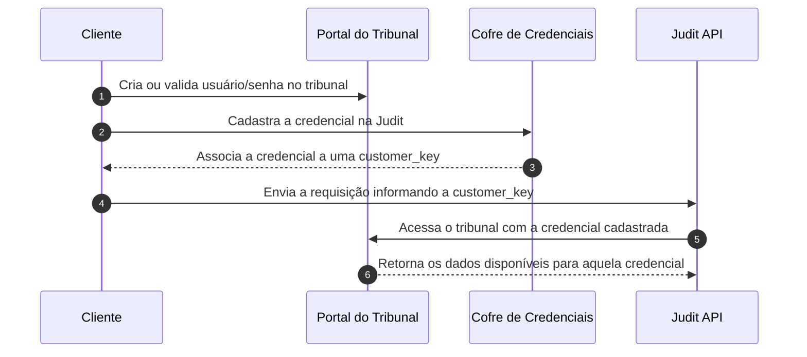
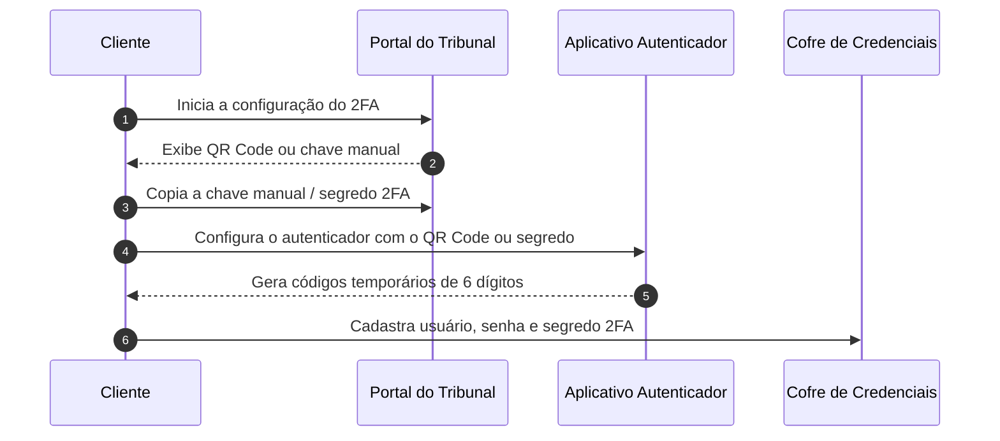

O **Cofre de Credenciais** guarda, criptografadas, as credenciais (CPF/OAB + senha) que advogados usam para se autenticar em tribunais brasileiros. Com isso, a Judit pode acessar processos sob **segredo de justiça** em nome do advogado, sem que sua aplicação precise jamais armazenar ou trafegar a senha.

> 🤖 Endpoint base: `https://crawler.production.judit.io/credentials`. Cadastre uma vez por sistema/tribunal e referencie depois nas consultas via `credential.customer_key`.

## Quando usar

<CardGroup cols={2}>
  <Card title="Acesso a processos sob segredo" icon="lock">
    Necessário para consultar processos cíveis e trabalhistas restritos.
  </Card>
  <Card title="Multi-tenant para escritórios" icon="users">
    Use `customer_key` para separar credenciais por advogado/cliente do escritório.
  </Card>
  <Card title="Conformidade LGPD" icon="shield-halved">
    Senhas são armazenadas criptografadas em cofre dedicado — sua aplicação nunca transita a senha.
  </Card>
  <Card title="Credencial coringa" icon="asterisk">
    Cadastre `"system_name": "*"` como fallback para tribunais sem credencial específica.
  </Card>
</CardGroup>

## Antes de cadastrar no Cofre: cadastro no tribunal

Antes de cadastrar uma credencial no **Cofre de Credenciais**, é necessário que essa credencial já exista no tribunal correspondente.

A Judit não cria usuários, senhas ou permissões dentro dos sistemas dos tribunais. O cadastro deve ser realizado diretamente no portal do tribunal pelo cliente, advogado, escritório ou responsável autorizado.

Após a criação ou validação da credencial no tribunal, ela poderá ser cadastrada no Cofre de Credenciais da Judit e associada a uma chave de identificação chamada `customer_key`.

<Info>
A `customer_key` não é a senha do tribunal. Ela é apenas uma chave de referência utilizada para selecionar, dentro do Cofre de Credenciais, qual credencial deve ser usada na consulta.
</Info>

### Fluxo de cadastro e uso



### Permissões da credencial no tribunal

O retorno da consulta autenticada depende diretamente das permissões da credencial cadastrada no próprio tribunal.

Isso significa que a Judit só conseguirá acessar processos, documentos, anexos ou movimentações que estejam disponíveis para aquele usuário no portal do tribunal.

Por exemplo:

- se a credencial possui acesso ao processo, a consulta poderá retornar dados autenticados;
- se a credencial não possui permissão no tribunal, a consulta poderá retornar apenas dados públicos ou não conseguir acessar o conteúdo protegido;
- se o processo estiver em segredo de justiça, o acesso dependerá das permissões concedidas à credencial no sistema do tribunal.

<Warning>
Cadastrar uma credencial no Cofre não garante, por si só, acesso a processos sigilosos ou documentos restritos. O acesso sempre depende das permissões existentes no tribunal.
</Warning>

### Autenticação em dois fatores

Alguns tribunais podem exigir autenticação em dois fatores, também conhecida como **2FA**, **MFA**, token, código por e-mail, SMS, aplicativo autenticador ou certificado digital.

Quando isso acontece, o comportamento pode variar conforme a regra de autenticação do próprio tribunal.

Em geral:

- se o tribunal exigir o segundo fator apenas no primeiro acesso ou em intervalos específicos, a credencial poderá funcionar após a validação inicial;
- se o tribunal exigir o segundo fator a cada novo login, a consulta autenticada poderá depender de uma etapa adicional de validação;
- se o código de autenticação expirar rapidamente ou exigir ação manual recorrente, a execução automatizada poderá ser impactada.

<Warning>
Tribunais com autenticação em dois fatores podem aumentar o tempo de execução da consulta ou exigir validações adicionais. Nesses casos, o suporte da Judit deve ser acionado para avaliar a viabilidade operacional do uso da credencial.
</Warning>

### Como obter o segredo 2FA para cadastro no Cofre

Em tribunais que exigem autenticação em dois fatores por aplicativo autenticador, como Google Authenticator, Microsoft Authenticator, Authy ou similares, é necessário cadastrar no Cofre o **segredo 2FA** da credencial.

Esse segredo também pode ser identificado como `secret`, `secrecy`, chave secreta, chave manual ou chave de configuração, dependendo do sistema utilizado.

<Warning>
Não cadastre o código temporário de 6 dígitos no campo de 2FA.  
Esse código muda a cada poucos segundos e não deve ser usado como segredo da credencial.
</Warning>

#### Diferença entre segredo 2FA e código temporário

| Informação | O que é | Deve ser cadastrado no Cofre? |
| :--- | :--- | :--- |
| **Segredo 2FA** | Chave fixa usada para gerar os códigos temporários | **Sim** |
| **Código temporário** | Código de 6 dígitos gerado pelo aplicativo autenticador | **Não** |

#### Como identificar o segredo 2FA

Durante a configuração do 2FA no portal do tribunal, normalmente o tribunal exibe um **QR Code** para ser lido por um aplicativo autenticador.

Além do QR Code, alguns tribunais também exibem uma opção como:

- `Não consigo ler o QR Code`
- `Inserir chave manualmente`
- `Exibir chave secreta`
- `Chave de configuração`
- `Secret key`
- `Setup key`

A chave exibida nessa etapa é o **segredo 2FA** que deve ser cadastrado no Cofre de Credenciais.

<Info>
O segredo 2FA geralmente é uma sequência alfanumérica maior que um código comum, podendo conter letras e números.  
Exemplo meramente ilustrativo: `JBSWY3DPEHPK3PXP`
</Info>

#### Fluxo recomendado para cadastro com 2FA



#### O que cadastrar no Cofre

Ao cadastrar uma credencial com autenticação em dois fatores, informe:

- usuário/login do tribunal;
- senha do tribunal;
- `customer_key` desejada para identificar a credencial;
- segredo 2FA, quando o tribunal exigir autenticação por aplicativo autenticador.

<Warning>
O segredo 2FA deve ser a chave fixa de configuração do autenticador, e não o código temporário gerado pelo aplicativo.
</Warning>

#### Caso o 2FA já esteja configurado

Se o 2FA já tiver sido configurado anteriormente e o tribunal não exibir mais a chave secreta, normalmente não é possível recuperar o segredo diretamente pelo aplicativo autenticador.

Nesse cenário, o caminho recomendado é:

1. acessar o portal do tribunal com a credencial;
2. remover, redefinir ou reconfigurar a autenticação em dois fatores;
3. iniciar uma nova configuração de 2FA;
4. copiar a chave manual ou segredo exibido no momento da configuração;
5. cadastrar esse segredo no Cofre de Credenciais.

<Note>
Cada tribunal pode ter um fluxo diferente para redefinição do 2FA. Caso o portal não permita visualizar ou reconfigurar o segundo fator, será necessário acionar o suporte do próprio tribunal ou o responsável pela credencial.
</Note>

## Boas práticas para cadastro de credenciais

Recomendamos que as credenciais cadastradas no Cofre sejam:

- credenciais institucionais ou de serviço, quando permitido pelo tribunal;
- criadas com permissões compatíveis com os processos que precisam ser consultados;
- validadas previamente no portal do tribunal antes do uso via API;
- mantidas atualizadas sempre que houver troca de senha ou alteração de acesso;
- configuradas com um método de autenticação em dois fatores compatível com a operação automatizada, quando aplicável.

<Note>
Caso a senha seja alterada, a credencial expire ou o tribunal solicite uma nova validação de acesso, será necessário atualizar ou revalidar a credencial no Cofre para manter a consulta funcionando corretamente.
</Note>

## Como selecionar a credencial no payload da requisição

Para utilizar uma credencial cadastrada no Cofre de Credenciais durante a consulta, informe o campo `customer_key` dentro de `search.search_params.credential`.

O valor de `customer_key` deve corresponder à chave da credencial previamente cadastrada no Cofre.

<Note>
A consulta será executada utilizando a credencial associada à `customer_key` informada no payload.
</Note>

### Exemplo de requisição

```bash
curl --location 'https://requests.prod.judit.io/requests/' \
--header 'Content-Type: application/json' \
--header 'api-key: <api-key>' \
--data '{
    "search": {
        "search_type": "lawsuit_cnj",
        "search_key": "0000000-00.0000.0.00.0000",
        "search_params": {
            "credential": {
                "customer_key": "CUSTOMER-KEY"
            }
        }
    }
}'
```

<Warning>
Caso a `customer_key` informada não exista, esteja inválida ou esteja vinculada a uma credencial expirada, a consulta poderá falhar ou não utilizar a credencial esperada.
</Warning>

## Rota para cadastrar suas chaves no cofre de credenciais

Para começar a utilizar o cofre de credeniais, você deve realizar uma solicitação POST para a rota `crawler.production.judit.io/credentials` e cadastrar as credenciais dos advogados nos respectivos tribunais disponibilizados.

### Payload da Solicitação

A solicitação POST deve incluir um payload com as seguintes propriedades: 

- `system_name`: A sigla do [tribunal e sistema](/resource/glossary#lista-para-cofre-de-credenciais) que será cadastrado a nova credencial.
  - `Obs:` Poderá ser cadastrada uma credencial coringa `"system_name": "*"`. Se uma credencial for cadastrada nela, todos os tribunais que não tiverem outra credencial cadastrada utilizarão a credencial coringa.
- `customer_key`: Identificador personalizado para associar a credencial a um cliente ou advogado. Pode ser qualquer nome ou rótulo definido pelo responsável pelo cadastro, facilitando a organização e o gerenciamento das credenciais.

- `username`: CPF (Cadastro de Pessoas Físicas) ou número da OAB (Ordem dos Advogados do Brasil), conforme exigido pelo sistema do tribunal onde o login será realizado.

- `password`: Senha cadastrada no respectivo tribunal.

Propriedades necessárias apenas nos casos de tribunais que exigem autenticação de dois fatores:

- `custom_data`: Objeto opcional destinado a armazenar informações adicionais específicas para o sistema ou contexto de uso. Pode incluir campos personalizados como, por exemplo, um secret necessário para autenticação ou outras configurações específicas.

- `secret`: Token de autenticação de dois fatores do sistema a ser cadastrado.

`Obs:` As credenciais cadastradas são criptografadas, garantindo a segurança dos dados, e não podem ser acessadas posteriormente. Para modificar informações já cadastradas, basta criar um novo registro utilizando o mesmo `customer_key` e o mesmo `system_name`. O novo cadastro substituirá automaticamente a credencial existente.

Exemplo de payload para cadastro de credenciais sem autenticação de dois fatores:

```json

{
  "credentials": [
    {
      "system_name": "PJE TJBA - 1º grau",
      "customer_key": "00000001",
      "username": "999.999.999-99",
      "password": "Senha123"
    },
    {
      "system_name": "ESAJ - TJAC - 1º grau",
      "customer_key": "00000002",
      "username": "999.999.999-99",
      "password": "Senha123"
    }
  ]
}
```

Exemplo de payload para cadastro de credenciais com autenticação de dois fatores:

```json

{
  "credentials": [
    {
      "system_name": "PJE TJBA - 1º grau",
      "customer_key": "00000001",
      "username": "999.999.999-99",
      "password": "Senha123",
      "custom_data": {
				"secret": "<TOKEN>"
			}
    }
  ]
}
```

Exemplo de resposta a solicitação:

```json

[
    {
        "system_name": "ESAJ - TJAC - 1º grau",
        "message": "CREDENTIAL_CREATED"
    },
    {
        "system_name": "PJE TJBA - 1º grau",
        "message": "CREDENTIAL_CREATED"
    }
]
```

## Rota de verificação de credenciais cadastradas

Para verificar se uma credencial está cadastrada, envie uma solicitação GET para o endpoint `crawler.production.judit.io/credentials`, incluindo o parâmetro `customer_key` correspondente à credencial que deseja consultar.

A resposta retornará todas as credenciais disponíveis no cofre associadas à `customer_key` consultada. O campo `credential_status` indicará o status de cada credencial:

- active: Credencial cadastrada e ativa.
- not exists: Credencial não encontrada no sistema.

Segue um exemplo de solicitação GET para verificar a existência de uma credencial:

```json

curl --location 'https://crawler.production.judit.io/credentials?customer_key=teste_01' \
--header 'api-key: <API-KEY>'

```

Segue um exemplo de resposta para a solicitação GET realizada:

```json

{
    "systems": [
        {
            "name": "*",
            "customer_key": "",
            "credential_status": "not exists"
        },
        {
            "name": "ESAJ - TJAM - 1º grau",
            "customer_key": "teste_01",
            "credential_status": "active"
        },
        {
            "name": "PROJUDI TJGO - 1º grau",
            "customer_key": "teste_01",
            "credential_status": "active"
        }
    ]
}

```

## Como utilizar o Cofre de Credenciais na requisição

O **Cofre de Credenciais** permite vincular uma consulta a uma credencial previamente cadastrada para o cliente.  
Para isso, informe a chave da credencial no campo `customer_key`, dentro de `search.search_params.credential`.

Essa chave identifica qual credencial deve ser utilizada na execução da consulta.

<Note>
O valor de `customer_key` deve corresponder a uma chave já cadastrada no Cofre de Credenciais. Caso a chave informada não exista ou esteja inválida, a consulta poderá falhar ou não utilizar a credencial esperada.
</Note>

### Exemplo de requisição

```bash
curl --location 'https://requests.prod.judit.io/requests/' \
--header 'Content-Type: application/json' \
--header 'api-key: <api-key>' \
--data '{
  "search": {
    "search_type": "lawsuit_cnj",
    "search_key": "0000000-00.0000.0.00.0000",
    "search_params": {
      "credential": {
        "customer_key": "CUSTOMER-KEY"
      }
    }
  }
}'
```

## Rota para deletar uma chave no cofre de Credenciais

Para deletar um sistema no cofre de credenciais, você deve realizar uma solicitação DELETE para a rota `crawler.production.judit.io/credentials`.

### Payload da Solicitação

A solicitação DELETE deve incluir um payload com a seguinte propriedade: 

- `system_name`: A sigla do [tribunal e sistema](/resource/glossary#lista-para-cofre-de-credenciais) que será cadastrado a nova credencial.
- `customer_key`: Identificador personalizado adicionado no momento do cadastro da credencial.

Exemplo de payload para deletar credencial:

```json

{
	"system_name": "PROJUDI TJGO - 1º grau",
    "customer_key":"teste_01"
}

```
- Caso a solicitação seja bem sucedida a resposta será um objeto vazio.


A atualização das credenciais nos tribunais é de inteira responsabilidade do usuário. Portanto, cabe ao usuário realizar o cadastro da credencial no tribunal correspondente e acompanhar a validade e a situação da mesma para garantir que ela não seja suspensa ou invalidada.