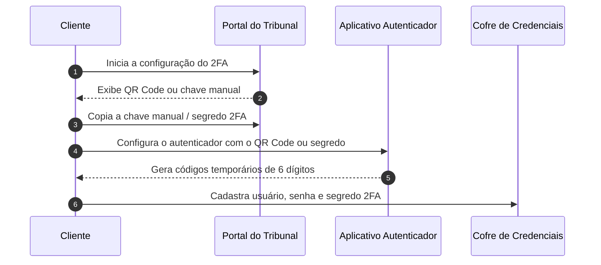

export const VaultAnimation = () => (
  <iframe sandbox="allow-scripts" scrolling="no" style={{width:'100%',height:'540px',border:'none',borderRadius:'12px',display:'block',margin:'20px 0'}} srcDoc={`<!doctype html><html><head><meta charset="utf-8"><style>*{margin:0;padding:0;box-sizing:border-box}html,body{width:100%;height:100%;overflow:hidden;background:#090c0d}canvas{display:block;width:100%;height:100%}</style></head><body><canvas id="c"></canvas><script>(function(){
var A='#4FD1C5',J='#1FC16B',T='#E0A82E',P='#C084FC',M='#7A8599';
var BG='#090c0d',TXT='#e5e7eb',NF='#111827',PT2='#0a1020';
var TOTAL=30.0;
var XP={cli:0.09,judit:0.38,cofre:0.65,court:0.90};
var NW=86,NH=42;
var FLOWS=[
  {id:'reg',title:'① Cadastro da Credencial',sub:'Configure uma vez por tribunal',col:A,ts:1,te:14,act:['cli','cofre','court'],steps:[
    {fr:'cli',to:'court',label:'valida credencial',note:'cria usuário/senha no portal',col:T,ts:1.5,te:2.3,yp:0.35},
    {fr:'cli',to:'cofre',label:'POST /credentials',note:'{system_name, customer_key, password}',col:P,ts:3.2,te:4.0,yp:0.52},
    {fr:'cofre',to:'cli',label:'CREDENTIAL_CREATED',note:'credencial criptografada',col:P,ts:4.5,te:5.3,yp:0.68}]},
  {id:'use',title:'② Uso na Consulta',sub:'Referencie customer_key na requisição',col:J,ts:16,te:29,act:['cli','judit','cofre','court'],steps:[
    {fr:'cli',to:'judit',label:'POST /requests',note:'{customer_key}',col:A,ts:16.5,te:17.3,yp:0.28},
    {fr:'judit',to:'cofre',label:'busca credencial',note:'',col:P,ts:17.8,te:18.6,yp:0.40},
    {fr:'cofre',to:'judit',label:'credencial encontrada',note:'',col:P,ts:19.1,te:19.9,yp:0.52},
    {fr:'judit',to:'court',label:'acessa autenticado',note:'processo sob segredo',col:T,ts:20.4,te:21.2,yp:0.64},
    {fr:'court',to:'judit',label:'dados restritos',note:'',col:J,ts:21.7,te:22.5,yp:0.76},
    {fr:'judit',to:'cli',label:'response_data',note:'',col:J,ts:23.0,te:23.8,yp:0.88}]}
];
var NODES=[{id:'cli',label:'Sua App',col:A},{id:'judit',label:'Judit API',col:J},{id:'cofre',label:'Cofre',col:P},{id:'court',label:'Tribunal',col:T}];
var cv=document.getElementById('c');
function setup(){var dpr=Math.min(window.devicePixelRatio||1,2),r=cv.getBoundingClientRect(),W=r.width||window.innerWidth,H=r.height||window.innerHeight;cv.width=Math.max(1,W*dpr);cv.height=Math.max(1,H*dpr);var ctx=cv.getContext('2d');ctx.setTransform(dpr,0,0,dpr,0,0);return{ctx:ctx,w:W,h:H};}
function ease(t){return t<0.5?2*t*t:1-Math.pow(-2*t+2,2)/2;}
function rr(ctx,x,y,w,h,r){ctx.beginPath();ctx.moveTo(x+r,y);ctx.arcTo(x+w,y,x+w,y+h,r);ctx.arcTo(x+w,y+h,x,y+h,r);ctx.arcTo(x,y+h,x,y,r);ctx.arcTo(x,y,x+w,y,r);ctx.closePath();}
function gx(n,w){return n==='cli'?w*XP.cli:n==='judit'?w*XP.judit:n==='cofre'?w*XP.cofre:w*XP.court;}
function eg(fr,to,w){var fx=gx(fr,w),tx=gx(to,w),d=tx>fx?1:-1;return{x1:fx+d*NW/2,x2:tx-d*NW/2,d:d};}
function dPkt(ctx,x,y,lbl,col){var pw=Math.max(36,lbl.length*6+14),ph=20;ctx.save();ctx.shadowColor=col;ctx.shadowBlur=18;rr(ctx,x-pw/2,y-ph/2,pw,ph,5);ctx.fillStyle=col;ctx.fill();ctx.shadowBlur=0;ctx.fillStyle=PT2;ctx.font='bold 9px monospace';ctx.textAlign='center';ctx.textBaseline='middle';ctx.fillText(lbl,x,y+0.5);ctx.restore();}
function draw(ctx,w,h,t){
  var ct=t%TOTAL;
  ctx.fillStyle=BG;ctx.fillRect(0,0,w,h);
  var fl=null;for(var i=0;i<FLOWS.length;i++){if(ct>=FLOWS[i].ts&&ct<FLOWS[i].te){fl=FLOWS[i];break;}}
  var nodeY=h*0.21;
  for(var i=0;i<NODES.length;i++){var n=NODES[i],lx=gx(n.id,w),ia=!fl||(fl.act.indexOf(n.id)>=0);ctx.save();ctx.strokeStyle=n.col;ctx.globalAlpha=ia?0.35:0.07;ctx.lineWidth=1;ctx.setLineDash([4,7]);ctx.beginPath();ctx.moveTo(lx,nodeY+NH/2);ctx.lineTo(lx,h*0.95);ctx.stroke();ctx.restore();}
  if(fl){ctx.save();ctx.fillStyle=fl.col;ctx.font='bold 13px Inter,system-ui,sans-serif';ctx.textAlign='center';ctx.textBaseline='middle';ctx.fillText(fl.title,w/2,h*0.055);ctx.fillStyle=M;ctx.font='10.5px Inter,system-ui,sans-serif';ctx.fillText(fl.sub,w/2,h*0.118);ctx.restore();}
  if(fl){for(var si=0;si<fl.steps.length;si++){var s=fl.steps[si],sy=h*s.yp,e=eg(s.fr,s.to,w),x1=e.x1,x2=e.x2,d=e.d,clx=(x1+x2)/2;var state=ct<s.ts?'pre':ct>s.te?'done':'live',alpha=state==='pre'?0.10:state==='done'?0.55:1.0;ctx.save();ctx.globalAlpha=alpha;ctx.strokeStyle=s.col;ctx.lineWidth=1.5;ctx.setLineDash([]);ctx.beginPath();ctx.moveTo(x1,sy);ctx.lineTo(x2,sy);ctx.stroke();ctx.fillStyle=s.col;ctx.beginPath();ctx.moveTo(x2,sy);ctx.lineTo(x2-d*7,sy-4);ctx.lineTo(x2-d*7,sy+4);ctx.closePath();ctx.fill();ctx.fillStyle=TXT;ctx.font='bold 10px monospace';ctx.textAlign='center';ctx.textBaseline='bottom';ctx.fillText(s.label,clx,sy-4);if(s.note){ctx.fillStyle=M;ctx.font='9px monospace';ctx.fillText(s.note,clx,sy-16);}ctx.restore();if(state==='live'){var p=ease((ct-s.ts)/(s.te-s.ts));dPkt(ctx,x1+(x2-x1)*p,sy+14,s.label,s.col);}}}
  for(var i=0;i<NODES.length;i++){var nd=NODES[i],px=gx(nd.id,w),ia=!fl||(fl.act.indexOf(nd.id)>=0);ctx.save();ctx.globalAlpha=ia?1:0.18;if(ia){ctx.shadowColor=nd.col;ctx.shadowBlur=14;}rr(ctx,px-NW/2,nodeY-NH/2,NW,NH,8);ctx.fillStyle=NF;ctx.fill();ctx.shadowBlur=0;ctx.strokeStyle=ia?nd.col:'rgba(255,255,255,0.10)';ctx.lineWidth=ia?1.8:1;ctx.stroke();ctx.fillStyle=ia?nd.col:M;ctx.font='bold 11px Inter,system-ui,sans-serif';ctx.textAlign='center';ctx.textBaseline='middle';ctx.fillText(nd.label,px,nodeY);ctx.restore();}
  for(var f=0;f<FLOWS.length;f++){var ia=fl&&fl.id===FLOWS[f].id;ctx.save();ctx.beginPath();ctx.arc(w/2+(f-0.5)*24,h*0.965,ia?5:3,0,Math.PI*2);ctx.fillStyle=ia?FLOWS[f].col:'rgba(255,255,255,0.18)';ctx.fill();ctx.restore();}
}
var dim,t0;
function loop(){var t=(performance.now()-t0)/1000;draw(dim.ctx,dim.w,dim.h,t);requestAnimationFrame(loop);}
window.addEventListener('load',function(){dim=setup();t0=performance.now();loop();});
window.addEventListener('resize',function(){dim=setup();});
cv.addEventListener('click',function(e){var r=cv.getBoundingClientRect(),cx=e.clientX-r.left,cy=e.clientY-r.top;for(var f=0;f<FLOWS.length;f++){var dx=cx-(dim.w/2+(f-(FLOWS.length-1)/2)*24),dy=cy-dim.h*0.962;if(dx*dx+dy*dy<=144){t0=performance.now()-FLOWS[f].ts*1000;break;}}});
cv.addEventListener('mousemove',function(e){var r=cv.getBoundingClientRect(),cx=e.clientX-r.left,cy=e.clientY-r.top,over=false;for(var f=0;f<FLOWS.length;f++){var dx=cx-(dim.w/2+(f-(FLOWS.length-1)/2)*24),dy=cy-dim.h*0.962;if(dx*dx+dy*dy<=144){over=true;break;}}cv.style.cursor=over?'pointer':'default';});
})()</script></body></html>`} />
);

O **Cofre de Credenciais** guarda, criptografadas, as credenciais (CPF/OAB + senha) que advogados usam para se autenticar em tribunais brasileiros. Com isso, a Judit pode acessar processos sob **segredo de justiça** em nome do advogado, sem que sua aplicação precise jamais armazenar ou trafegar a senha.

> 🤖 Endpoint base: `https://crawler.production.judit.io/credentials`. Cadastre uma vez por sistema/tribunal e referencie depois nas consultas via `credential.customer_key`.

## Quando usar

<CardGroup cols={2}>
  <Card title="Acesso a processos sob segredo" icon="lock">
    Necessário para consultar processos cíveis e trabalhistas restritos.
  </Card>
  <Card title="Multi-tenant para escritórios" icon="users">
    Use `customer_key` para separar credenciais por advogado/cliente do escritório.
  </Card>
  <Card title="Conformidade LGPD" icon="shield-halved">
    Senhas são armazenadas criptografadas em cofre dedicado — sua aplicação nunca transita a senha.
  </Card>
  <Card title="Credencial coringa" icon="asterisk">
    Cadastre `"system_name": "*"` como fallback para tribunais sem credencial específica.
  </Card>
  <Card title="Certificado digital A1" icon="certificate" href="#cadastro-de-credencial-com-certificado-digital-a1">
    Tribunais que só aceitam login por certificado usam a rota `POST /credentials/certificate`.
  </Card>
</CardGroup>

## Antes de cadastrar no Cofre: cadastro no tribunal

Antes de cadastrar uma credencial no **Cofre de Credenciais**, é necessário que essa credencial já exista no tribunal correspondente.

A Judit não cria usuários, senhas ou permissões dentro dos sistemas dos tribunais. O cadastro deve ser realizado diretamente no portal do tribunal pelo cliente, advogado, escritório ou responsável autorizado.

Após a criação ou validação da credencial no tribunal, ela poderá ser cadastrada no Cofre de Credenciais da Judit e associada a uma chave de identificação chamada `customer_key`.

<Info>
A `customer_key` não é a senha do tribunal. Ela é apenas uma chave de referência utilizada para selecionar, dentro do Cofre de Credenciais, qual credencial deve ser usada na consulta.
</Info>

### Fluxo de cadastro e uso

<VaultAnimation />

### Permissões da credencial no tribunal

O retorno da consulta autenticada depende diretamente das permissões da credencial cadastrada no próprio tribunal.

Isso significa que a Judit só conseguirá acessar processos, documentos, anexos ou movimentações que estejam disponíveis para aquele usuário no portal do tribunal.

Por exemplo:

- se a credencial possui acesso ao processo, a consulta poderá retornar dados autenticados;
- se a credencial não possui permissão no tribunal, a consulta poderá retornar apenas dados públicos ou não conseguir acessar o conteúdo protegido;
- se o processo estiver em segredo de justiça, o acesso dependerá das permissões concedidas à credencial no sistema do tribunal.

<Warning>
Cadastrar uma credencial no Cofre não garante, por si só, acesso a processos sigilosos ou documentos restritos. O acesso sempre depende das permissões existentes no tribunal.
</Warning>

### Autenticação em dois fatores

Alguns tribunais podem exigir autenticação em dois fatores, também conhecida como **2FA**, **MFA**, token, código por e-mail, SMS, aplicativo autenticador ou certificado digital.

Quando isso acontece, o comportamento pode variar conforme a regra de autenticação do próprio tribunal.

Em geral:

- se o tribunal exigir o segundo fator apenas no primeiro acesso ou em intervalos específicos, a credencial poderá funcionar após a validação inicial;
- se o tribunal exigir o segundo fator a cada novo login, a consulta autenticada poderá depender de uma etapa adicional de validação;
- se o código de autenticação expirar rapidamente ou exigir ação manual recorrente, a execução automatizada poderá ser impactada.

<Note>
Se o tribunal exigir **certificado digital**, o cadastro é feito por uma rota específica do Cofre. Veja [Cadastro de credencial com certificado digital (A1)](#cadastro-de-credencial-com-certificado-digital-a1).
</Note>

<Warning>
Tribunais com autenticação em dois fatores podem aumentar o tempo de execução da consulta ou exigir validações adicionais. Nesses casos, o suporte da Judit deve ser acionado para avaliar a viabilidade operacional do uso da credencial.
</Warning>

### Como obter o segredo 2FA para cadastro no Cofre

Em tribunais que exigem autenticação em dois fatores por aplicativo autenticador, como Google Authenticator, Microsoft Authenticator, Authy ou similares, é necessário cadastrar no Cofre o **segredo 2FA** da credencial.

Esse segredo também pode ser identificado como `secret`, `secrecy`, chave secreta, chave manual ou chave de configuração, dependendo do sistema utilizado.

<Warning>
Não cadastre o código temporário de 6 dígitos no campo de 2FA.  
Esse código muda a cada poucos segundos e não deve ser usado como segredo da credencial.
</Warning>

#### Diferença entre segredo 2FA e código temporário

| Informação | O que é | Deve ser cadastrado no Cofre? |
| :--- | :--- | :--- |
| **Segredo 2FA** | Chave fixa usada para gerar os códigos temporários | **Sim** |
| **Código temporário** | Código de 6 dígitos gerado pelo aplicativo autenticador | **Não** |

#### Como identificar o segredo 2FA

Durante a configuração do 2FA no portal do tribunal, normalmente o tribunal exibe um **QR Code** para ser lido por um aplicativo autenticador.

Além do QR Code, alguns tribunais também exibem uma opção como:

- `Não consigo ler o QR Code`
- `Inserir chave manualmente`
- `Exibir chave secreta`
- `Chave de configuração`
- `Secret key`
- `Setup key`

A chave exibida nessa etapa é o **segredo 2FA** que deve ser cadastrado no Cofre de Credenciais.

<Info>
O segredo 2FA geralmente é uma sequência alfanumérica maior que um código comum, podendo conter letras e números.  
Exemplo meramente ilustrativo: `JBSWY3DPEHPK3PXP`
</Info>

#### Fluxo recomendado para cadastro com 2FA



#### O que cadastrar no Cofre

Ao cadastrar uma credencial com autenticação em dois fatores, informe:

- usuário/login do tribunal;
- senha do tribunal;
- `customer_key` desejada para identificar a credencial;
- segredo 2FA, quando o tribunal exigir autenticação por aplicativo autenticador.

<Warning>
O segredo 2FA deve ser a chave fixa de configuração do autenticador, e não o código temporário gerado pelo aplicativo.
</Warning>

#### Caso o 2FA já esteja configurado

Se o 2FA já tiver sido configurado anteriormente e o tribunal não exibir mais a chave secreta, normalmente não é possível recuperar o segredo diretamente pelo aplicativo autenticador.

Nesse cenário, o caminho recomendado é:

1. acessar o portal do tribunal com a credencial;
2. remover, redefinir ou reconfigurar a autenticação em dois fatores;
3. iniciar uma nova configuração de 2FA;
4. copiar a chave manual ou segredo exibido no momento da configuração;
5. cadastrar esse segredo no Cofre de Credenciais.

<Note>
Cada tribunal pode ter um fluxo diferente para redefinição do 2FA. Caso o portal não permita visualizar ou reconfigurar o segundo fator, será necessário acionar o suporte do próprio tribunal ou o responsável pela credencial.
</Note>

## Boas práticas para cadastro de credenciais

Recomendamos que as credenciais cadastradas no Cofre sejam:

- credenciais institucionais ou de serviço, quando permitido pelo tribunal;
- criadas com permissões compatíveis com os processos que precisam ser consultados;
- validadas previamente no portal do tribunal antes do uso via API;
- mantidas atualizadas sempre que houver troca de senha ou alteração de acesso;
- configuradas com um método de autenticação em dois fatores compatível com a operação automatizada, quando aplicável.

<Note>
Caso a senha seja alterada, a credencial expire ou o tribunal solicite uma nova validação de acesso, será necessário atualizar ou revalidar a credencial no Cofre para manter a consulta funcionando corretamente.
</Note>

## Como selecionar a credencial no payload da requisição

Para utilizar uma credencial cadastrada no Cofre de Credenciais durante a consulta, informe o campo `customer_key` dentro de `search.search_params.credential`.

O valor de `customer_key` deve corresponder à chave da credencial previamente cadastrada no Cofre.

<Note>
A consulta será executada utilizando a credencial associada à `customer_key` informada no payload.
</Note>

### Exemplo de requisição

```bash
curl --location 'https://requests.prod.judit.io/requests/' \
--header 'Content-Type: application/json' \
--header 'api-key: <api-key>' \
--data '{
    "search": {
        "search_type": "lawsuit_cnj",
        "search_key": "0000000-00.0000.0.00.0000",
        "search_params": {
            "credential": {
                "customer_key": "CUSTOMER-KEY"
            }
        }
    }
}'
```

<Warning>
Caso a `customer_key` informada não exista, esteja inválida ou esteja vinculada a uma credencial expirada, a consulta poderá falhar ou não utilizar a credencial esperada.
</Warning>

## Rota para cadastrar suas chaves no cofre de credenciais

Para começar a utilizar o cofre de credeniais, você deve realizar uma solicitação POST para a rota `crawler.production.judit.io/credentials` e cadastrar as credenciais dos advogados nos respectivos tribunais disponibilizados.

### Payload da Solicitação

A solicitação POST deve incluir um payload com as seguintes propriedades: 

- `system_name`: A sigla do [tribunal e sistema](/resource/glossary#lista-para-cofre-de-credenciais) que será cadastrado a nova credencial.
  - `Obs:` Poderá ser cadastrada uma credencial coringa `"system_name": "*"`. Se uma credencial for cadastrada nela, todos os tribunais que não tiverem outra credencial cadastrada utilizarão a credencial coringa.
- `customer_key`: Identificador personalizado para associar a credencial a um cliente ou advogado. Pode ser qualquer nome ou rótulo definido pelo responsável pelo cadastro, facilitando a organização e o gerenciamento das credenciais.

- `username`: CPF (Cadastro de Pessoas Físicas) ou número da OAB (Ordem dos Advogados do Brasil), conforme exigido pelo sistema do tribunal onde o login será realizado.

- `password`: Senha cadastrada no respectivo tribunal.

Propriedades necessárias apenas nos casos de tribunais que exigem autenticação de dois fatores:

- `custom_data`: Objeto opcional destinado a armazenar informações adicionais específicas para o sistema ou contexto de uso. Pode incluir campos personalizados como, por exemplo, um secret necessário para autenticação ou outras configurações específicas.

- `secret`: Token de autenticação de dois fatores do sistema a ser cadastrado.

`Obs:` As credenciais cadastradas são criptografadas, garantindo a segurança dos dados, e não podem ser acessadas posteriormente. Para modificar informações já cadastradas, basta criar um novo registro utilizando o mesmo `customer_key` e o mesmo `system_name`. O novo cadastro substituirá automaticamente a credencial existente.

Exemplo de payload para cadastro de credenciais sem autenticação de dois fatores:

```json

{
  "credentials": [
    {
      "system_name": "PJE TJBA - 1º grau",
      "customer_key": "00000001",
      "username": "999.999.999-99",
      "password": "Senha123"
    },
    {
      "system_name": "ESAJ - TJAC - 1º grau",
      "customer_key": "00000002",
      "username": "999.999.999-99",
      "password": "Senha123"
    }
  ]
}
```

Exemplo de payload para cadastro de credenciais com autenticação de dois fatores:

```json

{
  "credentials": [
    {
      "system_name": "PJE TJBA - 1º grau",
      "customer_key": "00000001",
      "username": "999.999.999-99",
      "password": "Senha123",
      "custom_data": {
				"secret": "<TOKEN>"
			}
    }
  ]
}
```

Exemplo de resposta a solicitação:

```json

[
    {
        "system_name": "ESAJ - TJAC - 1º grau",
        "message": "CREDENTIAL_CREATED"
    },
    {
        "system_name": "PJE TJBA - 1º grau",
        "message": "CREDENTIAL_CREATED"
    }
]
```

## Cadastro de credencial com certificado digital (A1)

Alguns tribunais não aceitam login por CPF/OAB + senha e exigem **certificado digital**. Para esses casos, o Cofre de Credenciais possui uma rota separada, exclusiva para upload de certificado: `POST /credentials/certificate`.

<Warning>
O certificado **não** pode ser enviado pela rota `POST /credentials`. Se você tentar colocar o certificado dentro de `custom_data`, a API responde com o erro `CERTIFICATE_FIELDS_NOT_ALLOWED`. Use sempre a rota `/credentials/certificate`.
</Warning>

### O que você precisa antes de começar

| Item | Detalhe |
| :--- | :--- |
| **Certificado A1** | Arquivo `.pfx` ou `.p12` (padrão PKCS#12). Certificado **A3** (token USB ou cartão físico) **não é aceito**, porque depende de hardware conectado. |
| **Senha do arquivo** | É a senha do próprio arquivo `.pfx`, definida quando o certificado foi emitido ou exportado. **Não é a senha do portal do tribunal.** |
| **Tamanho** | O arquivo precisa ter no máximo **64 KB**. |
| **Validade** | O certificado precisa estar dentro do prazo de validade. Certificado vencido é recusado no upload. |
| **Sua `api-key`** | A mesma chave que você já usa nas demais rotas da Judit. |

<Info>
Se você tem um certificado A3 e precisa usá-lo em consultas automatizadas, será necessário emitir um certificado A1 do mesmo titular. Fale com a sua Autoridade Certificadora (Serasa, Certisign, Soluti, etc.).
</Info>

### Passo 1 — Converter o arquivo `.pfx` para Base64

O JSON de uma requisição HTTP só transporta texto, e um `.pfx` é um arquivo binário. Por isso, antes de enviar, o arquivo precisa ser convertido para **Base64** — que é apenas o mesmo arquivo reescrito como texto.

<Note>
Base64 **não é criptografia nem hash**. É só uma forma de representar o arquivo em caracteres de texto. Nada é perdido e nada é embaralhado na conversão.
</Note>

Escolha o comando de acordo com o seu sistema:

<CodeGroup>

```bash macOS
# Gera o Base64 em uma única linha e copia para a área de transferência
base64 -i ./certificado.pfx | tr -d '\n' | pbcopy
```

```bash Linux
# A flag -w 0 evita quebras de linha
base64 -w 0 ./certificado.pfx > certificado.base64.txt
```

```powershell Windows (PowerShell)
# Gera o Base64 em uma única linha e salva em um arquivo .txt
[Convert]::ToBase64String([IO.File]::ReadAllBytes("C:\caminho\certificado.pfx")) | Set-Content certificado.base64.txt
```

```javascript Node.js
const fs = require("fs");

const fileBase64 = fs.readFileSync("./certificado.pfx").toString("base64");
console.log(fileBase64);
```

```python Python
import base64

with open("certificado.pfx", "rb") as f:
    file_base64 = base64.b64encode(f.read()).decode()

print(file_base64)
```

</CodeGroup>

<Warning>
**A string Base64 precisa estar em uma única linha, sem quebras.** Se você usar `base64 arquivo.pfx` sem `tr -d '\n'` (macOS) ou sem `-w 0` (Linux), o resultado sai quebrado em várias linhas e a API responderá `PFX_MALFORMED`.
</Warning>

**Como saber se deu certo:** o texto gerado é enorme (milhares de caracteres — isso é normal) e normalmente começa com `MII`. Se o que você copiou for algo curto como `C:\certificados\meu.pfx` ou `./certificado.pfx`, você copiou o **caminho** do arquivo, e não o conteúdo dele.

### Passo 2 — Enviar o certificado para o Cofre

```bash
curl --location 'https://crawler.prod.judit.io/credentials/certificate' \
--header 'api-key: <api-key>' \
--header 'Content-Type: application/json' \
--data '{
  "customer_key": "teste",
  "system_name": "ESAJ - TJSP - 1º grau",
  "file_base64": "<conteudo-do-pfx-em-base64>",
  "password": "123456"
}'
```

<Warning>
A autenticação é feita pelo header **`api-key`**, exatamente como nas outras rotas da Judit. **Não use `Authorization: Bearer`** — essa rota não usa token Bearer.
</Warning>

#### Campos do corpo da requisição

| Campo | Tipo | Obrigatório | Descrição |
| :--- | :--- | :--- | :--- |
| `file_base64` | string | **Sim** | Conteúdo do arquivo `.pfx` / `.p12` convertido para Base64, em uma única linha (o resultado do Passo 1). |
| `password` | string | **Sim** | Senha do arquivo `.pfx`. Repetindo: é a senha do certificado, não a do tribunal. |
| `system_name` | string | Recomendado | Sistema e tribunal em que o certificado será usado, exatamente como aparece na [lista de sistemas do Cofre](/api-reference/endpoint/vault/vault) — por exemplo `ESAJ - TJSP - 1º grau`. Use `"*"` para cadastrar o certificado como **credencial coringa**, válida para qualquer tribunal que não tenha credencial específica. |
| `customer_key` | string | Recomendado | Identificador que você define para essa credencial (por advogado, cliente ou escritório). É essa mesma chave que você informará na consulta. Se não for enviada, é usado o valor padrão `"*"`. |
| `custom_data` | objeto | Não | Só é necessário quando o tribunal também exige autenticação em dois fatores. Veja o [Passo 5](#passo-5-opcional--certificado--código-2fa). |

<Info>
A `customer_key` é apenas um rótulo de referência escolhido por você. Ela não tem relação com o tribunal e não é uma senha.
</Info>

#### Passo a passo no Postman

<Steps>
  <Step title="Método e URL">
    Selecione **POST** e informe a URL `https://crawler.prod.judit.io/credentials/certificate`.
  </Step>
  <Step title="Headers">
    Na aba **Headers**, adicione duas linhas:

    | Key | Value |
    | :--- | :--- |
    | `api-key` | sua chave da Judit |
    | `Content-Type` | `application/json` |
  </Step>
  <Step title="Body">
    Na aba **Body**, selecione **raw** e, no seletor à direita, escolha **JSON**. Cole o JSON com os quatro campos e substitua `file_base64` pelo texto gerado no Passo 1.

    <Warning>
    Não use **form-data** nem o tipo **File** do Postman para anexar o `.pfx`. Esta rota recebe apenas JSON, com o arquivo já convertido para Base64.
    </Warning>
  </Step>
  <Step title="Enviar">
    Clique em **Send**. A resposta esperada é um `200` com a mensagem `CERTIFICATE_CREATED`.
  </Step>
</Steps>

### Passo 3 — Conferir a resposta

```json
{
  "message": "CERTIFICATE_CREATED",
  "customer_key": "teste",
  "subject_cn": "NOME DO TITULAR:12345678909",
  "not_after": "2027-01-01T00:00:00.000Z",
  "uploaded_at": "2026-07-31T17:00:00.000Z"
}
```

| Campo | Descrição |
| :--- | :--- |
| `message` | `CERTIFICATE_CREATED` no primeiro envio; `CERTIFICATE_UPDATED` quando você substitui um certificado já cadastrado do mesmo titular. |
| `customer_key` | Chave da credencial que acabou de ser criada ou atualizada. |
| `subject_cn` | Titular do certificado (nome e CPF/CNPJ), lido do próprio arquivo. Use para confirmar que enviou o certificado certo. |
| `not_after` | Data de validade do certificado, em ISO 8601. Anote para renovar antes de vencer. |
| `uploaded_at` | Data e hora do upload, em ISO 8601. |

O certificado é validado no momento do upload (senha, validade e tamanho) e armazenado criptografado. A resposta **nunca** devolve o arquivo nem a senha — depois de cadastrado, o certificado não pode ser lido de volta.

### Passo 4 — Usar o certificado na consulta

O uso é igual ao de qualquer outra credencial do Cofre: basta informar a mesma `customer_key` em `search.search_params.credential`.

```bash
curl --location 'https://requests.prod.judit.io/requests/' \
--header 'Content-Type: application/json' \
--header 'api-key: <api-key>' \
--data '{
  "search": {
    "search_type": "lawsuit_cnj",
    "search_key": "0000000-00.0000.0.00.0000",
    "search_params": {
      "credential": {
        "customer_key": "teste"
      }
    }
  }
}'
```

<Note>
Se você cadastrou o certificado com a `customer_key` padrão `"*"`, não é necessário informar `credential` na consulta — ele será usado automaticamente como credencial coringa.
</Note>

### Passo 5 (opcional) — Certificado + código 2FA

Alguns tribunais exigem **duas coisas ao mesmo tempo**: o certificado digital **e** o segredo 2FA (também chamado de `secret`, `secrecy`, chave secreta, chave manual ou chave de configuração do autenticador).

Tudo é feito em **uma única requisição**: basta acrescentar o objeto `custom_data`, com a chave `secret` dentro, ao mesmo payload do certificado.

```bash
curl --location 'https://crawler.prod.judit.io/credentials/certificate' \
--header 'api-key: <api-key>' \
--header 'Content-Type: application/json' \
--data '{
  "customer_key": "teste",
  "system_name": "ESAJ - TJSP - 1º grau",
  "file_base64": "<conteudo-do-pfx-em-base64>",
  "password": "123456",
  "custom_data": {
    "secret": "JBSWY3DPEHPK3PXP"
  }
}'
```

| Campo | Tipo | Obrigatório | Descrição |
| :--- | :--- | :--- | :--- |
| `custom_data` | objeto | Não | Objeto com dados extras da credencial. Envie apenas quando o tribunal exigir 2FA. |
| `custom_data.secret` | string | Não | Segredo 2FA da credencial — a **chave fixa** de configuração do aplicativo autenticador. |

<Warning>
O `secret` é a **chave fixa de configuração** do autenticador (algo como `JBSWY3DPEHPK3PXP`) — **nunca** o código temporário de 6 dígitos, que muda a cada poucos segundos. Cadastrar o código de 6 dígitos faz a credencial parar de funcionar em minutos.
</Warning>

<Note>
Não sabe onde encontrar essa chave? Ela aparece na configuração do 2FA no portal do tribunal, atrás de opções como "Não consigo ler o QR Code", "Inserir chave manualmente", "Exibir chave secreta" ou "Setup key". O passo a passo completo está em [Como obter o segredo 2FA para cadastro no Cofre](#como-obter-o-segredo-2fa-para-cadastro-no-cofre).
</Note>

<Info>
Se a credencial já tinha um `secret` cadastrado anteriormente, o upload do certificado **não apaga** esse segredo. Você pode enviar `custom_data` de novo para atualizá-lo, ou omitir o campo para manter o que já está gravado.
</Info>

### Trocar, renovar ou remover o certificado

- **Renovar ou trocar:** repita o mesmo upload com a mesma `customer_key` e o `system_name`. A credencial é atualizada, o certificado anterior é descartado e a resposta vem com `CERTIFICATE_UPDATED`.
- **Titular diferente:** se o novo certificado pertencer a outro CPF/CNPJ, a API retorna `CERTIFICATE_HOLDER_MISMATCH` (409). Remova a credencial antes de cadastrar o certificado do novo titular.
- **Consultar:** use `GET https://crawler.prod.judit.io/credentials?customer_key=teste` com o header `api-key`. Uma credencial cadastrada com `system_name: "*"` aparece na lista com `name: "*"`.
- **Remover:** use `DELETE https://crawler.prod.judit.io/credentials` enviando `system_name` e `customer_key`. O certificado armazenado é apagado junto com a credencial. Se ela não existir, a resposta é `404` (`CREDENTIAL_NOT_FOUND`).

### Erros e como resolver

| Código | HTTP | O que aconteceu | Como resolver |
| :--- | :--- | :--- | :--- |
| `PFX_MALFORMED` | 400 | O Base64 está inválido ou o arquivo `.pfx` está corrompido. | Refaça o Passo 1 garantindo uma única linha, sem quebras e sem espaços. Confirme que enviou o conteúdo do arquivo, não o caminho dele. |
| `PFX_PASSWORD_INVALID` | 400 | A senha informada não abre o arquivo. | Use a senha do arquivo `.pfx`, não a senha do portal do tribunal. Teste abrir o certificado localmente com essa senha. |
| `PFX_NO_PRIVATE_KEY` | 400 | O arquivo não contém a chave privada. | Exporte o certificado novamente marcando a opção de exportar a chave privada. |
| `PFX_NO_CERTIFICATE` | 400 | O arquivo não contém certificado. | Verifique se o arquivo exportado é realmente um `.pfx` / `.p12` completo. |
| `PFX_EXPIRED` | 400 | O certificado está vencido. | Emita ou renove o certificado junto à Autoridade Certificadora. |
| `PFX_NOT_YET_VALID` | 400 | O certificado ainda não entrou em vigor. | Aguarde a data de início da validade. |
| `PFX_TOO_LARGE` | 400 | O arquivo tem mais de 64 KB. | Exporte apenas o certificado do titular, sem cadeias ou certificados extras desnecessários. |
| `CERTIFICATE_HOLDER_MISMATCH` | 409 | Já existe um certificado cadastrado nessa credencial e ele pertence a outro titular. | Remova a credencial e cadastre novamente com o novo titular. |
| `CREDENTIAL_TYPE_CONFLICT` | 409 | Já existe uma credencial de usuário/senha para essa combinação de `customer_key` e sistema. | Use outra `customer_key` para o certificado ou remova a credencial de usuário/senha antes. |
| `CERTIFICATE_FIELDS_NOT_ALLOWED` | 400 | Você tentou enviar campos de certificado na rota `POST /credentials`. | Envie o certificado pela rota `POST /credentials/certificate`. |

### Erros mais comuns na prática

<AccordionGroup>
  <Accordion title="Enviei o caminho do arquivo em vez do conteúdo">
    `"file_base64": "C:\\certificados\\meu.pfx"` está errado. O campo espera o **texto Base64** gerado no Passo 1, com milhares de caracteres — e não o local do arquivo no seu computador.
  </Accordion>
  <Accordion title="O Base64 saiu quebrado em várias linhas">
    Acontece quando o comando é executado sem `tr -d '\n'` (macOS) ou sem `-w 0` (Linux). Refaça a conversão usando exatamente os comandos do Passo 1.
  </Accordion>
  <Accordion title="Usei a senha do tribunal no campo password">
    O campo `password` é a senha do arquivo `.pfx`, criada na emissão ou exportação do certificado. A senha do portal do tribunal não abre o arquivo e gera `PFX_PASSWORD_INVALID`.
  </Accordion>
  <Accordion title="Usei Authorization: Bearer e recebi erro de autenticação">
    Esta rota autentica pelo header `api-key`. Remova o header `Authorization` e envie `api-key: sua-chave`.
  </Accordion>
  <Accordion title="Tentei anexar o .pfx como arquivo no Postman">
    A rota aceita apenas `Content-Type: application/json` com o arquivo já convertido para Base64. Não use **form-data**, **binary** nem o seletor de arquivos do Postman.
  </Accordion>
  <Accordion title="Meu certificado é A3 (token ou cartão)">
    Certificados A3 exigem o dispositivo físico conectado no momento do login e, por isso, não podem ser cadastrados no Cofre. É necessário um certificado A1 (arquivo `.pfx` / `.p12`) do mesmo titular.
  </Accordion>
  <Accordion title="Cadastrei o certificado mas a consulta continua sem trazer o processo sigiloso">
    O certificado apenas autentica o titular. O acesso ao processo depende das permissões daquele titular dentro do tribunal. Se o advogado não estiver habilitado no processo, o retorno continuará limitado aos dados públicos.
  </Accordion>
</AccordionGroup>

## Rota de verificação de credenciais cadastradas

Para verificar se uma credencial está cadastrada, envie uma solicitação GET para o endpoint `crawler.production.judit.io/credentials`, incluindo o parâmetro `customer_key` correspondente à credencial que deseja consultar.

A resposta retornará todas as credenciais disponíveis no cofre associadas à `customer_key` consultada. O campo `credential_status` indicará o status de cada credencial:

- active: Credencial cadastrada e ativa.
- not exists: Credencial não encontrada no sistema.

Segue um exemplo de solicitação GET para verificar a existência de uma credencial:

```json

curl --location 'https://crawler.production.judit.io/credentials?customer_key=teste_01' \
--header 'api-key: <API-KEY>'

```

Segue um exemplo de resposta para a solicitação GET realizada:

```json

{
    "systems": [
        {
            "name": "*",
            "customer_key": "",
            "credential_status": "not exists"
        },
        {
            "name": "ESAJ - TJAM - 1º grau",
            "customer_key": "teste_01",
            "credential_status": "active"
        },
        {
            "name": "PROJUDI TJGO - 1º grau",
            "customer_key": "teste_01",
            "credential_status": "active"
        }
    ]
}

```

## Como utilizar o Cofre de Credenciais na requisição

O **Cofre de Credenciais** permite vincular uma consulta a uma credencial previamente cadastrada para o cliente.  
Para isso, informe a chave da credencial no campo `customer_key`, dentro de `search.search_params.credential`.

Essa chave identifica qual credencial deve ser utilizada na execução da consulta.

<Note>
O valor de `customer_key` deve corresponder a uma chave já cadastrada no Cofre de Credenciais. Caso a chave informada não exista ou esteja inválida, a consulta poderá falhar ou não utilizar a credencial esperada.
</Note>

### Exemplo de requisição

```bash
curl --location 'https://requests.prod.judit.io/requests/' \
--header 'Content-Type: application/json' \
--header 'api-key: <api-key>' \
--data '{
  "search": {
    "search_type": "lawsuit_cnj",
    "search_key": "0000000-00.0000.0.00.0000",
    "search_params": {
      "credential": {
        "customer_key": "CUSTOMER-KEY"
      }
    }
  }
}'
```

## Rota para deletar uma chave no cofre de Credenciais

Para deletar um sistema no cofre de credenciais, você deve realizar uma solicitação DELETE para a rota `crawler.production.judit.io/credentials`.

### Payload da Solicitação

A solicitação DELETE deve incluir um payload com a seguinte propriedade: 

- `system_name`: A sigla do [tribunal e sistema](/resource/glossary#lista-para-cofre-de-credenciais) que será cadastrado a nova credencial.
- `customer_key`: Identificador personalizado adicionado no momento do cadastro da credencial.

Exemplo de payload para deletar credencial:

```json

{
	"system_name": "PROJUDI TJGO - 1º grau",
    "customer_key":"teste_01"
}

```
- Caso a solicitação seja bem sucedida a resposta será um objeto vazio.


A atualização das credenciais nos tribunais é de inteira responsabilidade do usuário. Portanto, cabe ao usuário realizar o cadastro da credencial no tribunal correspondente e acompanhar a validade e a situação da mesma para garantir que ela não seja suspensa ou invalidada.