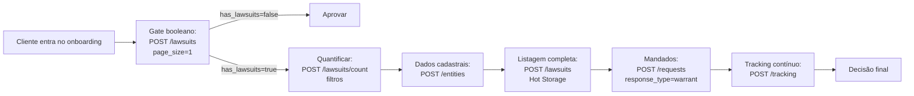

> 🤖 Este guia mostra a sequência mínima de chamadas para realizar uma diligência jurídica completa de uma pessoa física ou jurídica usando a Judit. Use o esqueleto como ponto de partida — adapte o roteiro à sua matriz de risco.

## O fluxo



## Pré-requisitos

<CardGroup cols={2}>
  <Card title="API key" icon="key">
    Cadastre-se em [judit.io](https://judit.io) e gere sua chave. Veja [Autenticação](/introduction/authentication).
  </Card>
  <Card title="Webhook URL (opcional)" icon="webhook">
    Endpoint HTTPS público para receber `tracking_response`. Veja [Webhook](/webhook/callbacks).
  </Card>
</CardGroup>

## Passo 1: Gate booleano (filtro grosso)

Antes de gastar com diligência completa, faça uma checagem barata.

<CodeGroup>
```bash cURL
curl -X POST 'https://lawsuits.production.judit.io/lawsuits' \
  --header 'api-key: '"$JUDIT_API_KEY" \
  --header 'Content-Type: application/json' \
  --data '{
    "search": { "search_type": "cpf", "search_key": "999.999.999-99", "response_type": "lawsuits" },
    "search_params": { "pagination": { "page": 1, "page_size": 1 } }
  }'
```

```python Python
import os, requests

def has_lawsuits(doc: str, search_type: str = "cpf") -> bool:
    r = requests.post(
        "https://lawsuits.production.judit.io/lawsuits",
        headers={"api-key": os.environ["JUDIT_API_KEY"]},
        json={
            "search": {"search_type": search_type, "search_key": doc, "response_type": "lawsuits"},
            "search_params": {"pagination": {"page": 1, "page_size": 1}},
        },
        timeout=10,
    )
    return r.json().get("has_lawsuits", False)

if not has_lawsuits("999.999.999-99"):
    approve_user()
    return
```
</CodeGroup>

Detalhes em [Tem Processo? (true/false)](/cache-judit/has-lawsuits).

## Passo 2: Quantificar e tirar a foto agregada

Se o gate retornou `true`, agora vale entender **a magnitude** do passivo.

<CodeGroup>
```python Python
def lawsuits_count(doc, search_type="cpf", filter_=None):
    body = {
        "search": {"search_type": search_type, "search_key": doc, "response_type": "lawsuits"}
    }
    if filter_:
        body["search"]["search_params"] = {"filter": filter_}
    r = requests.post(
        "https://lawsuits.production.judit.io/lawsuits/count",
        headers={"api-key": os.environ["JUDIT_API_KEY"]},
        json=body, timeout=10,
    )
    return r.json()["total"]

# Quantos processos passivos trabalhistas?
n_trabalhistas = lawsuits_count("999.999.999-99", filter_={
    "side": "Passive",
    "tribunals": {"keys": ["TRT01","TRT02","TRT15"], "not_equal": False},
})
```
</CodeGroup>

Detalhes em [Quantidade de Processos](/cache-judit/count) e [Agregações Sintéticas](/cache-judit/cache-grouped).

## Passo 3: Dados cadastrais

```python
def entity(doc):
    r = requests.post(
        "https://lawsuits.production.judit.io/entities",
        headers={"api-key": os.environ["JUDIT_API_KEY"]},
        json={"search": {"search_type": "cpf", "search_key": doc, "response_type": "entity"}},
        timeout=10,
    )
    return r.json()
```

Resposta inclui nomes alternativos, endereços, telefones, sócios (PJ) e situação na Receita. Veja [Dados Cadastrais](/registration-data/registration-data).

## Passo 4: Listagem detalhada via Hot Storage

Quando você precisa do conteúdo dos processos para análise, traga via Hot Storage com paginação.

```python
def list_lawsuits(doc, page=1, page_size=50):
    r = requests.post(
        "https://lawsuits.production.judit.io/lawsuits",
        headers={"api-key": os.environ["JUDIT_API_KEY"]},
        json={
            "search": {"search_type": "cpf", "search_key": doc, "response_type": "lawsuits"},
            "search_params": {"pagination": {"page": page, "page_size": page_size}},
        },
        timeout=15,
    )
    return r.json()["lawsuits"]
```

Detalhes em [Hot Storage](/cache-judit/hotstorage).

## Passo 5: Mandados de prisão (opcional para PF)

```python
def open_warrants(cpf):
    r = requests.post(
        "https://requests.production.judit.io/requests",
        headers={"api-key": os.environ["JUDIT_API_KEY"]},
        json={"search": {"search_type": "cpf", "search_key": cpf, "response_type": "warrant"}},
        timeout=15,
    )
    return r.json()["request_id"]  # consulta assíncrona — receba via webhook
```

Detalhes em [Mandados de Prisão](/criminal-consultation/warrant).

## Passo 6: Tracking contínuo

Para o cliente aprovado, configure monitoramento periódico:

```python
def track_cpf(cpf, callback_url):
    r = requests.post(
        "https://tracking.production.judit.io/tracking",
        headers={"api-key": os.environ["JUDIT_API_KEY"]},
        json={
            "search": {"search_type": "cpf", "search_key": cpf, "response_type": "lawsuits"},
            "recurrence": 7,
            "notification_filters": {"step_terms": ["sentença", "trânsito em julgado", "execução"]},
            "callback_url": callback_url,
        },
        timeout=10,
    )
    return r.json()["tracking_id"]
```

Detalhes em [Tracking](/tracking/tracking).

## Custos e dicas

<AccordionGroup>
  <Accordion title="Decisão por orçamento">
    O fluxo escalonado evita gastos desnecessários: se o gate (Passo 1) é `false`, encerre. Se é `true` mas a contagem (Passo 2) é baixa, talvez não valha trazer a lista completa.
  </Accordion>

  <Accordion title="Atualidade dos dados">
    Hot Storage retorna dados do datalake da Judit (cache). Para o estado mais recente do tribunal, use a [consulta assíncrona](/requests/requests) com `on_demand: true`.
  </Accordion>

  <Accordion title="Sigilo">
    Se sua diligência exige acesso a processos sigilosos, registre a credencial OAB no [Cofre](/essentials/cofre-de-credenciais) e use `customer_key` em todas as chamadas relevantes.
  </Accordion>

  <Accordion title="Throttling responsável">
    Para portfólios, dispare em paralelo (10-50 simultâneas), respeitando o limite do plano. Em 429, faça backoff exponencial.
  </Accordion>
</AccordionGroup>

## Próximos passos

* 👉 **[Monitoramento em massa](/guides/monitoramento-massa)** — guia para monitorar 10k+ entidades com governança de quota.
* 👉 **[Códigos de Erro](/resource/errors)** — troubleshooting durante a integração.
* 👉 **[Cobertura de Tribunais](/resource/courtCoverage)** — para validar quais filtros usar.
