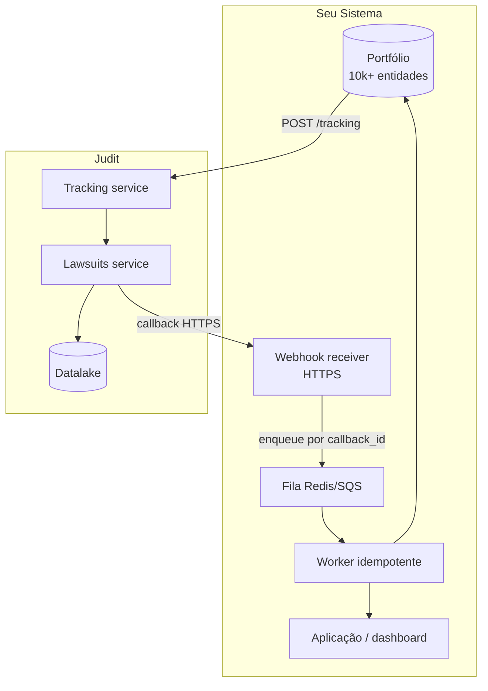

> 🤖 Este guia mostra como configurar monitoramento contínuo de milhares de processos na Judit sem custos surpresa nem perda de eventos. Use como referência para arquiteturas de portfólio, equipes de cobrança, escritórios e bancos.

## Princípios

<CardGroup cols={2}>
  <Card title="1. Tier por criticidade" icon="layer-group">
    Não use a mesma `recurrence` para tudo. Tribunais ativos com sentença pendente: 1 dia. Arquivados: 30 dias.
  </Card>
  <Card title="2. Filtre o ruído" icon="filter">
    `notification_filters.step_terms` evita trafegar/cobrar andamentos irrelevantes. Comece com 5–10 termos e ajuste.
  </Card>
  <Card title="3. Idempotência sempre" icon="rotate">
    `callback_id` único por entrega — guarde em tabela e ignore duplicatas. Webhooks reentregam.
  </Card>
  <Card title="4. Granularidade do tracker" icon="boxes-stacked">
    Um tracker por (entidade, tier) facilita pausar/desligar quem caiu de criticidade.
  </Card>
</CardGroup>

## Arquitetura de referência



## Passo 1: Modele os tiers

| Tier | Critério | Recorrência |
| :--- | :--- | :--- |
| **Quente** | Sentença pendente, recurso ativo, valor da causa > R$ 100k | 1 dia |
| **Morno** | Em andamento sem urgência | 7 dias |
| **Frio** | Arquivado, suspenso, sobrestado | 30 dias |

Decisões de tier devem ser **dinâmicas**: assim que `step_type = "SENTENÇA"` chega, promova para **Quente**.

## Passo 2: Crie trackers em batch (recomendado)

A forma mais eficiente para portfólios grandes é usar `POST /tracking/bulk` — uma única chamada que cria até **1000 trackers** de uma vez.

<CodeGroup>
```python Python (bulk — recomendado)
import os, requests

API_KEY = os.environ["JUDIT_API_KEY"]
CALLBACK_URL = "https://seu-app.com/webhooks/judit"

TIERS = {
    "quente": {"recurrence": 1, "step_terms": ["sentença", "recurso", "execução", "trânsito"]},
    "morno":  {"recurrence": 7, "step_terms": ["sentença", "execução"]},
    "frio":   {"recurrence": 30, "step_terms": ["sentença", "arquivamento"]},
}

def make_tracking(entity_doc, tier):
    cfg = TIERS[tier]
    return {
        "fixed_time": False,
        "search": {"search_type": "cpf", "search_key": entity_doc, "response_type": "lawsuits"},
        "recurrence": cfg["recurrence"],
        "notification_filters": {"step_terms": cfg["step_terms"]},
        "callback_url": CALLBACK_URL,
    }

# Lote em até 1000 — divida o portfólio em chunks de 1000
def create_bulk(portfolio_chunk):
    payload = {"trackings": [make_tracking(doc, tier) for doc, tier in portfolio_chunk]}
    r = requests.post(
        "https://tracking.production.judit.io/tracking/bulk",
        headers={"api-key": API_KEY},
        json=payload, timeout=60,
    )
    r.raise_for_status()
    body = r.json()
    return body["trackings"], body["errors"]  # {index, error, input}

# Chunked
all_trackers, all_errors = [], []
for i in range(0, len(portfolio), 1000):
    trackers, errors = create_bulk(portfolio[i:i+1000])
    all_trackers.extend(trackers); all_errors.extend(errors)
```

```python Python (loop concorrente — fallback)
import os, requests
from concurrent.futures import ThreadPoolExecutor

API_KEY = os.environ["JUDIT_API_KEY"]
CALLBACK_URL = "https://seu-app.com/webhooks/judit"

TIERS = {
    "quente": {"recurrence": 1, "step_terms": ["sentença", "recurso", "execução", "trânsito"]},
    "morno":  {"recurrence": 7, "step_terms": ["sentença", "execução"]},
    "frio":   {"recurrence": 30, "step_terms": ["sentença", "arquivamento"]},
}

def create_tracker(entity_doc, tier):
    cfg = TIERS[tier]
    r = requests.post(
        "https://tracking.production.judit.io/tracking",
        headers={"api-key": API_KEY},
        json={
            "fixed_time": False,
            "search": {"search_type": "cpf", "search_key": entity_doc, "response_type": "lawsuits"},
            "recurrence": cfg["recurrence"],
            "notification_filters": {"step_terms": cfg["step_terms"]},
            "callback_url": CALLBACK_URL,
        },
        timeout=15,
    )
    r.raise_for_status()
    return r.json()["tracking_id"]

with ThreadPoolExecutor(max_workers=20) as ex:
    futures = [ex.submit(create_tracker, doc, tier) for doc, tier in portfolio]
    tracker_ids = [f.result() for f in futures]
```
</CodeGroup>

<Note>
A resposta de `/tracking/bulk` traz dois arrays: `trackings` (criações com sucesso) e `errors` (cada um com `{index, error, input}` para diagnóstico). Idempotente do ponto de vista do servidor, mas registre os IDs criados antes de retentar.
</Note>

Detalhes em [Tracking](/tracking/tracking).

## Passo 3: Webhook receiver idempotente

<CodeGroup>
```python Python (Flask)
from flask import Flask, request, jsonify
import sqlite3

app = Flask(__name__)
db = sqlite3.connect("callbacks.db", check_same_thread=False)
db.execute("CREATE TABLE IF NOT EXISTS seen (callback_id TEXT PRIMARY KEY, seen_at TIMESTAMP DEFAULT CURRENT_TIMESTAMP)")

@app.post("/webhooks/judit")
def receive():
    payload = request.get_json()
    cb_id = payload.get("callback_id")
    if not cb_id:
        return jsonify(ok=False), 400
    try:
        db.execute("INSERT INTO seen (callback_id) VALUES (?)", (cb_id,))
        db.commit()
    except sqlite3.IntegrityError:
        return jsonify(ok=True, status="duplicate"), 200
    process_event(payload)  # idempotente por design
    return jsonify(ok=True), 200
```

```javascript Node.js (Express)
const express = require("express");
const app = express();
const seen = new Set();
app.use(express.json());

app.post("/webhooks/judit", (req, res) => {
  const cb = req.body.callback_id;
  if (!cb) return res.status(400).end();
  if (seen.has(cb)) return res.json({ ok: true, status: "duplicate" });
  seen.add(cb);
  processEvent(req.body);
  res.json({ ok: true });
});

app.listen(8080);
```
</CodeGroup>

Comportamento de retentativa em [Webhook](/webhook/callbacks).

## Passo 4: Promova/rebaixe tiers automaticamente

```python
def process_event(payload):
    event = payload.get("event")
    if event != "tracking_response":
        return
    data = payload["response_data"]
    for step in data.get("steps", []):
        term = (step.get("step_type") or "").upper()
        if term in ("SENTENÇA", "RECURSO", "EXECUÇÃO"):
            promote_to(data["lawsuit_cnj"], "quente")
        elif term == "ARQUIVAMENTO":
            demote_to(data["lawsuit_cnj"], "frio")
```

Para reconfigurar a `recurrence` ou outros campos do tracker, faça `PATCH https://tracking.production.judit.io/tracking/{id}` com o novo payload. Para apenas pausar ou retomar, use `POST /tracking/{id}/pause` e `POST /tracking/{id}/resume`.

## Custos e governança

<AccordionGroup>
  <Accordion title="Cálculo de custo de tracker">
    Custo total ≈ Σ (entidades × execuções/mês). Tier quente (1d) = ~30 execuções/mês; morno (7d) = ~4; frio (30d) = ~1. Ajuste a recorrência por tier para caber no orçamento.
  </Accordion>

  <Accordion title="Pausas estratégicas">
    Use `POST /tracking/{id}/pause` em recessos forenses, períodos de greve, ou quando uma entidade entra em "freezer regulatório". Reative depois com `POST /tracking/{id}/resume`. Operações simples e baratas.
  </Accordion>

  <Accordion title="Reentregas e backoff">
    Se seu webhook devolver 5xx, a Judit reentrega com backoff (1m, 5m, 30m, 2h, 6h). Garanta que seu receiver responda 2xx mesmo que o processamento ocorra de forma assíncrona (enfileirar e responder OK).
  </Accordion>

  <Accordion title="Quota e 429">
    Em portfólios > 10k, faça throttling no seu lado: limite criação de trackers a 50/min e ingestão a 200 webhooks/s. Em 429, leia `X-RateLimit-Reset` e respeite.
  </Accordion>

  <Accordion title="Encerramento elegante">
    Trackers consomem nichos de quota mesmo quando ociosos. Marque para `DELETE` quando uma entidade sai do portfólio (cliente saiu, processo encerrado há 2 anos sem movimentação).
  </Accordion>
</AccordionGroup>

## Próximos passos

* 👉 **[KYC Completo](/guides/kyc-completo)** — fluxo de onboarding com Judit.
* 👉 **[Webhook & Callbacks](/webhook/callbacks)** — comportamento detalhado de entrega.
* 👉 **[Códigos de Erro](/resource/errors)** — quando o tracker volta vazio ou com `application_error`.
