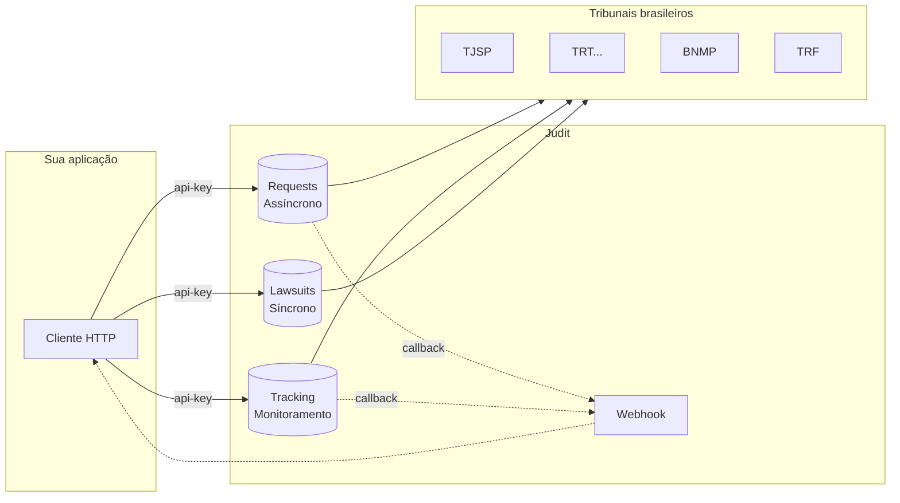

A **Judit API** entrega dados de processos judiciais brasileiros prontos para uso, em uma única integração. Em vez de manter scrapers em cada tribunal, sua aplicação faz uma chamada HTTP e recebe a capa do processo, partes, advogados, andamentos, anexos e relacionamentos — em tempo real ou de um datalake atualizado.

> 🤖 A Judit cobre Justiça Estadual, Federal, Trabalhista, Eleitoral, Militar, Superior e BNMP. Autenticação é por header `api-key`. Os 3 serviços principais são `requests` (assíncrono), `tracking` (monitoramento) e `lawsuits` (síncrono / cache).

## O que você consegue fazer

- **Buscar processos** por CPF, CNPJ, OAB, Nome ou número CNJ — assíncrono (busca direta no tribunal) ou síncrono (cache JUDIT em milissegundos).
- **Monitorar processos** automaticamente e receber atualizações por webhook quando houver nova movimentação.
- **Detectar novos processos** Porcessos distribuidos ligados a um documento.
- **Obter dados cadastrais** (Pessoa Física ou Jurídica) com opção de leitura no datalake ou em tempo real na Receita Federal.
- **Baixar anexos** e mandados de prisão (BNMP) em PDF.
- **Consultar execuções penais** (cumprimento de pena).
- **Resumir processos com IA** — gere resumos da capa do processo automaticamente (JUDIT IA).

## Casos de uso comuns

<CardGroup cols={2}>
  <Card title="Escritórios de advocacia" icon="briefcase">
    Centralize todos os processos do escritório em um só painel. Monitore andamentos críticos e gere relatórios automatizados.
  </Card>
  <Card title="Departamentos jurídicos" icon="building">
    Acompanhe a carteira jurídica corporativa e integre o status processual aos sistemas internos (ERP, CRM, BI).
  </Card>
  <Card title="Fintechs e bureaus de crédito" icon="chart-line">
    Rode due diligence em massa e enriqueça análises de risco com dados processuais por CPF/CNPJ em tempo real.
  </Card>
  <Card title="Compliance e KYC" icon="shield-check">
    Verifique processos relacionados a contraparte (PEP, antecedentes, mandados) durante o onboarding.
  </Card>
  <Card title="LegalTechs" icon="code">
    Suba sua plataforma sem precisar manter coletores em cada tribunal — foque em produto, não em infraestrutura.
  </Card>
  <Card title="Cobrança e recuperação" icon="hand-holding-dollar">
    Identifique processos passivos relevantes (valor, fase, classe) e priorize abordagens com base em fase processual.
  </Card>
</CardGroup>

## Arquitetura em 1 minuto

Três serviços, um padrão de autenticação:

| Serviço | URL | Quando usar |
| --- | --- | --- |
| `requests` | `https://requests.production.judit.io` | Consulta direta nos tribunais. Resultado chega via webhook ou polling. |
| `tracking` | `https://tracking.production.judit.io` | Monitoramento contínuo de processos com a recorrência que você define. |
| `lawsuits` | `https://lawsuits.production.judit.io` | Leitura síncrona do datalake JUDIT, retorno do processos atrelados ao documento consultado. |

## Comece em 3 passos

<Steps>
  <Step title="Solicite sua API Key">
    Fale com nosso [comercial](https://api.whatsapp.com/send/?phone=5521985284143) e receba sua chave de acesso.
  </Step>
  <Step title="Faça a primeira consulta">
    Siga o [Guia Rápido](/introduction/quickstart) para criar sua primeira requisição em menos de 5 minutos.
  </Step>
</Steps>
