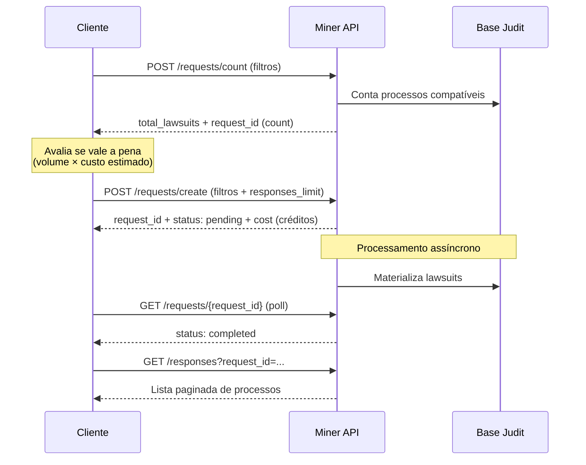

<Note>
**Beta público.** O Miner é um produto novo da Judit, em beta aberto. Os endpoints e o modelo de cobrança documentados aqui são estáveis, mas pequenos ajustes podem acontecer durante esta fase. Recomendamos travar a versão do contrato (via `If-Match` ou changelog) e nos seguir em [docs.judit.io/resource/changelog](/resource/changelog).
</Note>

<Warning>
**Os preços de uso da API Miner não estão inclusos na licença da Plataforma JUDIT Miner.** O acesso à API é cobrado **separadamente em créditos**, conforme a tabela de [Créditos & cobrança](/miner/credits). Confirme com o time comercial as faixas vigentes para sua conta antes de disparar buscas em produção.
</Warning>

O **Judit Miner** é um produto dedicado a **garimpar ativos judiciais em escala**: precatórios pagos ou em fase de pagamento (`judgement-bond`) e execuções de sentença com potencial de recuperação (`sentence-execution`). Em vez de ir processo por processo, você define um conjunto de filtros (tribunais, faixa de valor, naturezas, tags) e a Judit identifica para você todos os processos que se encaixam — descontando os que sua empresa já consultou anteriormente.

> 🤖 Host base: `https://miner.production.judit.io`. Autenticação por header `api-key` (mesma chave usada nos demais produtos Judit, com a permissão `miner_enabled` habilitada). O modelo de cobrança é por **créditos** — cada `find` é precificado por faixa antes de ser processado.

## O que o Miner faz

<CardGroup cols={2}>
  <Card title="Encontrar precatórios" icon="scale-balanced">
    Identifique precatórios federais, estaduais e municipais por ano orçamentário, natureza (alimentar/comum) e tribunal. Ideal para fundos de investimento e advocacia de recuperação.
  </Card>
  <Card title="Mapear execuções de sentença" icon="gavel">
    Detecte execuções com sinais de cálculo aprovado, possível precatório ou precatório já expedido. Ideal para originação de carteira de direitos creditórios.
  </Card>
  <Card title="Filtros por faixa de valor" icon="coins">
    Recorte por valor mínimo/máximo livre ou por faixas pré-definidas (`0-100k`, `100k-250k`, `250k-500k`, `500k-750k`, `750k-1.5M`, `1.5M+`).
  </Card>
  <Card title="Sem repetição entre buscas" icon="filter-circle-xmark">
    O `count` exclui automaticamente processos que sua empresa já consultou — você só paga pelo que ainda não viu.
  </Card>
</CardGroup>

## Como funciona

O Miner segue um fluxo de 3 etapas: **estimar** → **comprar** → **paginar**.

| Etapa | Endpoint | Para que serve |
| --- | --- | --- |
| **1. Contar** | `POST /requests/count` | Saber quantos processos batem com seus filtros, **sem custo** de créditos. Resposta síncrona. |
| **2. Criar busca** | `POST /requests/create` | Disparar a busca real. Retorna `cost` (créditos cobrados) e `status: pending`. |
| **3. Acompanhar** | `GET /requests/{request_id}` | Polar até `status: completed`. |
| **4. Coletar** | `GET /responses?request_id=...` | Listar processos retornados, paginado (até 100 por página). |

## Para quem é

<CardGroup cols={2}>
  <Card title="Fundos de direitos creditórios" icon="building-columns">
    Originação em massa de precatórios e créditos judiciais — com filtro fino por valor e tribunal.
  </Card>
  <Card title="Advocacia de recuperação" icon="briefcase">
    Identifique execuções com sinais de aprovação de cálculo ou precatório iminente para abordagem proativa.
  </Card>
  <Card title="Bancos e fintechs" icon="chart-line">
    Cesta de ativos judiciais para análise de portfólio e securitização.
  </Card>
  <Card title="Plataformas de marketplace" icon="store">
    Alimente listagens de precatórios à venda com inventário sempre fresco.
  </Card>
</CardGroup>

## O que não está no Miner

- **Consulta processual por CNJ específico** → use [Consulta Processual](/requests/requests) (Requests assíncrono) ou [Hot Storage](/cache-judit/hotstorage) (síncrono).
- **Monitoramento contínuo de movimentações** → use [Tracking](/tracking/tracking).
- **Dados cadastrais (Pessoa Física/Jurídica)** → use [`/entities`](/registration-data/registration-data).

O Miner foca em **descoberta de ativos** com base em atributos do processo. Para qualquer outro caso, os produtos correspondentes seguem disponíveis e cobram normalmente.

## Próximos passos

<CardGroup cols={2}>
  <Card title="Quickstart" icon="bolt" href="/miner/quickstart">
    Crie sua primeira busca em menos de 10 minutos.
  </Card>
  <Card title="Conceitos" icon="book" href="/miner/concepts">
    Entenda `kind`, `natures`, `tags`, faixas de valor e regras de combinação.
  </Card>
  <Card title="Créditos & cobrança" icon="coins" href="/miner/credits">
    Como funciona o `cost`, faixas de preço e tratamento de erros de billing.
  </Card>
  <Card title="Tribunais aceitos" icon="building-columns" href="/miner/tribunals">
    Lista completa de IDs e acrônimos para usar no filtro `tribunals`.
  </Card>
</CardGroup>
