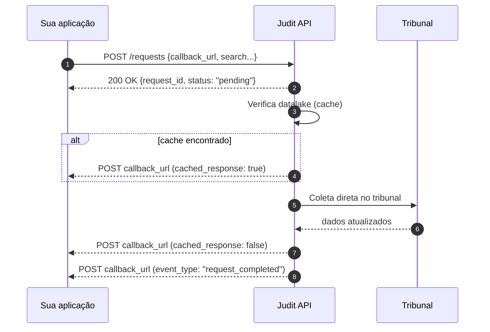

import CachedResponseInfo from '/snippets/cached-response-pt.mdx';

<CachedResponseInfo />

Os **Webhooks** entregam push em tempo real os resultados das suas consultas e monitoramentos: você não precisa fazer polling. Assim que a Judit termina de processar a requisição, fazemos um `POST` para a URL configurada com o objeto resposta no corpo. É a forma mais eficiente e barata de integração para fluxos assíncronos.

> 🤖 Padrão de entrega: HTTP POST com Content-Type `application/json`. Use uma URL HTTPS pública. Implemente idempotência baseada em `request_id` + `cached_response`. Em caso de erro 5xx ou timeout, fazemos retry com backoff.

## Quando usar

<CardGroup cols={2}>
  <Card title="Fluxos assíncronos em escala" icon="bolt">
    Em cargas grandes (centenas/milhares de requisições), webhook elimina o polling e reduz drasticamente o consumo da sua quota.
  </Card>
  <Card title="Notificações de monitoramento" icon="bell">
    Receba imediatamente quando um monitoramento detectar nova movimentação ou nasceu um novo processo.
  </Card>
  <Card title="Integração com sistemas internos" icon="diagram-project">
    Fila → handler → ERP/CRM/BI: padrão event-driven sem precisar consultar a Judit constantemente.
  </Card>
  <Card title="Identificação de cache vs. atualização" icon="layer-group">
    Use `cached_response` para diferenciar a resposta inicial (cache) da posterior (atualizada do tribunal).
  </Card>
</CardGroup>

## Como funciona



A cada evento, fazemos um `POST` HTTPS para sua URL com o payload em `application/json`. **A entrega é incremental** — você pode receber várias respostas para o mesmo `request_id` antes de chegar o evento `request_completed` que sinaliza fim do fluxo.

## Configurando seu webhook

Existem **duas formas** de receber retornos:

<CardGroup cols={2}>
  <Card title="1. Conta-toda (recomendado)" icon="building">
    Cadastre uma URL única que recebe **todas** as respostas (consultas + monitoramentos). Solicite via [Suporte](https://api.whatsapp.com/send/?phone=5511920501949) — leva poucos minutos.
  </Card>
  <Card title="2. Por requisição" icon="bullseye">
    Adicione `callback_url` no payload da requisição. Útil para roteamento dinâmico (ex.: webhook por ambiente ou cliente final).
  </Card>
</CardGroup>

<CodeGroup>
```json Requisição com callback_url
{
    "search": {
        "search_type": "lawsuit_cnj",
        "search_key": "9999999-99.9999.9.99.9999"
    },
    "callback_url": "https://api.seudominio.com/webhooks/judit",
    "with_attachments": true
}
```

```bash cURL
curl -X POST "https://requests.production.judit.io/requests" \
  -H "api-key: $JUDIT_API_KEY" \
  -H "Content-Type: application/json" \
  -d '{
    "search": { "search_type": "lawsuit_cnj", "search_key": "9999999-99.9999.9.99.9999" },
    "callback_url": "https://api.seudominio.com/webhooks/judit",
    "with_attachments": true
  }'
```

```javascript Node.js
await fetch("https://requests.production.judit.io/requests", {
  method: "POST",
  headers: {
    "api-key": process.env.JUDIT_API_KEY,
    "Content-Type": "application/json",
  },
  body: JSON.stringify({
    search: { search_type: "lawsuit_cnj", search_key: "9999999-99.9999.9.99.9999" },
    callback_url: "https://api.seudominio.com/webhooks/judit",
    with_attachments: true,
  }),
});
```
</CodeGroup>

<Note>
O parâmetro `with_attachments` aplica-se **apenas a consultas processuais** (`search_type: "lawsuit_cnj"`).
</Note>

## Eventos enviados

| `event_type` | Quando dispara | Payload |
| --- | --- | --- |
| `response_created` | Cada vez que um novo `response_data` é gerado para a requisição (cache ou tribunal) | Objeto `lawsuit`, `entity`, `warrant` ou `execution` |
| `request_completed` | Fim do fluxo da requisição (todos os tribunais responderam) | Objeto `request` final com `status: "completed"` |
| `tracking_response` | Disparado por monitoramentos (cada nova movimentação detectada) | Mesmo formato de `response_created` mas via `tracking_id` |

Todo payload tem um envelope padrão:

```json
{
  "user_id": "ab829a35-894b-4fbd-9168-2398fd69cecc",
  "callback_id": "d5dcbbd6-a9cc-4eef-b1d1-d58a59c4631b",
  "event_type": "response_created",
  "reference_type": "request",
  "reference_id": "ec545a1e-c0ac-47cf-a3df-3668f1bdde11",
  "payload": { /* objeto específico do evento */ }
}
```

- `callback_id` — id único da entrega (use para idempotência).
- `reference_id` — `request_id` ou `tracking_id` que originou o evento.
- `payload` — conteúdo (resposta processual, dados cadastrais, etc.).

## `cached_response`: lendo as duas entregas

A maior parte das requisições gera **duas entregas** em sequência: a primeira do cache e a segunda atualizada. Use `cached_response` para identificar.

| Sequência | `event_type` | `cached_response` | Significado |
| --- | --- | --- | --- |
| 1 | `response_created` | `true` | Veio do datalake JUDIT (resposta inicial rápida). |
| 2 | `response_created` | `false` | Coleta atual no tribunal. **Sempre que existir, é a versão definitiva.** |
| 3 | `request_completed` | — | Todos os tribunais responderam. Sua aplicação pode encerrar o ciclo. |

> ⚠️ Em consultas processuais recentemente refrescadas (dentro do `cache_ttl_in_days`), você pode receber **apenas** a entrega com `cached_response: true` — não há nova coleta no tribunal porque o cache ainda é válido.

## Boas práticas (essencial para produção)

<AccordionGroup>
  <Accordion title="✅ Idempotência" icon="repeat">
    Use `callback_id` como chave de idempotência: rejeite duplicatas baseado nele. Em retries, o mesmo `callback_id` é reentregue.
  </Accordion>
  <Accordion title="✅ Resposta rápida (HTTP 2xx)" icon="bolt">
    Responda `200 OK` em **menos de 10 segundos**. Processe assincronamente (fila/worker). Se demorar, contamos como falha e fazemos retry.
  </Accordion>
  <Accordion title="✅ Persistir o evento antes de processar" icon="database">
    Padrão produção: gravar o evento bruto em fila/log e processar depois. Evita perda em caso de erro de aplicação.
  </Accordion>
  <Accordion title="✅ Tratar `cached_response: true` como provisório" icon="layer-group">
    Sempre considere a entrega com `cached_response: false` (quando existir) como a versão final. UI/relatórios devem refletir o último valor.
  </Accordion>
  <Accordion title="✅ Validar origem (HTTPS + IP allowlist)" icon="shield-halved">
    Aceite `POST` apenas de IPs Judit (consulte o suporte). Use HTTPS sempre. Em ambientes regulados, valide também o cabeçalho `User-Agent`.
  </Accordion>
  <Accordion title="✅ Implementar retry tolerante" icon="rotate">
    Em caso de erro 5xx ou timeout, fazemos retries com backoff exponencial. Se sua URL ficar indisponível por muito tempo, perdemos eventos — mantenha o endpoint estável.
  </Accordion>
</AccordionGroup>

## Receptor de webhook (exemplo Node.js)

```javascript
import express from "express";
const app = express();
app.use(express.json());

const seen = new Set();
const lastByRequest = new Map();

app.post("/webhooks/judit", async (req, res) => {
  const { callback_id, event_type, reference_id, payload } = req.body;

  // 1. Idempotência
  if (seen.has(callback_id)) return res.sendStatus(200);
  seen.add(callback_id);

  // 2. Responde rápido — processa assíncrono
  res.sendStatus(200);

  // 3. Lógica
  if (event_type === "response_created") {
    const cached = !!payload?.tags?.cached_response || payload?.cached_response;
    // Sempre prefira a versão mais recente (cached_response: false)
    if (!cached || !lastByRequest.has(reference_id)) {
      lastByRequest.set(reference_id, payload);
      await persistResponse(payload);
    }
  }
  if (event_type === "request_completed") {
    await markRequestDone(reference_id);
  }
});

app.listen(3000);
```

```python Python (FastAPI)
from fastapi import FastAPI, Request
app = FastAPI()
seen = set()

@app.post("/webhooks/judit")
async def judit(req: Request):
    body = await req.json()
    cb_id = body.get("callback_id")
    if cb_id in seen:
        return {"ok": True}
    seen.add(cb_id)

    if body["event_type"] == "response_created":
        # Persistir prefereindo cached_response: false
        ...
    return {"ok": True}
```

 ## Envio da resposta

Realizamos uma solicitação POST para o webhook, enviando as respostas conforme os resultados da sua busca. O envio ocorre de forma incremental, à medida que as respostas são geradas, e é concluído quando o status da requisição é atualizado para **"completed"**.

### Resposta para consulta histórica:


Exemplo de reposta com `cached_response: true`:

<Accordion title="Ver exemplo de resposta">
```json
{
    "user_id": "ab829a35-894b-4fbd-9168-2398fd69cecc",
    "callback_id": "d5dcbbd6-a9cc-4eef-b1d1-d58a59c4631b",
    "event_type": "response_created",
    "reference_type": "request",
    "reference_id": "ec545a1e-c0ac-47cf-a3df-3668f1bdde11",
    "payload": {
        "request_id": "ec545a1e-c0ac-47cf-a3df-3668f1bdde11",
        "response_id": "2db448e0-7b9d-4e6b-a2d7-9c0adcff9b77",
        "response_type": "lawsuit",
        "response_data": {
            "code": "9999999-99.9999.9.99.9999",
            "instance": 1,
            "name": "Usuário teste 1 X Usuário teste 2",
            "free_justice": true,
            "secrecy_level": 0,
            "courts": [
                {
                    "code": "7846",
                    "name": "BANGU REGIONAL 2 VARA CIVEL"
                }
            ],
            "tribunal_acronym": "TJRJ",
            "county": "CAPITAL CENTRAL DE ARQUIVAMENTO DO NUR 1",
            "state": "RJ",
            "city": "RIO DE JANEIRO",
            "distribution_date": "2022-01-13T13:06:46.799Z",
            "last_step": {
                "step_id": "27572cb5",
                "step_date": "2025-06-29T20:07:53.000Z",
                "content": "Remetidos os Autos (cumpridos) para 2ª Vara Cível da Regional de Bangu",
                "steps_count": 19
            },
            "tags": {
                "crawl_id": "eb2d2f65-69c0-43bd-b75a-ad9d9a787447",
                "dictionary_updated_at": "2025-08-06T13:48:47.823Z",
                "possible_homonym": true,
                "datalake_id": "08004925520228190204",
                "datalake_segment": "JUSTICA_ESTADUAL"
            },
            "justice": "8",
            "tribunal": "19",
            "crawler": {
                "source_name": "JPje - RJ - Lawsuit - Auth - 1 instance",
                "crawl_id": "eb2d2f65-69c0-43bd-b75a-ad9d9a787447",
                "updated_at": "2025-07-01T15:42:55.700Z",
                "weight": 10
            },
            "area": "DIREITO CIVIL",
            "justice_description": "JUSTIÇA ESTADUAL",
            "created_at": "2024-09-25T04:13:06.923Z",
            "updated_at": "2025-08-04T15:27:19.032Z",
            "amount": 11617.01,
            "classifications": [
                {
                    "code": "7",
                    "name": "PROCEDIMENTO COMUM CÍVEL"
                }
            ],
            "subjects": [
                {
                    "code": "10671",
                    "name": "OBRIGAÇÃO DE FAZER / NÃO FAZER"
                },
                {
                    "code": "6007",
                    "name": "REPETIÇÃO DE INDÉBITO"
                },
                {
                    "code": "10441",
                    "name": "ACIDENTE DE TRÂNSITO"
                },
                {
                    "code": "14",
                    "name": "DIREITO TRIBUTÁRIO"
                },
                {
                    "code": "5986",
                    "name": "CRÉDITO TRIBUTÁRIO"
                },
                {
                    "code": "899",
                    "name": "DIREITO CIVIL"
                },
                {
                    "code": "10431",
                    "name": "RESPONSABILIDADE CIVIL"
                },
                {
                    "code": "10439",
                    "name": "INDENIZAÇÃO POR DANO MATERIAL"
                },
                {
                    "code": "8826",
                    "name": "DIREITO PROCESSUAL CIVIL E DO TRABALHO"
                },
                {
                    "code": "9148",
                    "name": "LIQUIDAÇÃO / CUMPRIMENTO / EXECUÇÃO"
                },
                {
                    "code": "",
                    "name": "INDENIZAÇÃO POR DANO MORAL"
                }
            ],
            "parties": [
                {
                    "main_document": "99999999999",
                    "name": "Usuário teste 1",
                    "side": "Active",
                    "person_type": "Autor",
                    "documents": [
                        {
                            "document": "99999999999",
                            "document_type": "cpf"
                        }
                    ],
                    "lawyers": [
                        {
                            "name": "Usuário teste 2",
                            "documents": []
                        }
                    ]
                },
                {
                    "main_document": "99999999999",
                    "name": "Usuário teste 2",
                    "side": "Passive",
                    "person_type": "RÉU",
                    "documents": [
                        {
                            "document": "99999999999",
                            "document_type": "cnpj"
                        }
                    ],
                    "lawyers": [
                        {
                            "name": "Usuário teste 3 - (99999999999)",
                            "documents": []
                        }
                    ]
                },
                {
                    "name": "Usuário teste 2",
                    "side": "Active",
                    "person_type": "Advogado",
                    "documents": [],
                    "lawyers": []
                },
                {
                    "name": "Usuário teste 3 - (99999999999)",
                    "side": "Passive",
                    "person_type": "Advogado",
                    "documents": [],
                    "lawyers": []
                }
            ],
            "attachments": [],
            "related_lawsuits": [],
            "steps": []
        },
        "user_id": "ab829a35-894b-4fbd-9168-2398fd69cecc",
        "created_at": "2025-08-06T13:48:47.824Z",
        "request_created_at": "2025-08-06T13:48:46.910Z",
        "is_scrapper_info": false,
        "tags": {
            "dashboard_id": null,
            "cached_response": true
        },
        "origin": "api",
        "origin_id": "ec545a1e-c0ac-47cf-a3df-3668f1bdde11"
    }
}
```
</Accordion>

Exemplo de reposta com `cached_response: false`:

<Accordion title="Ver exemplo de resposta">
```json
{
    "user_id": "ab829a35-894b-4fbd-9168-2398fd69cecc",
    "callback_id": "3be957e0-876f-4d36-b98b-d60ad63a0e1c",
    "event_type": "response_created",
    "reference_type": "request",
    "reference_id": "ec545a1e-c0ac-47cf-a3df-3668f1bdde11",
    "payload": {
        "request_id": "ec545a1e-c0ac-47cf-a3df-3668f1bdde11",
        "response_id": "aab3ba92-da01-461b-9d88-b3fc610b8b99",
        "response_type": "lawsuit",
        "response_data": {
            "code": "9999999-99.9999.9.99",
            "instance": 1,
            "name": "Uusuário teste 1 X Usuário teste 2",
            "free_justice": false,
            "secrecy_level": 0,
            "courts": [
                {
                    "code": "7838",
                    "name": "BANGU REGIONAL 1 VARA CIVEL"
                },
                {
                    "name": "1ª Vara Cível da Regional de Bangu",
                    "date": "2022-11-14T00:00:00.000Z"
                }
            ],
            "tribunal_acronym": "TJRJ",
            "county": "CAPITAL CENTRAL DE ARQUIVAMENTO DO NUR 1",
            "state": "RJ",
            "city": "RIO DE JANEIRO",
            "judge": "Juiz de Direito",
            "distribution_date": "2022-11-14T20:58:19.530Z",
            "last_step": {
                "step_id": "5d89299a",
                "step_date": "2023-07-04T09:44:00.000Z",
                "content": "Baixa Definitiva",
                "steps_count": 26
            },
            "tags": {
                "crawl_id": "f8639963-31af-4d0c-be0d-502db2d222cc",
                "dictionary_updated_at": "2025-08-06T13:48:47.822Z",
                "possible_homonym": true,
                "datalake_id": "08246793020228190204",
                "datalake_segment": "JUSTICA_ESTADUAL"
            },
            "justice": "8",
            "tribunal": "19",
            "crawler": {
                "source_name": "JPje - RJ - Lawsuit - Auth - 1 instance",
                "crawl_id": "f8639963-31af-4d0c-be0d-502db2d222cc",
                "updated_at": "2025-07-29T18:36:21.461Z",
                "weight": 10
            },
            "area": "DIREITO DO CONSUMIDOR",
            "justice_description": "JUSTIÇA ESTADUAL",
            "created_at": "2024-09-25T05:29:22.270Z",
            "updated_at": "2025-08-04T15:27:19.298Z",
            "amount": 9614.9,
            "classifications": [
                {
                    "code": "7",
                    "name": "PROCEDIMENTO COMUM CÍVEL"
                }
            ],
            "subjects": [
                {
                    "code": "7760",
                    "name": "FORNECIMENTO DE ENERGIA ELÉTRICA"
                },
                {
                    "code": "7780",
                    "name": "INDENIZAÇÃO POR DANO MATERIAL"
                },
                {
                    "code": "6226",
                    "name": "INCLUSÃO INDEVIDA EM CADASTRO DE INADIMPLENTES"
                },
                {
                    "code": "1156",
                    "name": "DIREITO DO CONSUMIDOR"
                },
                {
                    "code": "6220",
                    "name": "RESPONSABILIDADE DO FORNECEDOR"
                },
                {
                    "code": "7779",
                    "name": "INDENIZAÇÃO POR DANO MORAL"
                },
                {
                    "code": "7771",
                    "name": "CONTRATOS DE CONSUMO"
                }
            ],
            "parties": [
                {
                    "main_document": "99999999999",
                    "name": "Usuário teste 2",
                    "side": "Passive",
                    "person_type": "RÉU",
                    "documents": [
                        {
                            "document": "99999999999",
                            "document_type": "cnpj"
                        }
                    ],
                    "lawyers": [
                        {
                            "main_document": "99999999999",
                            "name": "Usuário teste 2",
                            "documents": [
                                {
                                    "document": "99999999999",
                                    "document_type": "cpf"
                                },
                                {
                                    "document": "999999",
                                    "document_type": "oab"
                                }
                            ]
                        },
                        {
                            "main_document": "99999999999",
                            "name": "Usuário teste 3",
                            "documents": [
                                {
                                    "document": "99999999999",
                                    "document_type": "cpf"
                                },
                                {
                                    "document": "9999999",
                                    "document_type": "oab"
                                }
                            ]
                        },
                        {
                            "main_document": "99999999999",
                            "name": "usuário teste 4",
                            "documents": [
                                {
                                    "document": "99999999999",
                                    "document_type": "cpf"
                                },
                                {
                                    "document": "9999999",
                                    "document_type": "oab"
                                }
                            ]
                        }
                    ]
                },
                {
                    "main_document": "99999999999",
                    "name": "Usuário teste 2",
                    "side": "Passive",
                    "person_type": "Advogado",
                    "documents": [
                        {
                            "document": "99999999999",
                            "document_type": "cpf"
                        },
                        {
                            "document": "99999999",
                            "document_type": "oab"
                        },
                        {
                            "document": "9999999",
                            "document_type": "oab"
                        }
                    ],
                    "lawyers": []
                },
                {
                    "main_document": "99999999999",
                    "name": "Usuário teste 3",
                    "side": "Passive",
                    "person_type": "Advogado",
                    "documents": [
                        {
                            "document": "99999999999",
                            "document_type": "cpf"
                        },
                        {
                            "document": "RJ0145264",
                            "document_type": "oab"
                        },
                        {
                            "document": "99999999",
                            "document_type": "oab"
                        }
                    ],
                    "lawyers": []
                },
                {
                    "main_document": "99999999999",
                    "name": "usuário teste 4",
                    "side": "Passive",
                    "person_type": "Advogado",
                    "documents": [
                        {
                            "document": "99999999999",
                            "document_type": "cpf"
                        },
                        {
                            "document": "RJ000000",
                            "document_type": "oab"
                        },
                        {
                            "document": "99999999",
                            "document_type": "oab"
                        }
                    ],
                    "lawyers": []
                },
                {
                    "main_document": "99999999999",
                    "name": "Uusuário teste 1",
                    "side": "Active",
                    "person_type": "Autor",
                    "documents": [
                        {
                            "document": "99999999999",
                            "document_type": "cpf"
                        }
                    ],
                    "lawyers": [
                        {
                            "main_document": "99999999999",
                            "name": "Usuário teste5",
                            "documents": [
                                {
                                    "document": "99999999999",
                                    "document_type": "cpf"
                                },
                                {
                                    "document": "999999RJ",
                                    "document_type": "oab"
                                }
                            ]
                        }
                    ]
                }
            ],
            "attachments": [],
            "related_lawsuits": [],
            "steps": []
        },
        "user_id": "ab829a35-894b-4fbd-9168-2398fd69cecc",
        "created_at": "2025-08-06T13:48:47.824Z",
        "request_created_at": "2025-08-06T13:48:46.910Z",
        "is_scrapper_info": false,
        "tags": {
            "dashboard_id": null,
            "cached_response": false
        },
        "origin": "api",
        "origin_id": "ec545a1e-c0ac-47cf-a3df-3668f1bdde11"
    }
}
```
</Accordion>

### Resposta para consulta processual:


Exemplo de reposta com `cached_response: true`:

<Accordion title="Ver exemplo de resposta">
```json
{
  "user_id": "7f8065a3-4891-428d-9456-dedfc12ff850",
  "callback_id": "1a1700da-531b-4b50-ab38-2855a2525929",
  "event_type": "response_created",
  "reference_type": "request",
  "reference_id": "949f0d48-022b-496c-a9a9-97a80c3f8044",
  "payload": {
    "request_id": "949f0d48-022b-496c-a9a9-97a80c3f8044",
    "response_id": "752c4e7d-b0b0-435f-a27f-56bed8e559c7",
    "response_type": "lawsuit",
    "response_data": {
      "code": "9999999-99.9999.9.99.9999",
      "instance": 1,
      "name": "Usuário teste 1 X Usuário teste 2",
      "free_justice": true,
      "secrecy_level": 0,
      "courts": [
        {
          "code": "7846",
          "name": "BANGU REGIONAL 2 VARA CIVEL"
        }
      ],
      "tribunal_acronym": "TJRJ",
      "county": "CAPITAL CENTRAL DE ARQUIVAMENTO DO NUR 1",
      "state": "RJ",
      "city": "RIO DE JANEIRO",
      "distribution_date": "2022-01-13T00:00:00.000Z",
      "last_step": {
        "step_id": "27572cb5",
        "step_date": "2025-06-29T20:07:53.000Z",
        "content": "Remetidos os Autos (cumpridos) para 2ª Vara Cível da Regional de Bangu",
        "steps_count": 19
      },
      "tags": {
        "crawl_id": "5bfc2f70-3142-4b79-b306-f4d9a70cc88e",
        "dictionary_updated_at": "2025-08-13T13:27:19.460Z",
        "possible_homonym": true,
        "datalake_id": "08004925520228190204",
        "datalake_segment": "JUSTICA_ESTADUAL"
      },
      "justice": "8",
      "tribunal": "19",
      "crawler": {
        "source_name": "JPje - RJ - Lawsuit - Auth - 1 instance",
        "crawl_id": "5bfc2f70-3142-4b79-b306-f4d9a70cc88e",
        "updated_at": "2025-08-13T13:26:20.073Z",
        "weight": 10
      },
      "status": "Finalizado",
      "phase": "Arquivado",
      "area": "DIREITO CIVIL",
      "justice_description": "JUSTIÇA ESTADUAL",
      "created_at": "2024-09-25T04:13:06.923Z",
      "updated_at": "2025-08-13T13:26:23.583Z",
      "amount": 11617.01,
      "classifications": [
        {
          "code": "7",
          "name": "PROCEDIMENTO COMUM CÍVEL"
        }
      ],
      "subjects": [
        {
          "code": "14",
          "name": "DIREITO TRIBUTÁRIO"
        },
        {
          "code": "5986",
          "name": "CRÉDITO TRIBUTÁRIO"
        },
        {
          "code": "899",
          "name": "DIREITO CIVIL"
        },
        {
          "code": "10431",
          "name": "RESPONSABILIDADE CIVIL"
        },
        {
          "code": "10439",
          "name": "INDENIZAÇÃO POR DANO MATERIAL"
        },
        {
          "code": "8826",
          "name": "DIREITO PROCESSUAL CIVIL E DO TRABALHO"
        },
        {
          "code": "9148",
          "name": "LIQUIDAÇÃO / CUMPRIMENTO / EXECUÇÃO"
        },
        {
          "code": "10671",
          "name": "OBRIGAÇÃO DE FAZER / NÃO FAZER"
        },
        {
          "code": "6007",
          "name": "REPETIÇÃO DE INDÉBITO"
        },
        {
          "code": "10441",
          "name": "ACIDENTE DE TRÂNSITO"
        },
        {
          "code": "",
          "name": "INDENIZAÇÃO POR DANO MORAL"
        }
      ],
      "parties": [
        {
          "main_document": "99999999999",
          "name": "Usuário teste 1",
          "side": "Active",
          "person_type": "Autor",
          "documents": [
            {
              "document": "99999999999",
              "document_type": "cpf"
            }
          ],
          "lawyers": [
            {
              "name": "Usuário teste 3",
              "documents": []
            }
          ]
        },
        {
          "main_document": "99999999999",
          "name": "Usuário teste 2",
          "side": "Passive",
          "person_type": "RÉU",
          "documents": [
            {
              "document": "99999999999",
              "document_type": "cnpj"
            }
          ],
          "lawyers": [
            {
              "name": "Usuário teste 2 - (99999999999)",
              "documents": []
            }
          ]
        },
        {
          "name": "Usuário teste 3",
          "side": "Active",
          "person_type": "Advogado",
          "documents": [],
          "lawyers": []
        },
        {
          "name": "Usuário teste 2 - (99999999999)",
          "side": "Passive",
          "person_type": "Advogado",
          "documents": [],
          "lawyers": []
        }
      ],
      "attachments": [
        {
          "attachment_id": "201273181",
          "attachment_name": "Certidão de Débito (Certidão de Débito)",
          "extension": "html",
          "tags": {
            "crawl_id": "7ce9007d-98d2-4ea6-b729-ca1f3bc77d2f"
          },
          "status": "done",
          "attachment_date": null
        },
        {
          "attachment_id": "16345831",
          "attachment_name": "Sentença (Sentença)",
          "extension": "html",
          "tags": {
            "crawl_id": "c53921e7-7c6e-4bbc-b816-64aee561cf8c"
          },
          "status": "done",
          "attachment_date": "2022-04-08T14:04:57.000Z"
        },
        {
          "attachment_id": "13084368",
          "attachment_name": "Contestação (Contestação)",
          "extension": "html",
          "tags": {
            "crawl_id": "c53921e7-7c6e-4bbc-b816-64aee561cf8c"
          },
          "status": "done",
          "attachment_date": "2022-02-15T15:52:41.000Z"
        },
        {
          "attachment_id": "11529202",
          "attachment_name": "Decisão (Decisão)",
          "extension": "html",
          "tags": {
            "crawl_id": "c53921e7-7c6e-4bbc-b816-64aee561cf8c"
          },
          "status": "done",
          "attachment_date": "2022-01-19T19:17:51.000Z"
        }
      ],
      "related_lawsuits": [],
      "steps": [
        {
          "lawsuit_cnj": "9999999-99.9999.9.99.9999",
          "lawsuit_instance": 1,
          "step_id": "27572cb5",
          "step_date": "2025-06-29T20:07:53.000Z",
          "content": "Remetidos os Autos (cumpridos) para 2ª Vara Cível da Regional de Bangu",
          "private": false,
          "created_at": "2025-08-13T13:26:23.096Z",
          "updated_at": "2025-08-13T13:26:23.096Z",
          "tags": {
            "crawl_id": "5bfc2f70-3142-4b79-b306-f4d9a70cc88e"
          }
        },
        {
          "lawsuit_cnj": "9999999-99.9999.9.99.9999",
          "lawsuit_instance": 1,
          "step_id": "a9d74d34",
          "step_date": "2025-06-29T20:07:53.000Z",
          "step_type": "123",
          "private": false,
          "created_at": "2025-08-11T18:00:08.187Z",
          "updated_at": "2025-08-11T18:00:08.187Z",
          "tags": {
            "crawl_id": "b5fc9f65-f071-48a0-a760-5a3a69e6ae6d"
          }
        },
        {
          "lawsuit_cnj": "9999999-99.9999.9.99.9999",
          "lawsuit_instance": 1,
          "step_id": "7136b764",
          "step_date": "2025-06-16T20:24:29.000Z",
          "content": "Juntada de Petição de certidão de débito\n\t\t\t\t\t\n\t\t16/06/2025 20:24:28",
          "private": false,
          "created_at": "2025-08-13T13:26:23.096Z",
          "updated_at": "2025-08-13T13:26:23.096Z",
          "tags": {
            "crawl_id": "5bfc2f70-3142-4b79-b306-f4d9a70cc88e"
          }
        },
        {
          "lawsuit_cnj": "9999999-99.9999.9.99.9999",
          "lawsuit_instance": 1,
          "step_id": "c92f8e31",
          "step_date": "2025-06-15T13:42:16.000Z",
          "content": "Expedição de Certidão.",
          "private": false,
          "created_at": "2025-08-13T13:26:23.096Z",
          "updated_at": "2025-08-13T13:26:23.096Z",
          "tags": {
            "crawl_id": "5bfc2f70-3142-4b79-b306-f4d9a70cc88e"
          }
        }
      ]
    },
    "user_id": "7f8065a3-4891-428d-9456-dedfc12ff850",
    "created_at": "2025-08-13T13:27:19.462Z",
    "request_created_at": "2025-08-13T13:27:18.416Z",
    "is_scrapper_info": false,
    "tags": {
      "debug": true,
      "dashboard_id": null,
      "cached_response": true
    },
    "origin": "api",
    "origin_id": "949f0d48-022b-496c-a9a9-97a80c3f8044"
  }
}
```
</Accordion>

Exemplo de reposta com `cached_response: false`:

<Accordion title="Ver exemplo de resposta">
```json
{
  "user_id": "7f8065a3-4891-428d-9456-dedfc12ff850",
  "callback_id": "10e9c234-4f10-4882-a296-53389060b32c",
  "event_type": "response_created",
  "reference_type": "request",
  "reference_id": "949f0d48-022b-496c-a9a9-97a80c3f8044",
  "payload": {
    "_id": "689c92bae1249918bf8266cb",
    "response_id": "752c4e7d-b0b0-435f-a27f-56bed8e559c7",
    "origin": "api",
    "origin_id": "949f0d48-022b-496c-a9a9-97a80c3f8044",
    "request_id": "949f0d48-022b-496c-a9a9-97a80c3f8044",
    "user_id": "7f8065a3-4891-428d-9456-dedfc12ff850",
    "response_type": "lawsuit",
    "response_data": {
      "code": "9999999-99.9999.9.99.9999",
      "instance": 1,
      "name": "Usuário 1 X Usuário 2",
      "free_justice": false,
      "secrecy_level": 0,
      "classifications": [
        {
          "code": "7",
          "name": "PROCEDIMENTO COMUM CÍVEL",
          "date": "2022-01-13T00:00:00.000Z"
        }
      ],
      "courts": [
        {
          "code": "7846",
          "name": "BANGU REGIONAL 2 VARA CIVEL"
        },
        {
          "name": "2ª Vara Cível da Regional de Bangu",
          "date": "2022-01-13T00:00:00.000Z"
        }
      ],
      "tribunal_acronym": "TJRJ",
      "county": "CAPITAL CENTRAL DE ARQUIVAMENTO DO NUR 1",
      "state": "RJ",
      "city": "RIO DE JANEIRO",
      "distribution_date": "2022-01-13T00:00:00.000Z",
      "amount": 11617.01,
      "attachments": [
        {
          "attachment_id": "201273181",
          "attachment_date": "2025-06-16T20:24:00.000Z",
          "attachment_name": "Certidão de Débito (Certidão de Débito)",
          "step_id": "50bb801c",
          "extension": "html",
          "status": "done",
          "tags": {
            "crawl_id": "7ce9007d-98d2-4ea6-b729-ca1f3bc77d2f"
          },
          "user_data": null
        },
        {
          "attachment_id": "200884452",
          "attachment_date": "2025-06-15T13:42:00.000Z",
          "attachment_name": "Certidão",
          "step_id": "3ff7cb6f",
          "extension": "html",
          "status": "done",
          "tags": {
            "crawl_id": "e3da89f2-8951-4061-98da-356e070301e1"
          },
          "user_data": null
        },
        {
          "attachment_id": "39678201",
          "attachment_date": "2022-12-14T17:31:00.000Z",
          "attachment_name": "Certidão",
          "step_id": "a9e15505",
          "extension": "html",
          "status": "done",
          "tags": {
            "crawl_id": "e3da89f2-8951-4061-98da-356e070301e1"
          },
          "user_data": null
        },
        {
          "attachment_id": "25650248",
          "attachment_date": "2022-08-04T14:10:00.000Z",
          "attachment_name": "Certidão",
          "step_id": "98b9142a",
          "extension": "html",
          "status": "done",
          "tags": {
            "crawl_id": "e3da89f2-8951-4061-98da-356e070301e1"
          },
          "user_data": null
        },
        {
          "attachment_id": "16345831",
          "attachment_date": "2022-04-08T14:04:57.000Z",
          "attachment_name": "Sentença (Sentença)",
          "step_id": "1909bb45",
          "extension": "html",
          "status": "done",
          "tags": {
            "crawl_id": "c53921e7-7c6e-4bbc-b816-64aee561cf8c"
          },
          "user_data": null
        },
        {
          "attachment_id": "16327314",
          "attachment_date": "2022-04-07T17:33:00.000Z",
          "attachment_name": "Ato Ordinatório",
          "step_id": "739c98d1",
          "extension": "html",
          "status": "done",
          "tags": {
            "crawl_id": "e3da89f2-8951-4061-98da-356e070301e1"
          },
          "user_data": null
        },
        {
          "attachment_id": "15939964",
          "attachment_date": "2022-04-01T18:29:00.000Z",
          "attachment_name": "Petição",
          "step_id": "c8ce483d",
          "extension": "html",
          "status": "done",
          "tags": {
            "crawl_id": "e3da89f2-8951-4061-98da-356e070301e1"
          },
          "user_data": null
        },
        {
          "attachment_id": "15939965",
          "attachment_date": "2022-04-01T18:29:00.000Z",
          "attachment_name": "Petição (COMPROVA DEPOSITO   0800492 55.2022.8.19.0204)",
          "step_id": "c8ce483d",
          "extension": "pdf",
          "status": "done",
          "tags": {
            "crawl_id": "e3da89f2-8951-4061-98da-356e070301e1"
          },
          "user_data": null
        },
        {
          "attachment_id": "15939966",
          "attachment_date": "2022-04-01T18:29:00.000Z",
          "attachment_name": "Procuração (SUBSTABELECIMENTO GOES)",
          "step_id": "c8ce483d",
          "extension": "pdf",
          "status": "done",
          "tags": {
            "crawl_id": "e3da89f2-8951-4061-98da-356e070301e1"
          },
          "user_data": null
        }
      ],
      "parties": [
        {
          "main_document": "99999999999",
          "name": "Usuário 1",
          "side": "Active",
          "person_type": "Autor",
          "documents": [
            {
              "document": "99999999999",
              "document_type": "cpf"
            }
          ],
          "lawyers": [
            {
              "name": "Usuário teste 4",
              "documents": []
            }
          ]
        },
        {
          "main_document": "99999999999",
          "name": "Usuário 2",
          "side": "Passive",
          "person_type": "RÉU",
          "documents": [
            {
              "document": "99999999999",
              "document_type": "cnpj"
            }
          ],
          "lawyers": [
            {
              "name": "Usuário teste 2 - (99999999999)",
              "documents": []
            }
          ]
        },
        {
          "name": "Usuário teste 4",
          "side": "Active",
          "person_type": "Advogado",
          "documents": []
        },
        {
          "name": "Usuário teste 2 - (99999999999)",
          "side": "Passive",
          "person_type": "Advogado",
          "documents": []
        }
      ],
      "subjects": [
        {
          "code": "6007",
          "name": "REPETIÇÃO DE INDÉBITO",
          "date": "2022-01-13T00:00:00.000Z"
        },
        {
          "code": "10441",
          "name": "ACIDENTE DE TRÂNSITO",
          "date": "2022-01-13T00:00:00.000Z"
        },
        {
          "code": "10671",
          "name": "OBRIGAÇÃO DE FAZER / NÃO FAZER",
          "date": "2022-01-13T00:00:00.000Z"
        },
        {
          "code": "14",
          "name": "DIREITO TRIBUTÁRIO"
        },

        {
          "code": "10671",
          "name": "OBRIGAÇÃO DE FAZER / NÃO FAZER"
        }
      ]
    }
  }
}
```
</Accordion>
